```{r setup, include=FALSE}
options(htmltools.dir.version = FALSE, crayon.enabled = TRUE)
knitr::opts_chunk$set(cache = FALSE,
                      fig.align='center',
                      message = FALSE,
                      warning = FALSE,
                      Encoding = "UTF-8")
# install.packages("devtools")
#devtools::install_github("gadenbuie/countdown")
#devtools::install_github("mitchelloharawild/icons")
library(countdown)
library(fontawesome)
```

class: inverse middle center

#  Déroulé

---
class: middle

.pull-left[

### Information géographique ?  (*9h - 9h45*)

- Les composantes de l'information géographique
- Où en trouver ?
- Formats de fichiers


### Systèmes d'Information Géographiques ? (*9h45 - 10h30*)

- Bref historique du développement des SIG
- Principes et fonctionnalités
- Principaux SIG
- Présentation de QGIS

#### Pause 10h30-10h45


]

.pull-right[.center-right[
###  Systèmes de coordonnées de référence, projections *(10h45 - 11h15)*

- Qu'est-ce qu'une projection ?
- Gérer les projections de ses couches géographiques dans QGIS 

### Manipulations de base (données vectorielles) *(11h15 - 12h30)*
- Import de données tabulaires
- Jointure attributaire
- Jointure spatiale
- Sélections attributaires

#### Déjeuner 12h30 - 13h30

]
]
---
class: middle

.pull-left[.center-left[
### Géotraitements *13h30 - 14h30*
- Présentation des géotraitements 
- Cas d'usage de géotraitements

### Mise en cohérence des critères *14h30-14h45*
- Modéliser sa chaîne de traitement
- Identifier une localisation optimale

### Mettre en page une carte *14h45 - 15h30*
- Eléments fondamentaux sur l'habillage cartographique
- Créer une mise en page avec QGIS


#### Pause 15h30-15h45


]]

.pull-right[.center-right[

### Cartographie thématique dans QGIS 15h45 - 16h30
- Typologies (symboles catégorisés)
- Cartes choroplèthes (symboles gradués)

### Prolongements (non abordé dans le détail) 16h30 - 16h40

- Digitalisation
- Statistiques spatiales
- Quelques mots sur les outils dédiés à la cartographie thématique (Magrit)

### Moment d'échange

]]

---

.left-column[

## Atelier

*Implantation d'une piste de* ***roller-derby*** *dans la Métropole Européenne de Lille*


.medium[

4 critères proposés :
- **Minimser les frais** : Un gymnase préexistant qui présente de bonnes prédispositions (taille, type d'activité).
- **Favoriser l'inclusion sociale** : un territoire dont le revenu médian se situe sous la moyenne de la Métropole Européenne de Lille.  
- **Optimisation de localisation** : Plus de 2000 m à vol d'oiseau d'un équipement existant.
- **Ouvrir aux jeunes populations** : au moins 5 écoles dans un voisinage géographique de 1000m.
]
]

.right-column[
<center>

</center>
]


---
## Télécharger les données de l'atelier : <a href="https://github.com/rysebaert/qgis_data_shs" target="_blank">https://github.com/rysebaert/qgis_data_shs</a>

Puis cliquez sur *data > data.zip > download*


--- 

---
## Données à disposition
.left-column[

.medium[

### Découpages géographiques 

Le découpage géographique 2019 des IRIS et des communes (polygones) de la Métropole Européenne de Lille. (Source : <a href="https://geoservices.ign.fr/adminexpress" target="_blank">Admin Express, IGN</a>).

*Fichiers : [data/GEOM/IRIS_METRO_LILLE.shp et data/GEOM/COMMUNES_METRO_LILLE.shp]*

]
]
.right-column[
<center>
```{r, eval = TRUE, echo = FALSE, message=FALSE, warning=FALSE, fig.height=7}
library(sf)
library(mapsf)
library(readxl)

iris <- st_read("data/GEOM/TERRITOIRES/IRIS_METRO_LILLE.shp", quiet = TRUE)
com <- st_read("data/GEOM/TERRITOIRES/COMMUNES_METRO_LILLE.shp", quiet = TRUE)
gym <- st_read("data/GEOM/EQUIPEMENTS/gym_osm.shp", quiet = TRUE)
school <- st_read("data/GEOM/EQUIPEMENTS/LILLE_ECOLE.shp", quiet = TRUE)

df <- read_excel("data/STAT/data_INSEE.xlsx")
df <- aggregate(df[,"P18_POP"], by = list(df$INSEE_COM), FUN = sum)
com <- merge(com, df, by.x = "INSEE_COM", by.y = "Group.1", all.x = TRUE)
com <- com[order(com$P18_POP, decreasing = TRUE),]
gym <- st_transform(gym, 2154)
school <- st_transform(school, 2154)

mf_shadow(com)
mf_map(iris, border = "white", col = "peachpuff", lwd = .25, add = TRUE)
mf_map(com, col = NA, add = TRUE)
mf_label(com[1:4,], var = "NOM_COM", halo = TRUE)
mf_scale(size = 5)
mf_credits("Ronan Ysebaert, Violaine Jurie, 2022\nSource: IGN, 2022")
mf_title("Contour des IRIS et des communes")

```
</center>

]

---
## Données à disposition
.left-column[

.medium[

### Gymnases  

L'emprise géographique des gymnases (polygones) et quelques attributs associés : surface, nom, type de sport pratiqués dans le gymnase (Source : <a href="https://www.openstreetmap.org/#map=11/50.6273/3.0563" target="_blank">OpenStreetMap</a>, librairie R<a href="https://cran.r-project.org/web/packages/osmdata/index.html" target="_blank">`osmdata`</a>)

*Fichier : [data/GEOM/gym_osm.shp]*

]
]
.right-column[
<center>
```{r, eval = TRUE, echo = FALSE, message=FALSE, warning=FALSE, fig.height=7, fig.align='center'}

mf_shadow(com)
mf_map(com, col = "peachpuff", add = TRUE)
mf_map(gym, col = "lightcoral", border = "lightcoral", add = TRUE)
mf_map(st_centroid(gym[gym$rllr_sk == 1,], 100), col = "red", border = "red", cex = 2, add = TRUE)
mf_legend(type = "typo", val = c("Gymnases", "Activité roller derby identifiée"), 
          pal = c("lightcoral", "red"), title = "", pos = "topleft")
mf_label(com[1:4,], var = "NOM_COM", halo = TRUE)
mf_scale(size = 5)
mf_credits("Ronan Ysebaert, Violaine Jurie, 2022\nSource: (c) OpenStreetMap et contributeurs, 2022")
mf_title("Emprise des gymnases")
```
</center>
]

---

## Données à disposition
.left-column[

.medium[

### Écoles élémentaires

La localisation (points) des écoles élémentaires en 2018 (Source : <a href="https://www.insee.fr/fr/statistiques/3568638?sommaire=3568656
" target="_blank">Dénombrement des équipements en 2021, INSEE</a>)

*Fichier : [data/GEOM/LILLE_ECOLE.shp]*

]
]
.right-column[
<center>
```{r, eval = TRUE, echo = FALSE, message=FALSE, warning=FALSE, fig.height=7, fig.align='center'}
mf_shadow(com)
mf_map(com, col = "peachpuff", add = TRUE)
mf_map(school, col = "blue", border = "blue", add = TRUE)
mf_label(com[1:4,], var = "NOM_COM", halo = TRUE)
mf_scale(size = 5)
mf_credits("Ronan Ysebaert, Violaine Jurie, 2022\nSource : Base Permanente des Équipements (INSEE), 2022")
mf_title("Localisation des écoles primaires")
```
</center>
]


---

## Données à disposition
.left-column[

.medium[

### Revenu de la population

Le revenu médian de la population en 2019 à l'échelle des IRIS / Communes. (Source : Source : <a href="https://www.insee.fr/fr/statistiques/6049648
" target="_blank">Revenu, pauvreté et niveau de vie en 2019 (Iris), INSEE</a>)

*Fichier : [data/STAT/data_INSEE.xlsx]*

]
]
.right-column[

<center>
```{r, eval = TRUE, echo = FALSE, message=FALSE, warning=FALSE, fig.height=7, fig.align='center'}
df <- read_excel("data/STAT/data_INSEE.xlsx")
iris <- merge(iris, df[,c("CODE_IRIS", "DEC_MED19")], by.x = "CODE_IRIS", by.y = "CODE_IRIS", all.x = TRUE)

mf_shadow(com)
mf_map(x = iris, var = "DEC_MED19", type = "choro", pal = "RdBu", breaks = "quantile",
       nbreaks = 8, border = NA, leg_val_rnd = -2, leg_title = "Revenu médian 2019",
       add = TRUE)
mf_map(com, col = NA, add = TRUE)
mf_label(com[1:4,], var = "NOM_COM", halo = TRUE)
mf_title("Revenus")
mf_scale(size = 5)
mf_credits("Ronan Ysebaert, Violaine Jurie, 2022\nSource : INSEE, 2022")
```
</center>
]


---

class: inverse middle center

#  Information géographique ? 

Les composantes de l'information géographique 

Où en trouver ?

Formats de fichiers


---

## Information Géographique ? 

.pull-left[
L'information géographique peut être définie comme «**l'ensemble de la description d'un objet et de sa position géographique à la surface de la Terre.**» (*Association Française pour l'Information Géographique*).

Toute information contenant une référence à un localisation, qu’il s’agisse d’un **point** précis du territoire, d’**une ligne** (route, frontière, cours d'eau) ou encore d’**une surface** (aire protégée, zone d’emploi, commune...) **a une dimension géographique**.

Entre **60 et 80%** de l’information que nous traitons possède une dimension géographique. (*Hahmann S. et Burghardt D., 2012, « How much information is geospatially referenced? Networks and cognition »*).
]

.pull-right[
Pour qu'une information soit considérée comme géographique, celle-ci doit précisément être **localisée dans l'espace**.    

La force des données géographiques est de pouvoir les croiser entre elles lorsqu'elles partagent un même socle géographique. On crée ainsi de la donnée à valeur ajoutée préparant la prise de décision (*Ministère de la Transition écologique et de la Cohésion des Territoires, 2019*).

]


---

## Les composantes de l'information géographique

```{r, echo = FALSE, out.width = "900px", fig.align='center'}

library(DiagrammeR)

grViz("digraph dot {

  # a 'graph' statement
  graph [overlap = true]

  # several 'node' statements
  node [shape = rectangle, fontname = Helvetica, color='#9c2005', fontsize=13]
  d1

  node [shape = ellipse, fontname = Helvetica, color=black, fontsize = 9] // sets as circles
  d2; d3; d4
  
  d1 [label = 'Données géographiques'];
  d2 [label = 'Niveau sémantique'];
  d3 [label = 'Niveau géométrique'];
  d4 [label = 'Niveau topologique'];

  # several 'edge' statements
  d1->d2[arrowhead = none]
  d1->d3[arrowhead = none]
  d1->d4[arrowhead = none] 

}")
```

---

## Niveau géométrique

Le **niveau géométrique** d'un objet géographique correspond à **sa forme et sa localisation** sur la surface terrestre, exprimés dans un **système de coordonnées** explicite.
   

```{r, echo = FALSE, out.width = "900px"}
knitr::include_graphics('fig/geom.png')
```

---

## Niveau géométrique

Pour stocker, manipuler, analyser et représenter de l'information géographique, on distingue généralement 2 types de données : le raster et le vecteur. 

.pull-left[


### Le raster  

**c'est une image** (plan scanné, photographie aérienne, image satellitaire...) **localisée dans l'espace**. 

L’information géographique est alors stockée dans des cellules (pixel) contiguës généralement carrées. 

Chaque pixel **défini par une résolution** possède des valeurs qui peuvent être traitées et cartographiées. 

La manipulation des rasters nécessite des méthodes et des outils spécialisés.    
]

.pull-right[
<span style="color:#9c2005;font-weight:bold;">Raster</span>  

</div>

]

---

## Niveau géométrique

Pour stocker, manipuler, analyser et représenter de l'information géographique, on distingue généralement 2 types de données : le raster et le vecteur. 


### Le vecteur

.pull-left[
**Le format vectoriel** utilise le concept d'**objets géométriques (points, lignes, polygones) pour représenter (et stocker) des objets géographiques**. 

Les objets vectoriels ne ne pixellisent pas. On parlera néanmoins de **niveaux de généralisation** pour qualifier leur niveau de précision (parfois aussi appelée résolution).

Leur manipulation est simple et permet de puissants traitements.    

]


.pull-right[

<div class="centered">
<span style="color:#9c2005;font-weight:bold;">Vecteur</span>  

</div>
</div>

]


---

## Niveau géométrique

Pour stocker, manipuler, analyser et représenter de l'information géographique, on distingue généralement 2 types de données : le raster et le vecteur. 

```{r, echo = FALSE, out.width = "700px", fig.align='center', message=FALSE}
knitr::include_graphics('fig/raster_vecteur_2.png')
```


---

## Niveau topologique

Le niveau topologique  **d'un objet géographique se déduit du niveau géométrique**. Il correspond aux relations éventuelles avec d'autres objets ou phénomènes (ex : contiguïté entre deux bâtiments).


```{r, echo = FALSE, fig.align='center', out.width = "500px"}
knitr::include_graphics('fig/topologie.gif')
```


---

## Niveau sémantique

**Il s'agit de l'ensemble des informations relatives à un objet géographique, qui le décrivent et le caractérisent**. Elles sont souvent nommées données attributaires.
<br>

```{r, echo = FALSE, out.width = "800px", fig.align='center'}
knitr::include_graphics('fig/attribut.gif')
```


---

## Niveau sémantique

**Il s'agit de l'ensemble des informations relatives à un objet géographique, qui le décrivent et le caractérisent**. Elles sont souvent nommées données attributaires.
<br>


```{r, echo = FALSE, out.width = "700px", fig.align='center'}
knitr::include_graphics('fig/attribut.png')
```

---

## Acquisition de l'IG : Relevés de terrain

Le **levé topographique avec théodolite** permet de relever précisément l'étendue et la topographie d'un territoire.        
Le **relevé de point GPS** permet de collecter la localisation précise d'objet dans l'espace.</p>

```{r image_grobs, fig.show = "hold", out.width = "40%", fig.align = "default"}

knitr::include_graphics('fig/triangualtion.png')
knitr::include_graphics('fig/gps.jpg')
```

---

## Acquisition de l'IG : télédétection (image satellite)

**La télédétection comprend l’ensemble des procédés et techniques qui permettent d'acquérir à distance des informations sur les objets terrestres**, en utilisant les propriétés des ondes électromagnétiques émises ou réfléchies par ces objets. La collecte de données de télédétection est réalisée par des avions ou par des satellites. 

**Les informations géographiques collectées par télédétection sont stockées en format RASTER**. Le traitement de ce genre de données nécessite l'**utilisation de logiciels spécialisés (Envi, Erdas, Idrisi...).**.    


```{r, echo = FALSE, out.width = "830px",fig.align='center'}
knitr::include_graphics('fig/teledec.jpg')
```


---

## Acquisition de l'IG : Photogrammétrie et LiDAR

**Ces deux technologies permettent de déterminer la forme, les dimensions, la position dans l'espace d'un objet**. Elles sont très utilisées pour les levés topographiques, mais aussi pour de nombreuses autres applications.


```{r, echo = FALSE, out.width = "800px",fig.align='center'}
knitr::include_graphics('fig/photogrametrie.jpg')
```

<p style="line-height:1.3;font-size:10pt;">La photogrammétrie est une technologie passive. Elle est basée sur des images transformées de la 2D en modèles cartométriques 3D. Elle utilise le même principe que les yeux humains pour établir une perception de profondeur. La limitation de la photogrammétrie est qu’elle ne peut générer que des points basés sur ce que le capteur de la caméra peut voir.</p>      

<p style="line-height:1.3;font-size:10pt;">Lidar qui signifie Light Detection and Ranging est une technologie basée sur des faisceaux laser. Il tire au laser et mesure le temps qu’il faut pour que la lumière revienne. C’est ce qu’on appelle un capteur actif car il émet sa source d’énergie plutôt que de détecter l’énergie émise par les objets au sol.</p>


---

## Acquisition de l'IG : Digitalisation

**La digitalisation consiste à numériser des points à partir d'un support visuel**, c'est à dire à attribuer à chaque point des coordonnées X et Y dans un système quelconque. Cela revient le plus souvent à **créer des objets géographiques vectoriels à partir d'information géographique en mode RASTER (ex : photo aérienne)**. 

```{r, echo = FALSE, out.width = "930px",fig.align='center'}
knitr::include_graphics('fig/digitalisation2.PNG')
```


---

## Acquisition de l'IG : Recensements et enquêtes 

**Les recensements de population et les enquêtes** contiennent la plupart du temps une dimension géographique. (ex : département de naissance, commune d'habitation, pays d'émigration...). Elles sont d'ailleurs **généralement diffusées par entités (objets) géographiques (IRIS, commune, département, région...)**.


.pull-left[

<div class="centered">

</div>

<p style="line-height:1.3;font-size:13pt;">Les données issues de recensements et d'enquêtes sont le plus souvent des données attributaires d'objets géographiques !</p>

]

.pull-right[

Cette carte représente des données issues du RGP 2006 et fournies à l'échelle des communes françaises. 

Il suffit de les mettre en relation avec les polygones des limites communales françaises pour les transformer en données attributaires d'objets géographiques.

]

---
## Acquistion de l'IG : Géolocalisation / GPS

Un exemple d'une application de suivi de bouquetins mis en oeuvre par le <a href="https://bouquetin.mercantour-parcnational.fr" target="_blank">Parc National du Mercantour</a>


```{r, echo = FALSE, out.width = "900px",fig.align='center'}
knitr::include_graphics('fig/bouquetins.PNG')
```

---

## Et... le Geoweb !

Le mot **Geoweb désigne le mélange du Web 2.0 (ou web participatif) avec tout ce qui est lié à l'information géographique**.

Les **SIG grand public** (ex : OpenStreetMap), les **bases de données participatives** ayant une dimension géographique (ex : Le boin coin) et les **applications** utilisant la géolocalisation (ex : Twitter) sont des outils du Geoweb.

```{r image_grobs2, fig.show = "hold", out.width = "45%", fig.align = "default"}

knitr::include_graphics('fig/cat-map.png')
knitr::include_graphics('fig/gps2.jpg')

```


---

.pull-left[

## Les sources de l'IG (France)

### Un incontournable : l'Institut Géographique National

- [Géoservices de l'IGN](https://geoservices.ign.fr/telechargement)  
- [Géoportail (portail nationnal d’accès à l’information géographique de référence)](https://www.geoportail.gouv.fr/)    


### Les organismes publics et les collectivités territoriales

- [Bureau de Recherches Géologiques et Minières (BRGM)](http://infoterre.brgm.fr)          
- [Agence de l'Environnement et de la Maîtrise de l'Energie (ADEME)](https://data.ademe.fr/)          
- [Office national des forêts](https://www.onf.fr/onf/connaitre-lonf/+/35::open-data-pour-mieux-partager-les-donnees-forestieres.html)
- Portail Open Data des régions : [Ile-de-France](https://data.iledefrance.fr/pages/home/), [Hauts-de-France](https://opendata.hautsdefrance.fr/), [Bretagne](https://data.bretagne.bzh/pages/home-page/), etc.    
- Portail Open Data des Métropoles : [Métropole du Grand Paris](https://metropole-grand-paris.opendata.arcgis.com/), [Métropole Européenne de Lille](https://opendata.lillemetropole.fr/page/home/), [Rennes Métropole](https://data.rennesmetropole.fr/explore/?sort=modified), etc.
- ...
]

.pull-right[
## Au niveau international

- [Eurostat - GISCO](https://ec.europa.eu/eurostat/web/gisco/geodata/reference-data)
- [Copernicus](https://land.copernicus.eu/)
- [Natural Earth](https://www.naturalearthdata.com/)
- [World Pop](https://www.worldpop.org/)
- [OpenStreetMap (OSM)](https://www.openstreetmap.fr/), données accessibles via des API comme [Overpass-turbo](http://overpass-turbo.eu/)
- [Global Administrative Boundaries (GADM)](https://gadm.org/)
]

---

## OpenStreetMap

OpenStreetMap (OSM) est un projet de cartographie lancé en 2004 qui a pour but de **constituer une base de données géographiques libre du monde** en utilisant le système GPS et d'autres données libres et ouvertes. **Tout le monde peut y contribuer et/ou utiliser les données**.

```{r, echo = FALSE, out.width = "960px",fig.align='center'}
knitr::include_graphics('fig/osm.png')
```


---

## OSM, la plateforme collaborative de l’IG libre

```{r, echo = FALSE, out.width = "800px",fig.align='center'}
knitr::include_graphics('fig/barsOSM.png')
```

<p style="line-height:1.3;font-size:11pt;font-style:italic;text-align:center;">Densité des bars à Paris avec des données OSM ([T.Giraud, R Geomatic](https://rgeomatic.hypotheses.org/1244) ) </p>

---

## Questions centrales pour rechercher de l'IG

- **Quel est mon espace d'étude ?** *Monde ? Europe ? France ? Ile-de-France ? ...*<br>

- **Quel est l'objet géographique sur lequel je travaille ?** *Pays ? Régions ? Communes ? Parcs naturels ? Rivières ? ...* <br>

- **Quelle est la thématique que je souhaite explorer ?** *Environnement ? Démographie ? Transport? ...* <br>

- **Quel est le format de données que je recherche ?** *Géométries ? Données statistiques à joindre à mes couches géographiques ?* <br>

- **Données conventionnelles ou non ? Quelle période ?**

</br>

D'un point de vue général, privilégiez l'usage de ressources gérées et maintenues par des **institutions**. 

---

## L'importance des métadonnées

.pull-left[

Avec la massification des données mises à disposition, **la documentation structurée** des données est essentielle. Elle facilite l'accès au contenu informationnel d'une ressource informatique. 

**Une métadonnée est littéralement une donnée sur une donnée. C'est un ensemble structuré d'informations décrivant une ressource** (pas spécifique à l'information géographique).

Les métadonnées synthétisent des informations élémentaires et facilitent la compréhension et l'utilisation des données : **Auteur, date de création/modification, technique de collecte, qualité, taille du fichier, unité de mesure, droits d'utilisation...**.

]

.pull-right[
```{r, echo = FALSE, out.width = "700px",fig.align='center'}
knitr::include_graphics('fig/meta.png')
```

Consulter attentivement les métadonnées associées aux données géographiques est primordial.
]


---

## Format de stockage de données vectorielles

Il existe **plusieurs formats de stockage de l'information géographique**. Les plus connus sont :</p>

.medium[
.pull-left[
- **Shapefile (.shp)** : ou « fichier de couches » est le format de fichier **historique** des (SIG). Initialement développé par ESRI pour ses logiciels commerciaux, il est devenu un standard de facto, et est utilisé par un grand nombre de logiciels libres.

- **Geographic JSON (.geojson)** : Un format ouvert d'encodage d'ensemble de données géospatiales simples utilisant la norme JSON (JavaScript Object Notation). Il permet de décrire des données de type point, ligne, chaîne de caractères, polygone et d'y ajouter des attributs d'information qui ne sont pas spatiaux. Le format GeoJSON, contrairement à la majorité des standards de systèmes d'informations géographiques, n'est pas écrit par l'Open Geospatial Consortium, mais par un groupe de travail de développeurs au travers d'internet. 
]


.pull-right[

- **GeoPackage (.gpkg)** : Un format de données géospatiales raster ou vecteur, ouvert, non propriétaire, non lié à un système d'exploitation. Conçu pour être aussi léger que possible, il permet notamment de stocker plusieurs couches géographiques dans un seul et même fichier. 


- **Keyhole Markup Language (.kml)** : ou « langage à base de balises géolocales », est fondé sur le formalisme XML et destiné à la gestion de l'affichage de données géospatiales dans les logiciels de SIG. Depuis 2008, le format est normalisé par l'Open Geospatial Consortium. Il s'agit, avec le .gpx, du format classique de données produites par GPS. 

]


]

---


## Le shapefile


Son extension est classiquement **.shp**, mais il est toujours accompagné de deux autres fichiers de même nom, mais aux extensions suivantes :


.pull-left[
- <span style="font-size:13pt;line-height:1.3;color:#9c2005;">**.dbf**</span><span style="font-size:13pt;line-height:1.3;"> : fichier qui contient les données attributaires.</span> 
- <span style="font-size:13pt;line-height:1.3;color:#9c2005;">**.shx**</span><span style="font-size:13pt;line-height:1.3;"> : fichier qui stocke l'index de la géométrie.</span>   


<p style="font-size:13pt;line-height:1.3;">D'autres fichiers peuvent être également fournis :</p>   
- <span style="font-size:12pt;line-height:1.3;color:#9c2005;">**.sbn et .sbx**</span><span style="font-size:13pt;line-height:1.3;"> : index spatial des formes.</span> 
- <span style="font-size:13pt;line-height:1.3;color:#9c2005;">**.prj**</span><span style="font-size:13pt;line-height:1.3;"> : information sur le système de coordonnées.</span> 
- <span style="font-size:13pt;line-height:1.3;color:#9c2005;">**.shp.xml**</span><span style="font-size:13pt;line-height:1.3;"> : métadonnées du shapefile.</span> 
- <span style="font-size:13pt;line-height:1.3;">Et bien d'autres encore : .sbn, .sbx, .fbn,.fbx, .cpg, .atx... </span> 
]


.pull-right[

]


---

## Format de stockage des données attributaires

**Les données attributaires peuvent être stockées dans des formats très différents**. Les SIG acceptent d'ailleurs de nombreux formats (.txt, .csv, .dbf, .xls, .xlsx, .ods, ...) en entrée pour importer des données attributaires. Ce n'est pas l'aspect le plus important.

**L'identifiant géographique est en revanche primordial**. Il permet de faire le lien avec les géométries, et ainsi les enrichir.


```{r, echo = FALSE, out.width = "635px",fig.align='center'}
knitr::include_graphics('fig/jointure.png')
```

<p style="font-size:12pt;line-height:1.3;font-style:italic;">Dans le cas ci-dessus, on utilise l'attribut (identifiant) NomC pour joindre la couche géographique (fichier shapefile) et la table d'attributs (fichier csv par exemple).</p>


---

## Données attributaires fournies par l'INSEE


L'INSEE et l'IGN utilisent des identifiants identiques pour qualifier les objets géographiques de référence du territoire français. 


.pull-left[

]

.pull-right[

]

<p style="font-size:10pt;line-height:1.3;font-style:italic;">Dans les fichiers de données INSEE (à gauche) l'attribut qui sert d'identifiant unique pour les communes est nommé CODGEO (code INSEE des communes). La couche géographique des communes fournies par l'IGN (à droite), comportent le même identifiant unique nommé INSEE_COM** </p>


---

## Requêter des données sur OpenStreetMap

.pull-left[

[La dernière version "officielle" du découpage administratif du territoire français](https://geoservices.ign.fr/adminexpress) : Admin express est dédié à cela. Pour cela il faut passer un peu de temps dans l'outil d'accès aux géoservices de l'IGN pour s'y retrouver ! 

Cette ressource permet d'accéder à tous les découpages géographiques officiels, depuis la commune à la région, et à différentes versions de découpage géographique.
]

.pull-right[
```{r, echo = FALSE, out.width = "800px",fig.align='center'}
knitr::include_graphics('fig/admin_express.PNG')
```
]

---

## Requêter des données sur OpenStreetMap

Il est au préalable important de définir la clé-valeur de l'objet OpenStreetMap désiré grâce au [wiki OpenSteetMap](https://wiki.openstreetmap.org/wiki/Tag:leisure%3Dpark). Ensuite d'effectuer la requête de l'objet désiré via l'API overpass-turbo. 

.pull-left[


]

.pull-right[

]

---

## Requêter des données sur OpenStreetMap

On peut ensuite exporter les résultats qui répondent à cette requête. 

```{r, echo = FALSE, out.width = "800px",fig.align='center'}
knitr::include_graphics('fig/osm_3.PNG')
```


---

class: inverse middle center

#  Immersion dans l'univers des SIG

Historique du développement des SIG

Principes et fonctionnalités

Outils SIG

Présentation de QGIS

---

## Londres, 1854

.pull-left[
**John Snow** est un médecin britannique. Ses travaux sur la **propagation du choléra** dans le quartier de Soho à Londres en 1854 sont reconnus dans l'histoire de l'**épidémiologie moderne** et de l'**analyse spatiale**.

.left-column[
<br>

]

.right-column[
.medium[
Il va identifier la **cause de l'épidémie** en utilisant un procédé simple, mais innovant, qui repose sur le principes de fonctionnement des SIG : **superposer deux couches géographiques différentes** :

- **Les lieux de résidence des décès liés à l'épidémie**.
- **Les pompes à eau** du quartier.]]  

.medium[
<br><br><br><br><br><br><br><br><br><br><br><br><br>
Il déterminera que la **transmission s'effectue par l'eau** et **identifiera le foyer de contamination** : la pompe de Brewer Street.]
]

.pull-right[

.leg-fig[**Carte de John Snow** avec la localisation des lieux de résidence des personnes décédées du choléra.]
]

---

## Londres, 1854

.pull-left[
**John Snow** est un médecin britannique. Ses travaux sur la **propagation du choléra** dans le quartier de Soho à Londres en 1854 sont reconnus dans l'histoire de l'**épidémiologie moderne** et de l'**analyse spatiale**.

.left-column[
<br>

]

.right-column[
.medium[
Il va identifier la **cause de l'épidémie** en utilisant un procédé simple, mais innovant, qui repose sur le principes de fonctionnement des SIG : **superposer deux couches géographiques différentes** :

- **Les lieux de résidence des décès liés à l'épidémie**.
- **Les pompes à eau** du quartier.]]  

.medium[
<br><br><br><br><br><br><br><br><br><br><br><br><br>
Il déterminera que la **transmission s'effectue par l'eau** et **identifiera le foyer de contamination** : la pompe de Brewer Street.]
]

.pull-right[

.leg-fig[Carte de John Snow revue par Mark Monmonnier, 1996]
]


---

## Un précurseur des applications SIG

.center[Si John Snow avait utilisé un système d'information géographique...]

.pull-left[

]

.pull-right[

]

---

## Historique

**Le concept de Système d'Information Géographique s'est développé et a évolué avec le développement de l'informatique**. 

- **1950 – 1970** : début de l’informatique, premières cartographies automatiques.

- **1970 - 1980** : diffusion des outils de cartographie automatique/SIG dans les organismes d’État (armée, cadastre, services topographiques…

- **1980 - 1990** : croissance du marché des logiciels SIG, développement des applications SIG.

- **Depuis les années 90 et 2000** : diffusion de SIG plus légers, libres, d'applications web et banalisation de l’usage de l’information géographique (cartographie en ligne, calcul d’itinéraires, utilisation de la géolocalisation, base de données participatives.

.medium[
**Les SIG sont aujourd’hui utilisés dans de nombreux domaines** : 
*Agriculture, aménagement du territoire, architecture, assurances & banque, automobile, BTP, cadastre, découpage électoral, défense, démographie, eau et assainissement, électricité, enseignement, environnement, épidémiologie, équipement, géologie, géomarketing, gestion de flotte, gestion de patrimoine, gestion de réseaux, gestion des sols, Internet, immobilier, implantation de commerces, ingénierie logistique, optimisation de parcours, pétrole et gaz, publicité, recherche, ressources naturelles, santé, services d'urgence, télécommunications, tourisme,...* ]

---

## Définition

**Système informatique de matériels, de logiciels, et de processus conçus pour permettre la collecte, la gestion, la manipulation, l'analyse, la modélisation et l'affichage de données à référence spatiale** afin de résoudre des problèmes complexes d'aménagement et de gestion. (*Comité fédéral de coordination inter-agences pour la cartographie numérique, 1988*)</p> 

.pull-left[
La pratique des logiciels de SIG est un métier : **sigiste**. 

Le SIG est également **l'outil de référence des géomaticiens**. 

La géomatique est une discipline issue de la géographie et des développements de l'informatique (**GEO**graphie + infor**MATIQUE**). 

La géomatique regroupe l'ensemble des outils et méthodes permettant d'acquérir, de représenter, d'analyser et d'intégrer des données géographiques.
]

.pull-right[

]

---

## Principes et fonctionnalités

Les logiciels SIG permettent de **superposer des couches géographiques de différentes natures, dans un même système de projection**. Cela permet de réaliser de puissantes **analyses croisées**.

.pull-left[
<br><br><br>
Ces logiciels permettent d'opérer sur l'intégralité de la chaîne de traitement des données géographiques :

- **Digitalisation** (Saisir et abstraire)  
- **Stockage** et **gestion** (Base de données)    
- **Analyse** (Géotraitements, analyse spatiale)       
- **Représentation** (Cartographie)   
]

.pull-right[

]

---

## Principes et fonctionnalités

.pull-left[
<br><br><br>
Pour **modéliser la réalité**, on superpose plusieurs couches d'information géographique, **vecteur et/ou raster**.

Chaque **couche géographique contient des objets de même type** (adresses, parcelles, routes, bâtiments, cours d'eau, limites administratives...)

**Une couche géographique = un type d'objet géographique** : point, ligne, polygone ou image géoréférencée (raster).
]

.center[
.pull-right[

]]

---

## Principes et fonctionnalités

Un SIG permet de travailler sur les trois composantes de l'information géographique :

.pull-left[
.medium[
### Niveau sémantique
**Les attributs** qui décrivent les objets géographiques (ex : libellé, population, catégorie) **peuvent être modifiés, supprimés, ajoutés et surtout requêtés** : Il est possible de sélectionner des objets géographiques **en fonction de la valeur des attributs**.

### Niveau géométrique
Possibilité de **modifier la localisation** et/ou **la forme** des objets géographiques, de **calculer des surfaces**, **des distances**, ou encore des **zones tampons**, de **convertir des polygones en point**... Les opérations possibles sur la géométrie des objets sont multiples.
]
]

.pull-right[
.medium[
### Niveau topologique
Une fonctionnalité puissante qui consiste à **requêter des objets par localisation**, c'est à dire **en fonction de leur positionnement par rapport à d'autres objets**. Pour cela on peut utiliser une série d'opérateur, exemple : *Contient*, *Croise*, *Intersecte*, *Est à l’intérieur*...]

.center[


.small[
Ex : *Sélection d'objets géographiques ponctuels situés à une certaine distance (euclidienne) d'autres objets géographiques ponctuels*
]]]


---

## Les outils : Logiciels d'analyse de données

Les logiciels d'analyse de données (R, SAS, SPSS, etc.) permettent de traiter, explorer et analyser les données disposant d'une dimension géographique, grâce à du code et des fonctions.


```{r, echo = FALSE, out.width = "590px", fig.align='center'}
knitr::include_graphics('fig/rstudio.png')
```

---


## Les outils :  Systèmes d'Informations Géographiques (SIG)

Les SIG sont l'ensemble des outils informatiques permettant de **collecter, stocker, gérer, manipuler, analyser, modéliser et représenter de l’information géographique**. 

.center[


]

---

## Les outils :  Logiciels de cartographie thématique

Bien que les SIG permettent la réalisation de représentations cartographiques, il ne s'agit pas de leur principale fonctionnalité et réaliser une carte peut s'avérer fastidieux... Si l'on souhaite rapidement réaliser une carte qui respecte l'ensemble des règles de la cartographie, **il est plus simple d'utiliser un logiciel spécialisé**.


```{r, echo = FALSE, out.width = "500px",fig.align='center'}
knitr::include_graphics('fig/Magrit.png')
```

---

## Ouvrir QGIS

**Lancez l'application QGIS Desktop**, comme vous le feriez avec n'importe quel logiciel :

<br><br>
.center[

]

---

## Organiser son travail

L'utilisation d'un SIG nécessite de la **rigueur méthodologique**, car l'on se retrouve vite submergé de fichiers. Vous devez donc :

- Travailler en **projet**.

- Utiliser des **intitulés de fichiers** intelligibles.

- Ranger vos données en utilisant des **sous-répertoires**.

- Stocker votre projet **sur une clef USB** (et faire une copie). 


Commencez par **créer votre répertoire de travail** (sur une clé USB de préférence). Téléchargez les données du Moodle et décompressez-les dans votre répertoire de travail. **Ouvrez Qgis et créez un nouveau projet**. *(Projet/enregister/)*

---

## Organiser son projet

Dans votre répertoire de travail, créez une architecture de sous-répertoires qui vous paraît cohérente et dans laquelle vous vous y retrouverez facilement. Ne gardez que les fichiers qui vous seront utiles !</p>

.center[

]

---
.left-column[
## L'Interface de QGIS

.medium[
1.  **Menu principal**

2.  **La barre d’outils** : Raccourci vers les outils les plus récurrents utilisés

3.  **Barre d’outils latérale** : Par défaut, raccourci vers les options d'import de données.

4.  **La barre d’état** : Niveau de zoom, échelle, coordonnées géographiques

5.  **Les panneaux** : Explorateur, listing des couches géographiques chargées...

6.  **Le canevas de carte** : visualisation des couches géographiques.  
]
]

.right-column[


]

---

.left-column[
## Importer une couche vectorielle

**Pour importer des données facilement**, utilisez la barre d'outil latérale.

Choisissez l'icône **en fonction du type de données à importer** (Vecteur, raster, csv...).

Choisissez la couche *IRIS* (Couches Géo > 01_Découpages_territoriaux)
]

.right-column[


.center[
Importez la couche **IRIS** dans QGIS
]
]

---

.left-column[
## Sélection par attributs

Il est possible de sélectionner les objets géographiques à partir de leur **table attributaire**

1. Clic droit sur la couche IRIS
2. Ouvrir la table d'attribut
3. Sélectionner les entités en utilisant une expression 
]


.right-column[

.center[
Sélectionnez uniquement les IRIS de **votre espace d'étude**
]
]

---

.left-column[
## Sélection par attributs

Il est possible de sélectionner les objets géographiques à partir de leur **table attributaire**


1. Clic droit sur la couche IRIS
2. Ouvrir la table d'attribut
3. Sélectionner les entités en utilisant une expression 
4. Choisir son espace d'étude (champ LIB_EPCI)
]

.right-column[


.center[
Sélectionnez uniquement les IRIS de **votre espace d'étude**
]
]


---
.left-column[
## Export d'une sélection


1. Suite à la précédente sélection, clic droit sur la couche IRIS
2. Sélectionner "Exporter, sauvegarder les entités sous...
3. Sélectionner **l'emplacement de votre dossier de travail** et **nommer** la couche. Choisissez un format shapefile ou GEOJSON. 
4. Sélectionner l'option **N'enregistrer que les entités sélectionnées**

]

.right-column[

.center[
**Exportez les IRIS** qui composent votre espace d'étude
]
]

---
.left-column[
## Gestion de la projection

**La projection** d'une couche géographique **est indiquée dans ses propriétés générales**.

.medium[
Les couches géographiques s'affichent automatiquement dans le système de projection de la première couche géographique importée.

Pour modifier le système de projection, il suffit d'enregistrer une nouvelle version de la couche géographique concernée dans le système de projection souhaité (clic-droit sur la couche, enregistrez-sous...).
]
]

.right-column[


Importez la couche géographique contenant vos **équipements d'intérêt**, observez sa **projection** et enregistrez la dans la même projection que celle de vos **IRIS**.

]

---

.left-column[

## Quelques options utiles

**Pour sélectionner et zoomer**, utilisez les différentes fonctionnalité de la barre d'outils.

.medium[
Les icônes *loupe* permettent de **zoomer/dé-zoomer**. Il est également possible d'utiliser la roulette de votre souris. **L'outil de sélection offre plusieurs solutions** : sélection par clic, par polygone, à main levée...

]
]

.right-column[
.center[

]
]

---
.left-column[
## Gestion de l'affichage graphique

Pour changer l'ordre d'affichage des couches, il suffit de les faire glisser à la position de son choix, comme des onglets dans un navigateur Web.

Pour **visualiser l'ensemble d'une couche géographique**, **cliquez droit sur la couche** concernée dans le panneau légende, puis cliquez sur *Zoomer sur la couche*.

]

.right-column[


.center[
Importez la couche géographique des **communes**, placer les couches géographiques dans l'ordre suivant : **IRIS, communes, votre équipement** 
]
]

---
.left-column[
## Gestion de l'affichage graphique

Modifier le style graphique (**symbologie**) d'une couche géographique

**Double-clic sur la couche géographique concernée**, puis onglet*symbologie*.


]

.right-column[


.center[
Jouer sur le **style graphique** (couleur de fond, bordures) des couches IRIS, communes et équipement.
]
]


---
.left-column[
## Gestion de l'affichage graphique

Rajouter des **labels (étiquettes)** à la couche peut faciliter le repérage / la lecture de la carte.


Clic-droit sur la couche commune, puis propriétés. Cliquez ensuite sur "étiquettes".

]

.right-column[
.center[


Faites apparaître sur l'espace d'affichage **le nom des communes** de votre espace d'étude.
]
]

---

## Gestion de l'affichage graphique

.center[


Familiarisez vous avec vos équipements et votre espace d'étude en **superposant intelligemment les couches IRIS, communes, départements** ainsi que celle contenant **votre équipement**. 

Jouez sur les styles, et améliorez la **lisibilité**
]


---
## Exportez une image, enregistrez votre projet

.left-column[

]

.right-column[
**Vous pouvez exporter le visuel créé au format .png**. 
Attention néanmoins, il **manque beaucoup d'éléments** (titre, légende, sources...) etc. pour que cette carte soit valable ! Nous verrons cela dans les prochaines séances. Cela peut néanmoins constituer une base de travail et de réflexion. 

**Enregistrez votre projet à la racine de votre dossier de travail**. Les couches que vous avec chargé et leur style associé seront ainsi enregistrées pour la prochaine utilisation 
]

---

class: inverse middle center

#  Systèmes de coordonnées de référence, projections

Qu'est-ce qu'une projection

Gérer la projection de ses couches géographiques dans QGIS


---
class: left middle

## Le géoïde terrestre

**La Terre n'est pas une sphère** qui est une forme géométrie dite parfaite. **Elle est légèrement aplatie aux pôles et bosselée selon les continents**. Son apparence sphérique lorsqu'on l'observe depuis l'espace masque les nombreuses petites irrégularités de sa surface.

Toute mesure ayant besoin d'une référence, on modélise la forme de la Terre selon le modèle théorique du **géoïde**.

.pull-left[
```{r, echo = FALSE, out.width = "350px", fig.align='center'}
knitr::include_graphics('fig/geoide.png')
```
]

.pull-right[

.medium[
<br><br>
Un géoïde est une surface équipotentielle du champ de pesanteur coïncidant « au mieux » avec le **niveau moyen des océans et qui se prolonge sous les continents**.
 
**La surface du géoïde équivaut au niveau d'altitude 0** à l'échelle mondiale. La notion d'**altitude traduit donc la hauteur au-dessus du géoïde**.

Pour la France, il est calé sur un niveau zéro scellé dans le port de Marseille.
]
]

---

##  Formalisation mathématique du géoïde


.pull-left[

<br><br><br>
Le géoïde est une **surface difforme** à laquelle on ne saurait appliquer des **relations mathématiques**.

Pour modéliser cette surface, on utilise une **figure géométrique régulière**: **l'ellipsoïde**.      

Il s'agit d'un volume globalement sphérique présentant un aplatissement aux pôles.
]

.pull-right[

```{r, echo = FALSE, out.width = "200px", fig.align='center'}
knitr::include_graphics('fig/globe.gif')
knitr::include_graphics('fig/AnimationSphere2.GIF')
```
]

---

## L'ellipsoïde terrestre

**L'ellipsoïde est la surface mathématique qui se rapproche le plus du géoïde**. 

Il sert de **référence pour la construction des projections cartographiques**. Positionner l'ellipsoïde en fonction du géoïde permet de construire **un système géodésique**.

.pull-left[
```{r, echo = FALSE, out.width = "500px", fig.align='center'}
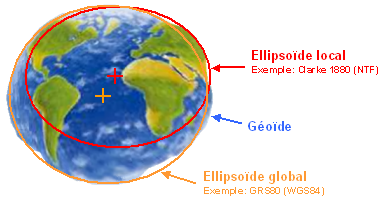
```
]

.pull-right[
```{r, echo = FALSE, out.width = "400px", fig.align='center'}
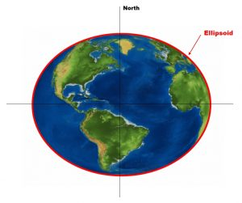
```
]

---

## Ecart ellipsoïde-géoïde

.pull-left[
```{r, echo = FALSE, out.width = "500px", fig.align='center'}
knitr::include_graphics('fig/geoide.png')
```

]

.pull-right[
.medium[
<br><br>

**Les couleurs traduisent l'écart entre le géoïde et l'ellipsoïde**. Cela se nomme la 'hauteur', et **ne dépasse pas 110 mètres** ! 

Si la forme de la terre n'est pas régulière, elle se rapproche donc fortement d'un ellipsoïde

Il est important de noter que **l'altitude** d'un point est calculé par rapport à son l'**éloignement vertical à la surface du géoïde** et **pas à celle de l’ellipsoïde de référence**.
]
]


---


## Les systèmes géodésiques

**Un système géodésique** sert de repère pour déterminer les coordonnées géographiques (ou géodésiques) d'un objet à la surface de la Terre. 

.pull-left[
```{r, echo = FALSE, out.width = "300px", fig.align='center'}
knitr::include_graphics('fig/meridien_paral.gif')
```
]

.pull-right[
```{r, echo = FALSE, out.width = "300px", fig.align='center'}
knitr::include_graphics('fig/sphere_lat_long.png')
```
]

**Ces coordonnées sont des valeurs angulaires, calculées par rapport à un parallèle (équateur) et un méridien de référence (Greenwich)**. Les coordonnées d'un objet traduit (au minimum) deux dimensions : **la latitude et la longitude = des angles**.

---

## Les systèmes géodésiques à connaître

Un même **ellipsoïde peut être positionné différemment par rapport au géoïde**, et ainsi constituer des systèmes de référence géodésiques **différents**. Le même objet n'aura pas les mêmes coordonnées géographiques dans différents systèmes géodésiques.

- **WSG84 (World Geodesic System 1984)**  
*Le plus utilisé au monde. C'est ce système géodésique qui est utilisé pour le GPS (système de positionnement par satellites).*

- **ITRS (International Terrestrial Reference System)**  
*Le plus précis à l'échelle mondiale (précision centimétrique).* 

- **RGF93 (Réseau Géodésique Français 1993)**.  
*Système géodésique officiel en France métropolitaine.*

- **NTF (Nouvelle Triangulation de la France)**
*Ancien système géodésique français de référence, couvrant le territoire métropolitain.*

---

## Les projections cartographiques

.center[
**Un système géodésique permet de localiser un objet sur une surface en 3 dimensions**    

```{r, echo = FALSE, out.width = "800px", fig.align='center'}
knitr::include_graphics('fig/orange.png')
```

*Mais comment représenter l'information géographique sur un plan en deux dimensions, sur une carte ?*]
---

## Les projections cartographiques

Une **projection est un procédé mathématique permettant de passer de l'ellipsoïde à sa représentation sur une surface plane**. 

Toutes les projections provoquent des déformations. Plus l'espace représenté est vaste, plus les altérations sont importantes.


```{r, echo = FALSE, out.width = "800px", fig.align='center'}
knitr::include_graphics('fig/projection_style.jpeg')
```

Les projections cartographiques peuvent se classer **selon le type d'altération et la surface de projection**. 

---

## Surfaces de projection

Un ellipsoïde **peut être projeté sur différentes surfaces**, facilement **représentables en deux dimensions**.

.pull-left[

]

.pull-right[
.medium[
Le cône, le cylindre et le plan sont des formes géométriques développables. 

Dans la **projection conique** les méridiens et les parallèles sont projetés sur un cône qui est tangent avec le parallèle souhaité. Cette projection permet d'établir des cartes assez fidèles à la réalité dans les régions voisines du parallèle de contact. Par contre les régions éloignées sont très déformées et souvent un des deux hémisphères ne peut être cartographié en même temps que l'autre.

Une **projection cylindrique** est la projection de la Terre sur un cylindre tangent à un grand cercle ou sécant en deux cercles. Lorsque la sphère est projetée sur un seul cylindre, il y a une importante distorsion des hautes latitudes, où les surfaces sont considérablement agrandies.

Une **projection azimutale** est une manière de projeter une sphère sur un plan, et en particulier, une façon de représenter entièrement la surface de la Terre sous la forme d'un disque.

]
]

---

## Surfaces de projection

Un ellipsoïde **peut être projeté sur différentes surfaces**, facilement **représentable en deux dimensions**.

.pull-left[
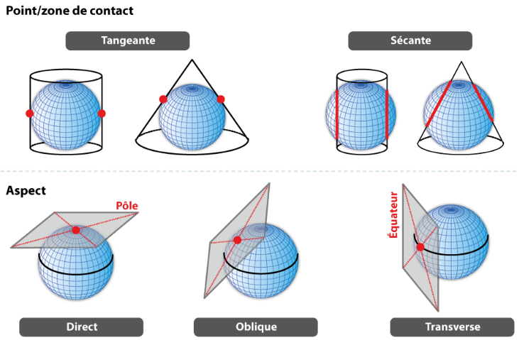
]


.pull-right[
.medium[
<br><br><br>

Pour un plan **tangent**, le cône, le cylindre ou le plan ne touchent la Terre que le long d'une seule droite ou qu'à un point. 

Dans le cas d'un **plan sécant**, le cône ou le cylindre coupent au travers de la Terre au moyen de deux cercles. 

Le lieu du point de contact définit l'endroit où les distorsions sont les moins importantes. Il est appelé **parallèle de référence**

Les projections planes peuvent être orientées de différentes manières : **polaire (directe)**, **équatoriale (transverse)** et **oblique**.
]
]

---

## Le choix du centrage : pas de règle, mais le résultat n'est pas anodin !

.pull-left[


]

.pull-right[


]


---


## Les types de projection (déformations)

Les projections peuvent être classées selon les **altérations géométriques** qu'elles provoquent.

.pull-left[

### Projections conformes

**Conservent localement les angles, donc les formes**. Les méridiens et parallèles se coupent à angle droit.    

**Les surfaces et les distances sont déformées.** Ce type de projection peut être utilisé pour la navigation maritime.
]

.pull-right[
```{r, echo = FALSE, out.width = "480px", fig.align='center'}
knitr::include_graphics('fig/mercator.jpg')
```
.medium[Exemple : **Projection Mercator**]
.small[*Gerardus Mercator (1569)*]

]

---

## Les types de projection (déformations)

Les projections peuvent être classées selon les **altérations géométriques** qu'elles provoquent.

.pull-left[

### Projections équivalentes

**Conserve localement les surfaces**, mais au prix d’une **déformation des distances et des angles** de route sur la carte.] 

.pull-right[
```{r, echo = FALSE, out.width = "520px", fig.align='center'}
knitr::include_graphics('fig/gall_peters.jpg')
```
.medium[Exemple : **Projection Gall–Peters**]
.small[*James Gall et Arno Peters (1855)*]

]

---
## Les types de projection (déformations)

Les projections peuvent être classées selon les **altérations géométriques** qu'elles provoquent.

.pull-left[

### Projections aphylactiques

Projections  **ni conformes, ni équivalentes**, mais qui cherchent à faire un **compromis acceptable** entre les inévitables déformations des surfaces, des distances et des angles sur une carte.
]

.pull-right[
```{r, echo = FALSE, out.width = "550px", fig.align='center'}
knitr::include_graphics('fig/Natural_Earth.JPG')
```
.medium[Exemple : **Projection Natural Earth**]
.small[*Tom Patterson (2011)*]
]

---
## Les types de projection (déformations)

Les projections peuvent être classées selon les **altérations géométriques** qu'elles provoquent.

.pull-left[

### Projections aphylactiques (équidistantes)

La **distance et la direction**, mesurées à partir du point central, sont toutes deux exactes.] 


.pull-right[
```{r, echo = FALSE, out.width = "380px", fig.align='center'}
knitr::include_graphics('fig/postel.png')
```
.medium[Exemple : **Projection Postel**]
.small[*Al-Biruni (1000 envir.)*]
]


---

## Quelles déformations ? 

Le cas controversé de la projection Mercator... 

.pull-left[
```{r, echo = FALSE, out.width = "500px", fig.align='center'}
knitr::include_graphics('fig/russie_afrique.png')
```
.medium[En réalité, la Russie est 2 fois moins étendue que l'Afrique...]
]

.pull-right[
```{r, echo = FALSE, out.width = "500px", fig.align='center'}
knitr::include_graphics('fig/SA_groenland.png')
```
.medium[... Et l'Amérique du Sud 8 fois plus étendue que le Groenland !]
]


---

## Quelles déformations ? 

```{r, echo = FALSE, out.width = "800px", fig.align='center'}
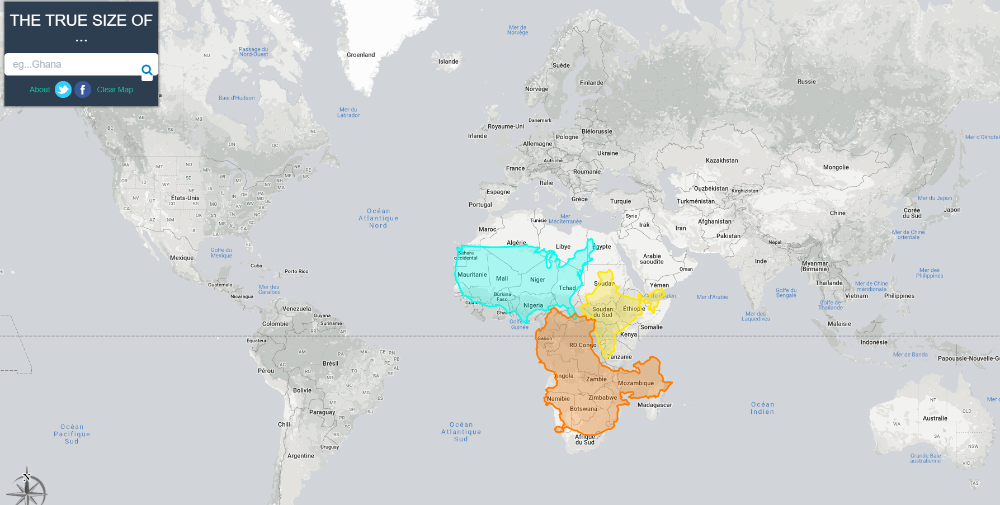
```

.center[
.medium[*https://thetruesize.com*]
]


---

## Quelles déformations ? 

**L'indicatrice de Tissot** permet d'apprécier les déformations engendrées par l'usage d'un système de projection cartographique.

.pull-left[
```{r, echo = FALSE, out.width = "450x", fig.align='center'}
knitr::include_graphics('fig/mercator_deform.png')
```
]

.pull-right[
```{r, echo = FALSE, out.width = "500px", fig.align='center'}
knitr::include_graphics('fig/equivalente_deform.png')
```

<br>
Une forme géométrique (un cercle ou une ellipse) est répétée de manière régulière sur le planisphère.
]

---

## Quelle projection choisir ? Des normes, des références et des choix

**Le choix d'une projection cartographique** ne se fait pas aléatoirement.

-  En France, tout comme dans de nombreux pays, vous êtes soumis à des **normes** si vous travaillez dans le cadre d'une **mission de service public.**

-  Sinon, **c'est la zone représentée, la thématique et l'objectif de la carte** qui vous permettront de choisir une projection.
.medium[
* Pour la navigation, les directions sont importantes.
* Sur les cartes routières, les distances précises sont importantes. 
<br><br>
** Des conventions pour certaines zones géographiques :**
* Pour les régions de basse latitude (près de l'Équateur), utilisez des projections cylindriques.
* Pour les régions de latitude moyenne, les projections coniques sont plus adaptées.
* Pour les régions polaires, plutôt des projections azimutales.
]

D'un point de vue général, ne pas oublier que plus la surface à représenter est importante, plus les distorsions le seront également
---

## En France : La projection Lambert93

.pull-left[
Suite à un décret du [3 mars 2006](https://geodesie.ign.fr/contenu/fichiers/Decret2006-272_03-03-06MODdecret2000-1276.pdf) :

.medium[
Toutes les administrations de l'État, collectivités locales et entreprises chargées de l'exécution d'une mission de service public doivent utiliser le **système géodésique de référence RGF93** pour leurs échanges de données géoréférencées.

Ce système géodésique est compatible avec le système géodésique de **référence européen ETRS89** et avec le système géodésique de référence mondial **WGS84** (utilisé par le système GPS).

Les cartes officielles représentant l'ensemble de la France métropolitaine doivent utiliser la projection de référence **Lambert93 Conique Conforme**. 9 variantes de cette projection existent, elles couvrent 9 zones s'étalant du Nord au Sud et doivent être utilisées pour la cartographie locale.]

.leg-fig[
[Source : Géoréférencement et RGF93, théorie et concepts, 2008](http://gtsoft.ftpacs.com/RGF93_theorie_et_concept_T3.pdf?PHPSESSID=649823751d32b07817a3795a95f748aa)]
]

.pull-right[


]

---

## Chaque pays a son popre système de projection de référence ! 

L'EPSG (European Petroleum Survey Group) a construit en place une base de données qui recense et identifie les systèmes de **coordonnées géographiques de projection les plus utilisés**.

.center[
[**epsg.io**](https://epsg.io/) est aujourd'hui une ressource Open-Source de référence internationale.
]

```{r, echo = FALSE, out.width = "800px", fig.align='center'}
knitr::include_graphics('fig/epsg1.PNG')
```

.medium[
Les **codes EPSG** sont des identifiants uniques pour qualifier de systèmes de projection, directement utilisables dans des SIG.
]
---

## Atelier : Harmoniser les Systèmes de Coordonnées de Référence des couches géographiques du projet 


---

class: inverse middle center

#  Manipulations de base (vecteur)

Import de données tabulaires

Jointure attributaire

Jointure spatiale

Sélections attributaires

---
## Jointure attributaire

.pull-left[
Une **jointure attributaire** permet de joindre **deux tables attributaires décrivant des entités communes et partageant un champ commun**. L'opération produit **une seule table** juxtaposant les champs de la table à joindre à ceux de la table d'origine.

Dans un SIG la table d'origine est souvent celle associée aux entités localisées d'**une couche géographique**, ce qui permet par exemple de cartographier les **données d'un tableau statistique sans dimension spatiale**. 

Les jointures attributaires sont utilisées lorsque l'on souhaite introduire des informations nouvelles dans une couche géographique, par exemple des données décrivant le nombre de commerces que l'on souhaite joindre à une couche de communes.
]

.pull-right[
<br><br><br>


.leg-fig[Source : Université Virtuelle Environnement et Développement durable, glossaire des SIG.
]
]
---
## Jointure spatiale

.pull-left[
<br><br>
Une **jointure spatiale** permet de caractérister le **positionnement relatif d'entités issues de deux couches géographiques différentes**.

Par exemple, une table des écoles pourra être jointe à une table des communes en fonction d'une **relation spatiale de type inclusion géométrique**. 

Si le point de l'école se trouve dans le polygone correspondant à la commune, les attributs de la table commune deviendront des attributs de la table école. Par définition, une jointure ne peut donc être effectuée qu'entre des données géographiques et non des tables attributaires.
]

.pull-right[
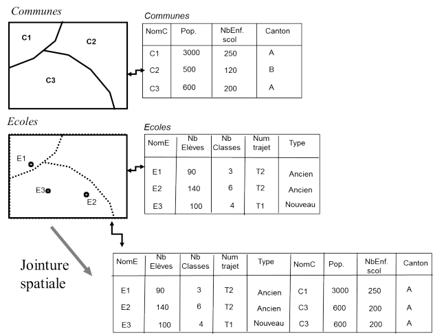

.leg-fig[
Source : Université Virtuelle Environnement et Développement durable, glossaire des SIG.
]
]

---

## Sélection par attributs

.pull-left[
Il s'agit d'une sélection portant sur les **caractéristiques non spatiales des entités**. Dans un SIG, elles sont prises en charge dans la table attributaire des couches géographiques.

On peut effectuer une sélection par expression sur des **variables catégorielles/qualitatives** *(ex : IRIS de de la commune "Bagnolet")* ou sur des **variables quantitatives** *(ex: IRIS dont le nombre de foyers fiscaux est supérieur à "10000")*

Le SIG renverra alors une sélection des entités dont les valeurs répondent à la requête
]

.pull-right[

]

---
## Sélection par localisation

.pull-left[
<br><br><br><br>
La sélection par localisation permet de sélectionner certaines entités d'une couche au regard de leur positionnement géographique vis-à-vis d'une autre couche géographique.

Le choix du **prédicat géométrique est important** (intersecte, contient, est disjoint, égal, touche, chevauche, à l'intérieur, croise, etc.) 
]

.pull-right[

.leg-fig[Source : École nationale des techniciens de l'équipement. Établissement d'Aix-en-Provence
]
]

---
class: middle

## Atelier (1) : Extraire les bibliothèques inclues dans le territoire d'Est-Ensemble
### Sélectionner par localisation et sélectionner par expression. 

---

## Sélection des bibliothèques d'Est Ensemble

### **Étape 1** - Importer des couches vecteur

.medium[
*Importez les couches bibliothèque et IRIS Est Ensemble. (ajouter une couche vecteur)*
]
.center[

]
---

## Sélection des bibliothèques d'Est Ensemble

### **Étape 2** - Harmoniser les projections

.medium[
*Enregistrez la couche d'équipement dans la même projection que la couche IRIS. (clic droit sur la couche bibliothèque > enregistrez sous > choisir le même SCR que la couche IRIS)*
]
.center[
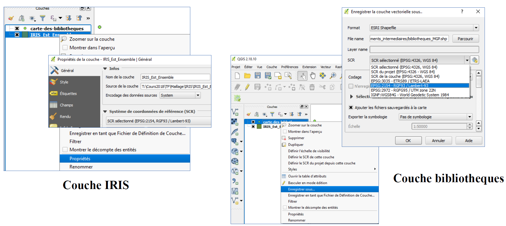
]

---

## Sélection des bibliothèques d'Est Ensemble

### **Étape 3** - Sélection par localisation

.medium[Ne sélectionnez que les bibliothèques contenues dans le territoire d'Est Ensemble *(vecteur > outil de recherche > sélection par localisation)*.]

.center[
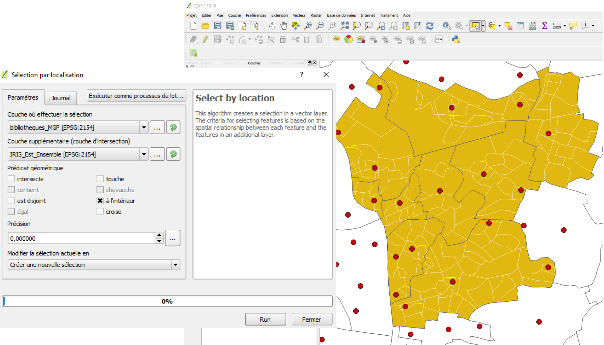
]

---

## Sélection des bibliothèques d'Est Ensemble

### **Étape 3** - Sélection par localisation

.medium[
Observer le résultat de la sélection et l'enregistrer. *(clic droit sur la couche bibliothèques > n'enregistrer que les entités sélectionnées)*.
**NB**: pour connaître les bibliothèques qui ne sont pas comprises dans cet espace, on peut inverser la sélection.
]

.center[
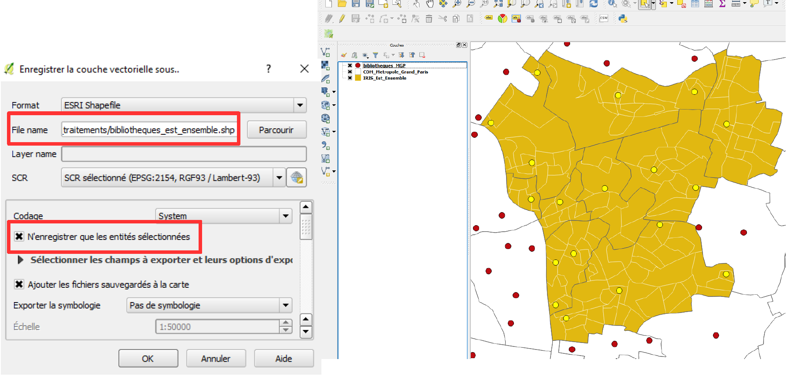
 ]

---

## Sélection des bibliothèques d'Est Ensemble

### **Étape 4** - Filtrer les résultats 

.left-column[
.medium[
*Pour notre projet, nous décidons de moderniser une bibliothèque existante. Nous souhaitons donc retirer toutes les médiathèques déjà existantes de cette sélection.*

*Ouvrez la table attributaire, triez les résultats, et ne sélectionnez que les bibliothèques. Enregistrez la sélection sous le nom "bibli_est_ensemble"*.

*On note ainsi que 16 bibliothèques et sont incluses dans le territoire d'Est Ensemble. Ce territoire compte aussi déjà 2 médiathèques, situées dans les communes de Bagnolet et Noisy-le-Sec.*
]]

.right-column[
.center[
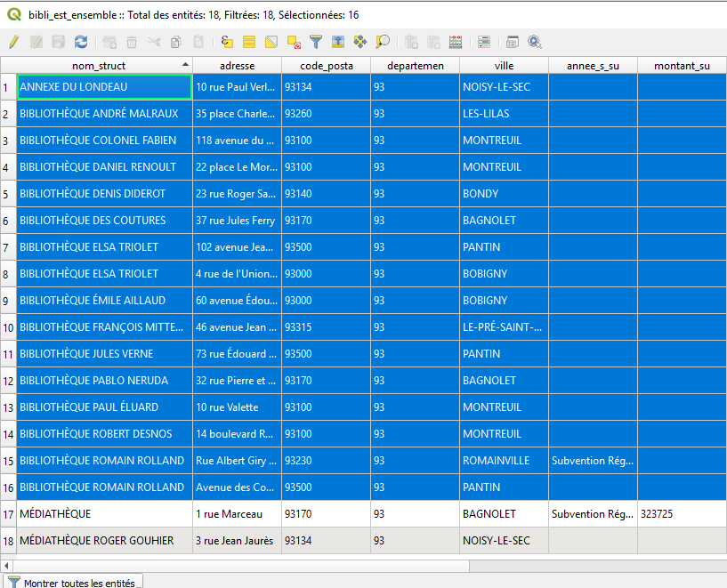
]]

---

## Sélection des bibliothèques d'Est Ensemble

### **Étape 5** - Enregistrer le résultat

.left-column[
.medium[
 <br><br><br>
 S'il s'agissait de votre projet, nous vous conseillerions d'améliorer le style de cette couche importante, de lui trouver un nom clair du type *critere1_bibli_est_ensemble.shp* et de l'enregistrer dans un dossier que vous maîtrisez.

Ne jamais oublier d'enregistrer votre projet à la fin de votre travail pour conserver l'ordre des couches et le style que vous leur avez affecté.
]
]

.right-column[
.center[
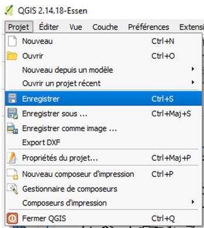
]]

---

<br><br><br><br><br><br><br>
## 3. Atelier (2) : Sélectionner les IRIS caractérisés par une population jeune
### Import de données attributaires, jointures attributaires, statistiques basiques, sélections par expression. 


---
## Sélection des IRIS caractérisés par une population jeune
.left-column[

### **Étape 1** - Consulter données et métadonnées

.medium[
*Quelles sont les champs dont je vais avoir besoin* ?

*Quel est leur code associé* ?

> Se reporter aux métadonnées !

**Enregistrer le fichier Excel au format .csv**

]
]

.right-column[
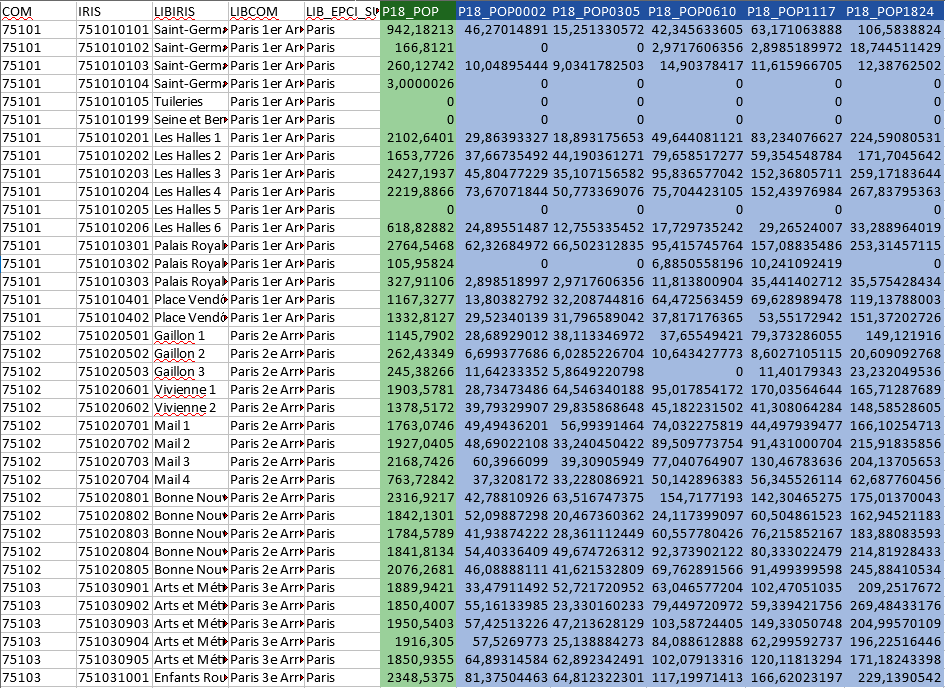
]


---
## Sélection des IRIS caractérisés par une population jeune

.left-column[

### **Étape 2** - Importer un fichier tabulaire

.medium[
*Importez le fichier contenant les structures par âge des IRIS d'Ile-de-France.*

- Virgule en séparateur décimal
- Pas de géométrie

*Cliquez sur "ajouter"*
]
]

.right-column[
.center[
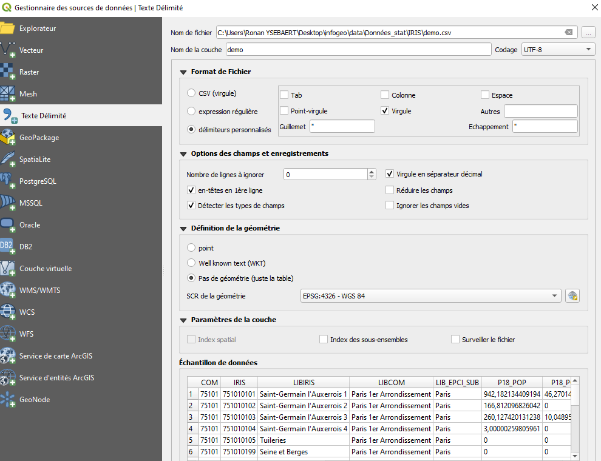
]
]
---
## Sélection des IRIS caractérisés par une population jeune
.left-column[


### **Étape 3** - Jointure attributaire

.medium[
Jointure de ce fichier de données non spatiales à la couche géographique des IRIS.

Au préalable, il faut s'assurer de la concordance des données statistiques avec les géométries et identifier le nom de la colonne (identifiant unique) sur laquelle portera la jointure.

*Clic droit sur la couche IRIS, propriétés, jointure, cliquez sur "+"*
]
]

.right-column[
.center[
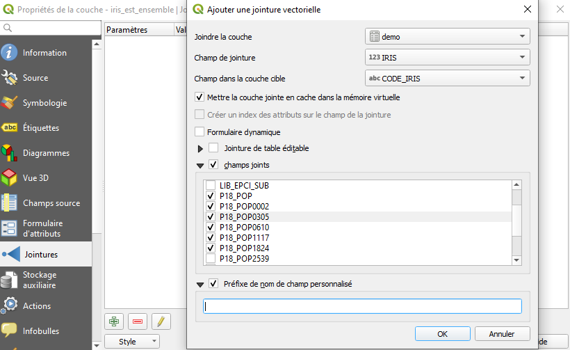
]]

---
## Sélection des IRIS caractérisés par une population jeune
.left-column[


### **Étape 3** - Jointure attributaire


.medium[
Jointure de ce fichier de données non spatiales à la couche géographique des IRIS.

Au préalable, il faut s'assurer de la concordance des données statistiques avec les géométries et identifier le nom de la colonne (identifiant unique) sur laquelle portera la jointure.

*Choisir les deux champs à mettre en lien N'hésitez pas à jeter un oeil aux tables attributaires et aux métadonnées pour vous aider à cibler les bons identifiants.*
]
]

.right-column[
**BRAVO !!! Vous venez de joindre les données démographiques de l'INSEE dans la table attributaire de la couche IGN IRIS !** 
.center[
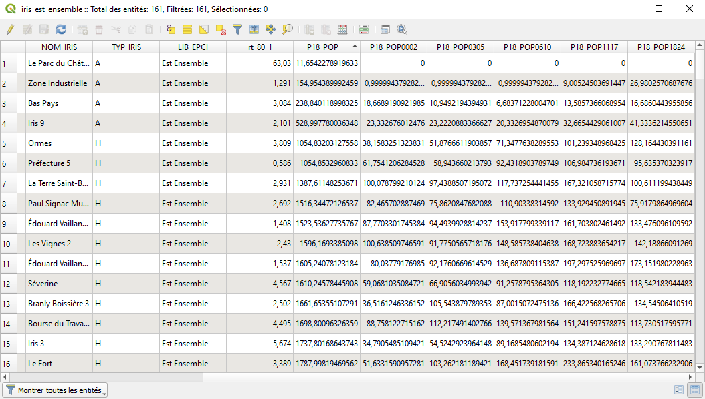
]]

---
## Sélection des IRIS caractérisés par une population jeune
.left-column[


### **Étape 4** - Calcul de la part des 0-24 ans

*Appuyez sur le stylo pour finir (l'édition) et enregistrez les résultats (OK)* 
]

.right-column[

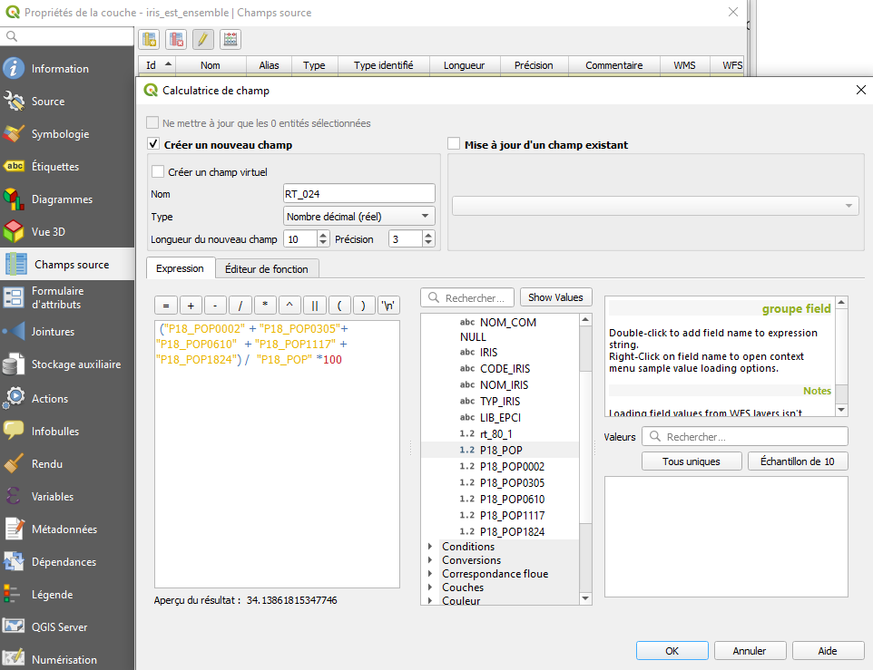
]


---
## Sélection des IRIS caractérisés par une population jeune

### **Étape 5** - Sélection par expression

.left-column[
.medium[
<br><br><br>
Sélectionnez les IRIS caractérisés par une part de la population supérieure à 33 %.
*Clic droit sur la couche IRIS > ouvrir la table d'attributs > sélectionner des entités en utilisant une expression.*

NB : On pourrait aussi envisager la sélection autrement: 25 % des IRIS les plus jeunes, créer des indices de vieillissement, prendre des classes d'âge plus fines. Il vous faudra justifier vos choix. 
]
]

.right-column[
.center[
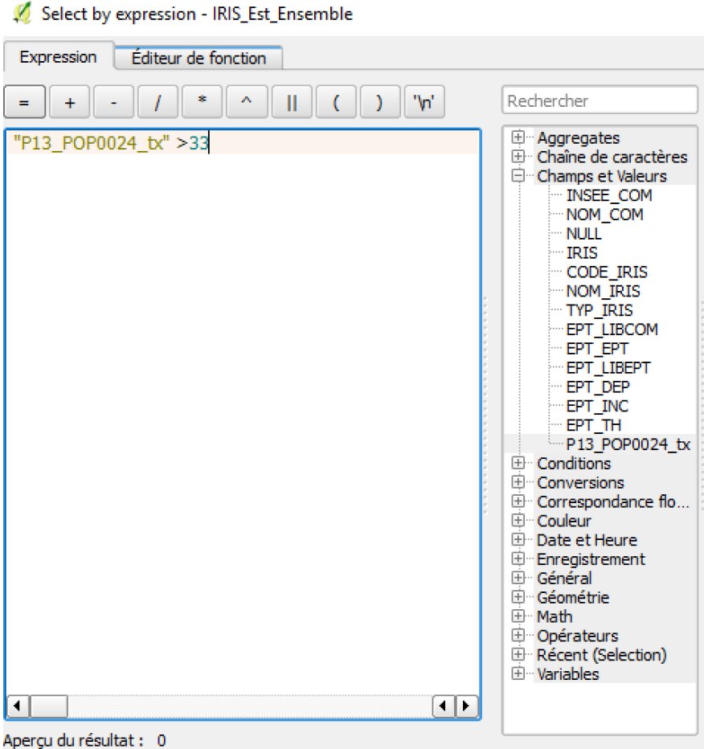
]]

---

## Sélection des IRIS caractérisés par une population jeune

### **Étape 6** - Enregistrer les résultats 

.left-column[
<br><br><br>
.medium[
85 IRIS à Est-Ensemble sont caractérisés par une part de la population âgée de 0 à 24 ans supérieure à un tiers de la population totale !

*Clic droit sur la couche IRIS > enregistrer la couche vectorielle sous...> n'enregistrer que les entités sélectionnés*

Toujours choisir un nom de fichier qui vous parle (et assez court). Ex : "CRITERE_POP024.shp"<
]
]

.right-column[
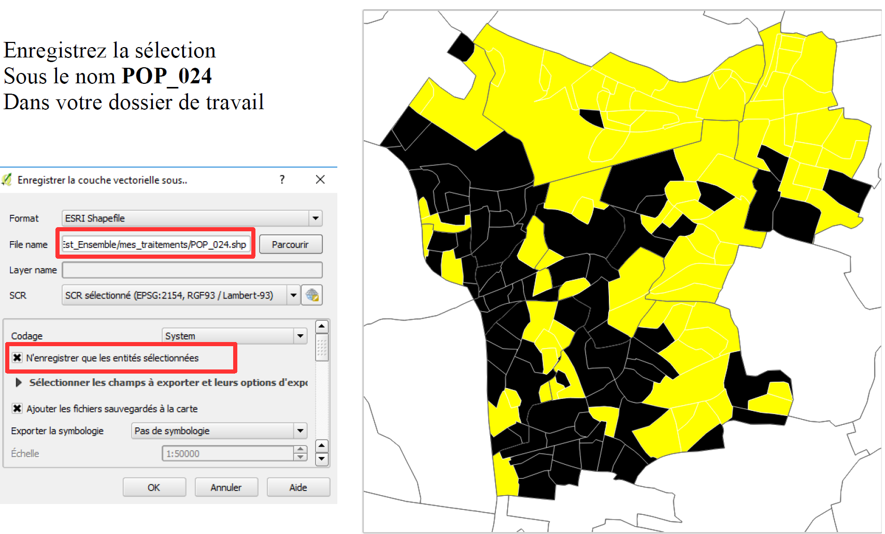
]

---

## Jointures, sélections par expression...

**Objectif** : Réaliser une sélection sur un second critère statistique : Faible revenu dans les IRIS d'Est Ensemble.

**Proposition d'un 3e critère** : Sélectionner les 25% d'IRIS les plus pauvres d'Est ensemble.

→ Comment procéder ?

--

1. Importer le fichier `socio_eco.xlsx` après avoir repéré le champ pertinent (`DEC_MED19`)
2. Faire la **jointure attributaire** avec la couche IRIS
3. Repérer le niveau de revenu des 25% des IRIS les plus pauvres, c'est-à-dire le *premier quartile*
4. Sélectionner (**sélection par attribut**) les IRIS qui correspondent à cette tranche de revenu médian
5. Enregistrer le résultat (3e critère)

---

## Le 1er quartile des IRIS, par revenu

.pull-left[
Importer le fichier `socio_eco.xlsx` après avoir repéré le champ pertinent (`DEC_MED19`)
]

.pull-right[
.center[

]
]

---

## Le 1er quartile des IRIS, par revenu

.pull-left[
Faire la **jointure attributaire** avec la couche IRIS
]

.pull-right[
.center[

]
]

---

## Le 1er quartile des IRIS, par revenu

.pull-left[
Repérer le niveau de revenu des 25% des IRIS les plus pauvres, c'est-à-dire le *premier quartile*
]

.pull-right[
.center[

]
]

---

## Le 1er quartile des IRIS, par revenu

.pull-left[
Repérer le niveau de revenu des 25% des IRIS les plus pauvres, c'est-à-dire le *premier quartile*
]

.pull-right[
.center[

]
]

---

## Le 1er quartile des IRIS, par revenu

.pull-left[
Repérer le niveau de revenu des 25% des IRIS les plus pauvres, c'est-à-dire le *premier quartile*
]

.pull-right[
.center[

]
]

---

## Le 1er quartile des IRIS, par revenu

.pull-left[
Sélectionner (**sélection par attribut**) les IRIS qui correspondent à cette tranche de revenu médian
]

.pull-right[
.center[

]
]

---

## Le 1er quartile des IRIS, par revenu

.pull-left[
Enregistrer le résultat (3e critère)
]

.pull-right[
.center[

]
]

---

.center[

]


---

class: inverse middle center

#  Géotraitements

---

## Géotraitement

.pull-left[

Les SIG proposent plusieurs outils de **géotraitement**. Ils permettent d'opérer sur la **géométrie et/ou la topologie** des objets géographiques. La dimension attributaire est parfois également prise en compte. Ces traitements peuvent s'effectuer en mode **vecteur** et/ou en mode **raster**.

Le résultat d'un géotraitement est la **création d'une nouvelle couche géographique**.


.leg-fig[
Extrusion des contours des côtes bretonnes par une série de géotraitements (Source : [Atol Open Blog](https://blog.atolcd.com/mise-a-jour-en-vue-pour-lextension-gis-de-pentaho-data-integration/))
]

]

.pull-right[


.leg-fig[
Tampons variables autour des rivières (Source : [Documentation QGIS](https://docs.qgis.org/2.8/fr/docs/gentle_gis_introduction/vector_spatial_analysis_buffers.html))]
]

---


## Géotraitement

.pull-left[

Les SIG proposent plusieurs outils de **géotraitement**. Ils permettent d'opérer sur la **géométrie et/ou la topologie** des objets géographiques. La dimension attributaire est parfois également prise en compte. Ces traitements peuvent s'effectuer en mode **vecteur** et/ou en mode **raster**.

Le résultat d'un géotraitement est la **création d'une nouvelle couche géographique**.


.leg-fig[
Extrusion des contours des côtes bretonnes par une série de géotraitements (Source : [Atol Open Blog](https://blog.atolcd.com/mise-a-jour-en-vue-pour-lextension-gis-de-pentaho-data-integration/))
]

]

.pull-right[


.leg-fig[
Périmètre de 500 m autour des monuments historiques avec interdiction relative de publicité (Source : [Open Data Métropole Européenne de Lille](https://opendata.lillemetropole.fr/explore/dataset/zone-de-500m-autour-des-monuments-historiques-spr/information/?location=12,50.65871,3.11617&basemap=jawg.streets))]
]


---
.pull-left[

## Zone tampon (buffer, distances tampon)

.center[

]
]

--
.pull-right[
## Intersection

.center[

]
]
---

## Différenciation symétrique (ou différence)

.pull-left[
.center[

]
]

--

.pull-right[
## Union

.center[

]
]

---

## Regroupement (merge, dissolve)

.center[

]

---

class: middle

## Atelier / Géotraitements

- **Diversifier l'offre géographique** : Extraire l'espace situé à plus de 1500m d'une médiathèque sur le territoire d'Est Ensemble : **géotraitements *espace tampon* et *différence* **.  

- **Une médiathèque accessible** : Extraire l'espace situé à moins de 1000m d'une station de RER : **géotraitements *union*, *espace tampon* et *intersection* **.  


---


## Diversifier l'offre géographique

.left-column[
.medium[
Objectif : Extraire l'**espace situé à plus de 1500m d'une médiathèque** sur le territoire d'Est Ensemble.

### **Étape 1** 
Ouvrir la couche *bibliotheque_Est_Ensemble.shp* (correctement projetée), extraire uniquement les médiathèques (depuis la table attributaire ou par une sélection par expression). 

### **Étape 2** 
Réaliser un **espace tampon** de 1500 mètres autour de celles-ci et nommer cette couche *mediatheques_1500m*.]]

.right-column[
.center[


.leg-fig[Création d'un **espace tampon de 1500m autour des médiathèques**]]]


---

## Diversifier l'offre géographique

.left-column[
.medium[
Objectif : Extraire l'**espace situé à plus de 1500m d'une médiathèque** sur le territoire d'Est Ensemble.

### **Étape 1** 
Ouvrir la couche *bibliotheque_Est_Ensemble.shp* (correctement projetée), extraire uniquement les médiathèques (depuis la table attributaire ou par une sélection par expression). 

### **Étape 2** 
Réaliser un **espace tampon** de 1500 mètres autour de celles-ci et nommer cette couche *mediatheques_1500m*.]]

.right-column[
.center[

.leg-fig[Création d'un **espace tampon de 1500m autour des médiathèques**]]]

---

## Diversifier l'offre géographique

.left-column[
.medium[
Objectif : Extraire l'**espace situé à plus de 1500m d'une médiathèque** sur le territoire d'Est Ensemble.

### **Étape 3** 
Réaliser la **différence** entre la couche *mediatheques_1500m* et la couche *EPT_Est_Ensemble*, la nommer *mediatheques_1500diff*.
]]

.right-column[
.center[

]]

---

## Diversifier l'offre géographique

.left-column[

.medium[

Objectif : Extraire l'**espace situé à plus de 1500m d'une médiathèque** sur le territoire d'Est Ensemble.

### **Étape 4** 
Supprimer les couches intermédiaires affichées dans le SIG, enregistrer la couche finale dans le répertoire adéquat et jouer sur le style de cette couche finale qui nous intéresse directement pour notre projet.]]

.right-column[
.center[

.leg-fig[L'espace à plus de 1500 mètres d'une médiathèque est dorénavant sélectionné !]]]

---

## Une médiathèque accessible

.left-column[
.medium[

Objectif : Extraire l'**espace qui se situe à moins de 1000m d'une station de tramway ou de métro**.

### **Étape 1**
Ouvrir les couches *arrets_metro* et *arrets_tram*, les enregistrer dans la projection du projet (EPSG:2154).

### **Étape 2**
Créer **l'union** de ces deux couches. Nommer le résultat *Metro_Tram*
]]

.right-column[
.center[

]]

---

## Une médiathèque accessible

.left-column[
.medium[

Objectif : Extraire l'**espace qui se situe à moins de 1000m d'une station de tramway ou de métro**.

### **Étape 1**
Ouvrir les couches *arrets_metro* et *arrets_tram*, les enregistrer dans la projection du projet (EPSG:2154).

### **Étape 2**
Créer **l'union** de ces deux couches. Nommer le résultat *Metro_Tram*
]]

.right-column[
.center[

.leg-fig[Les deux couches géographiques de transport sont désormais réunies en une seule !]
]]


---

## Une médiathèque accessible

.left-column[
.medium[

Objectif : Extraire l'**espace qui se situe à moins de 1000m d'une station de RER ou de métro**.

### **Étape 3**
Réaliser un **espace tampon** de 1000 mètres autour de celle-ci et nommer cette couche *Metro Tram 1000m*.]]  

.right-column[
.center[

]]

---

## Une médiathèque accessible

.left-column[
.medium[
### **Étape 4**
Réaliser l'**intersection** entre la couche `Metro Tram 1000M` et la couche **EPT_Est_Ensemble**, la nommer *Accessibilite*.

### **Étape 5**
Supprimer les couches intermédiaires affichées dans le SIG, enregistrer la couche finale dans le répertoire adéquat et jouer sur le style de cette couche finale qui nous intéresse directement pour notre projet.]]

.right-column[
.center[

]]

---

class: inverse middle center

# Mise en cohérence des critères

Modéliser sa chaîne de traitement

Identifier une localisation optimale

---
## Modéliser sa chaine de traitement

La modélisation graphique de la chaîne de traitement, aussi appelée *cheminement décisionnel* est particulièrement utile pour :

- Expliquer **les étapes de la réalisation** à d’autres personnes (reproductibilité des résultats, transposition à d'autres espaces d'études ou objets géographiques).

- Apporter de la **rigueur méthodologique** à ses travaux (transparence de la procédure). 

- Se rappeler comment sont **nommées et organisés les fichiers** (particulièrement utile d’une séance à l’autre).  

Nous vous conseillons de réaliser ce schéma au fur et à mesure de l’avancement de vos traitements ! 

---
## Modéliser sa chaine de traitement

Insérer maj chemin décisionnel

---

## Quelle implantation ? Une possible procédure... 

Nous avons créé 4 couches géographiques qui constituent nos critères pour l'implantation d'une nouvelle médiathèque :

- **POP024** : IRIS dont la part de la population de 0 à 24 ans est supérieure à 33 %. 
- **REV_Q1** : les 25 % plus pauvres IRIS sur le territoire d'Est Ensemble.
- **ACCESS** : l'espace situé à moins de 1000 m d'une station de métro ou de RER sur le territoire d'Est Ensemble.  
- **1500DIFF** : l'espace situé à plus de 1500 m d'une médiathèque existante.

<br>

Dans notre cas, nous allons explorer **deux situations** :

- **Nouvelle implantation** : Définir les IRIS qui présentent des caractéristiques favorables à l'implantation d'un nouvel équipement.
- **Modernisation d'une bibliothèque** : Identifier les bibliothèques dans ces secteurs favorables. 

---
## Une possible procédure... 

On peut procéder de bien des manières dans QGIS pour aboutir au résultat escompté, en voici par exemple une : 

1. Afficher les couches **IRIS**, **POP024** et **REV_Q1**.  
2. Par une **sélection par localisation**, sélectionner les IRIS de POP024 qui sont **égaux** à REV_Q1. Enregistrer la sélection sous le nom **IRIS_POP_REV**.
3. Sélectionner les IRIS de la couche **IRIS_POP_REV** qui sont à l'intérieur de **1500_DIFF**. Enregistrer la sélection sous le nom **IRIS_POP_REV_DISTMED**.
4. Sélectionner les IRIS de la couche **IRIS_POP_REV_MED** qui sont à l'intérieur de **ACCESS**. On enregistre la sélection sous le nom **IMPLANTATION_IRIS**.   

Pour maîtriser votre traitement, travaillez avec soin et méthode :
- N'affichez que les couches sur lesquelles vous effectuez vos sélections. Observez si les résultats sont conformes à votre intention avant de les enregistrer. 
- Maîtrisez l'endroit où vous enregistrez ces différents traitements intermédiaires, et nommez clairement les couches géographiques issues de ces sélections. 

---

## IRIS jeunes et à faible revenu... 

.center[
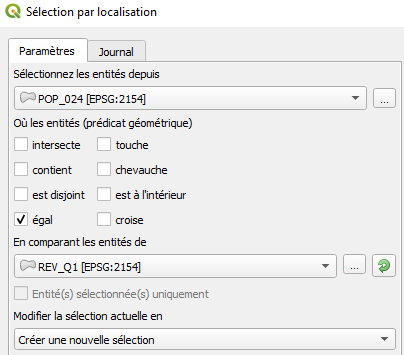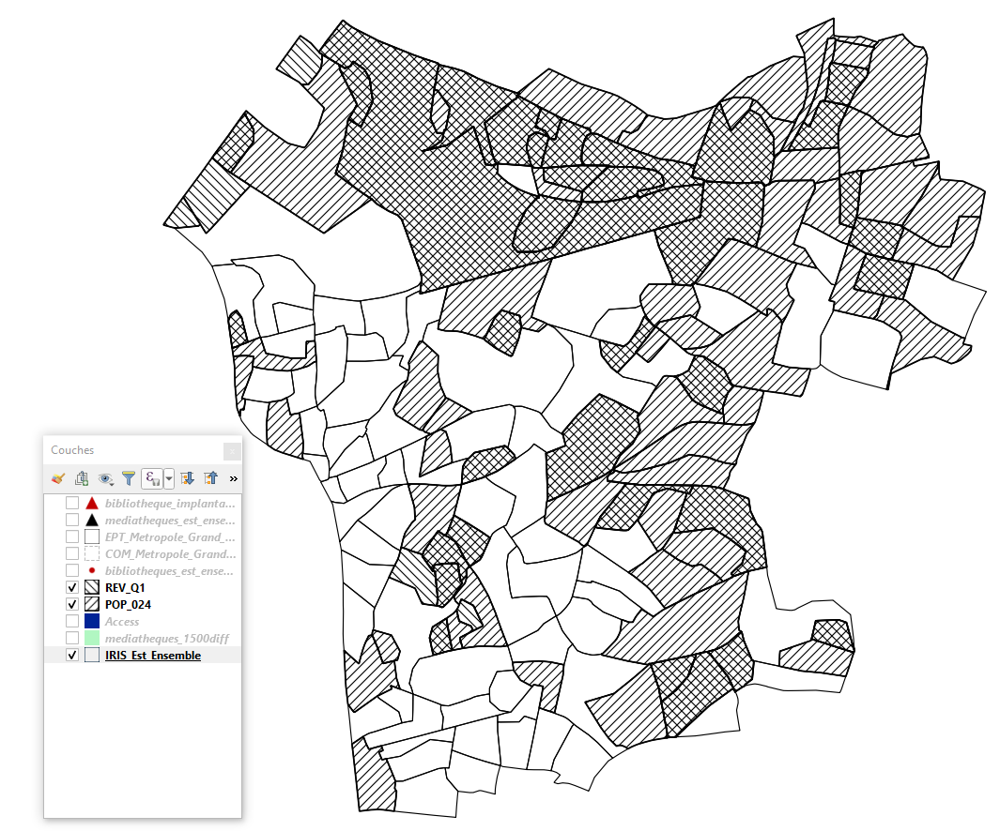
]


---

## IRIS jeunes et à faible revenu...  

.center[
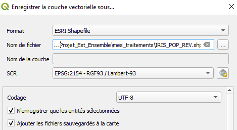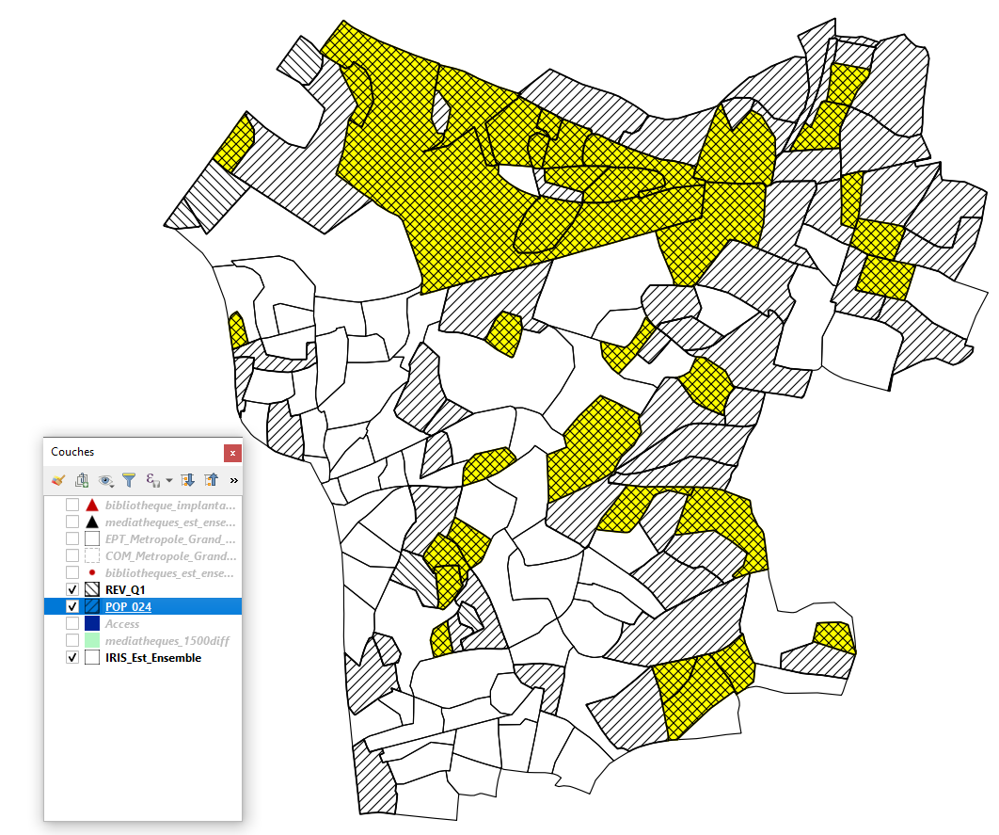
]


---

## ... A plus de 1500 m à vol d'oiseau d'une médiathèque existante...

.center[
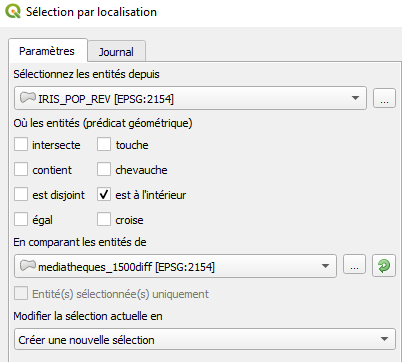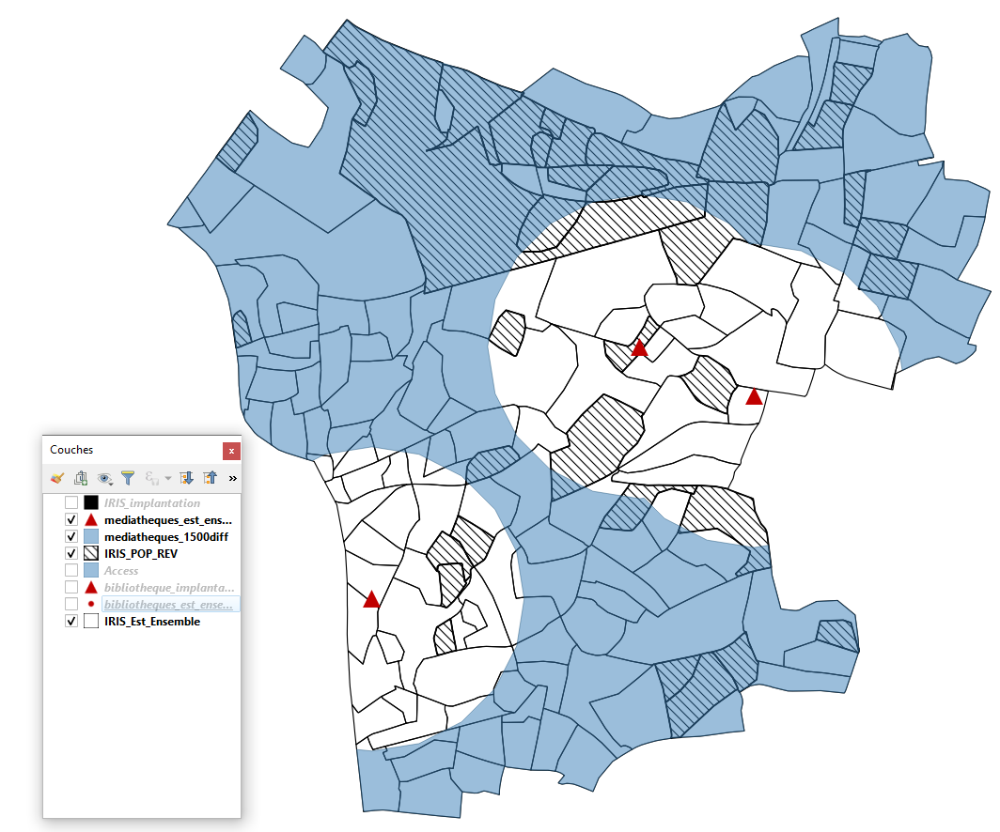
]

---

## ... A plus de 1500 m à vol d'oiseau d'une médiathèque existante...

.center[
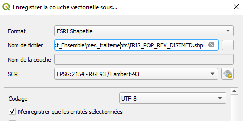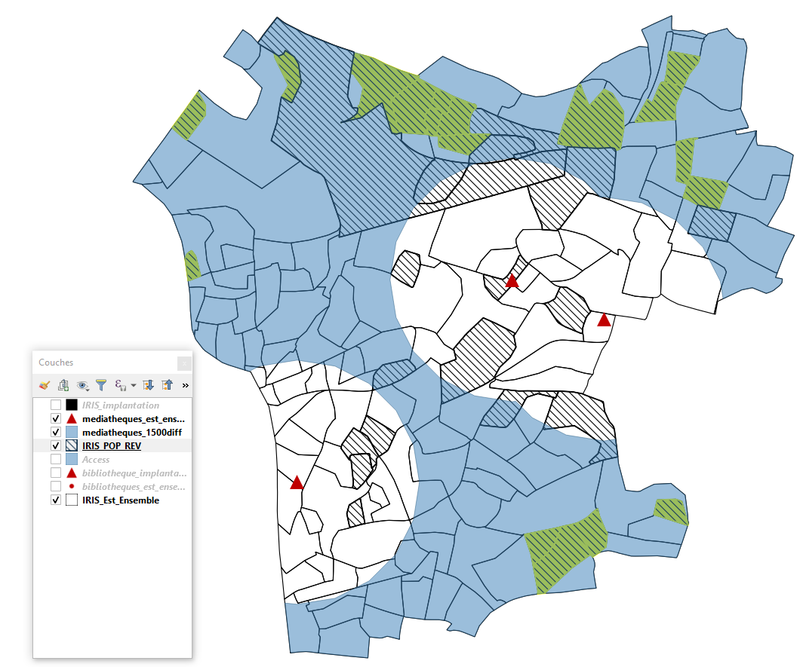
]

---

## ... Et à moins de 1000 m d'une station de métro ou de RER ! 

.center[
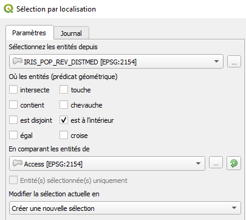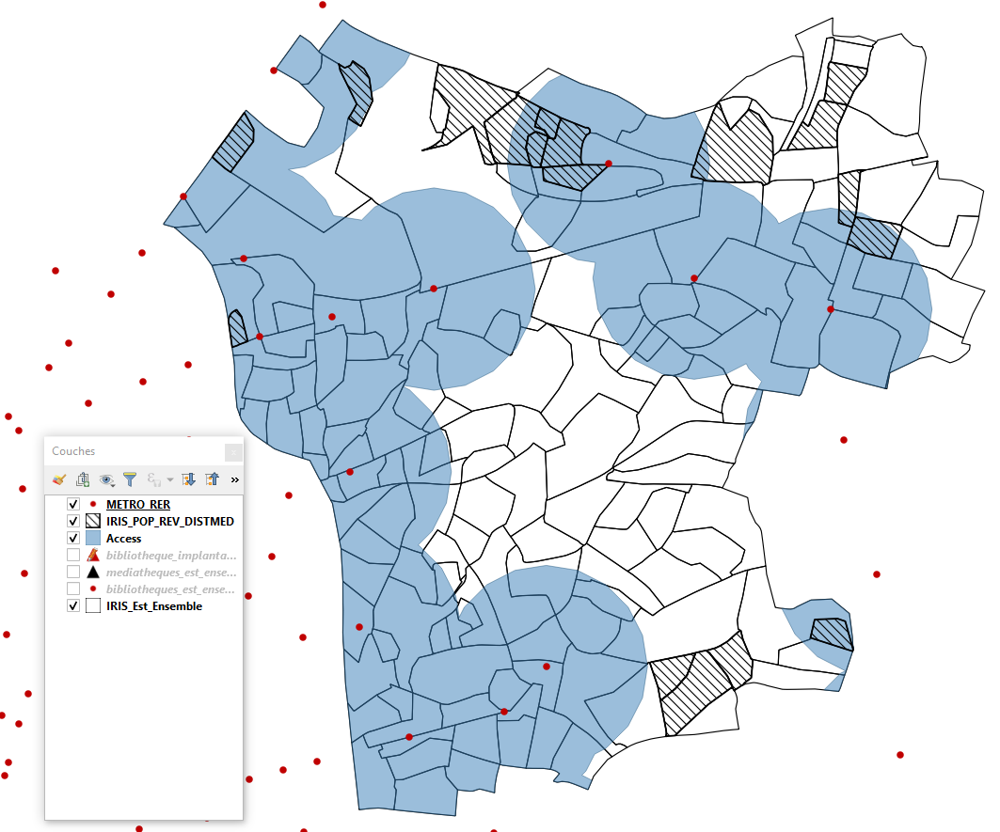
]

---

## ... Et à moins de 1000 m d'une station de métro ou de RER ! 

.center[
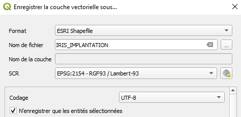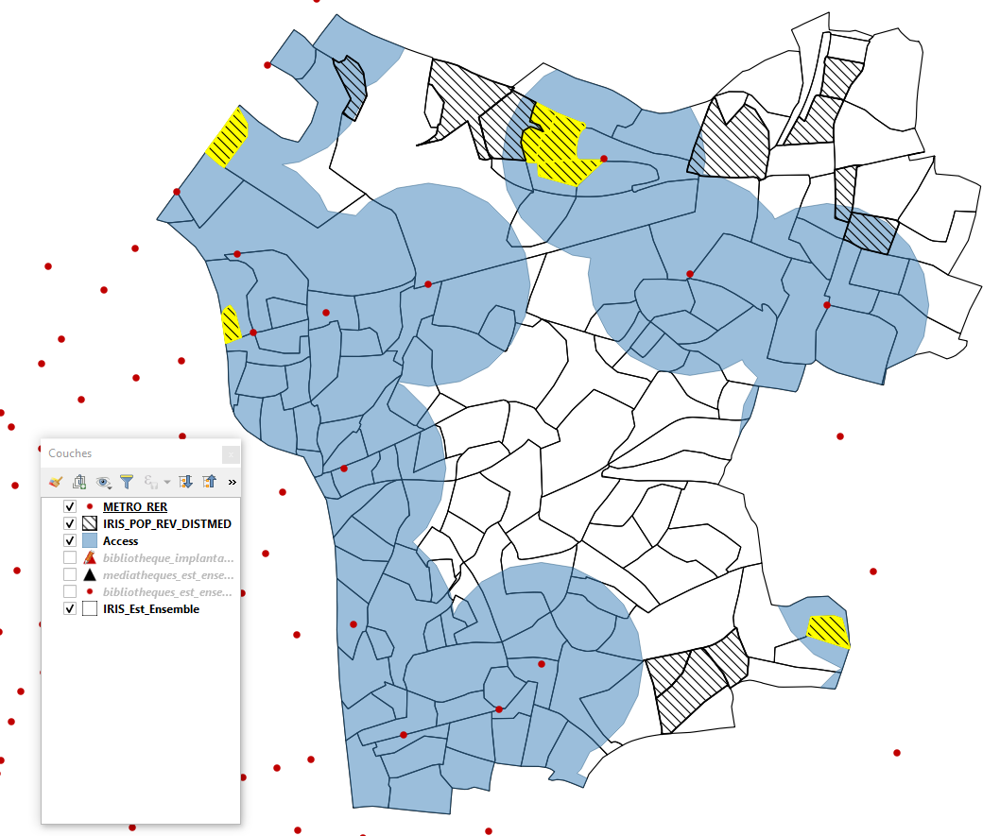
]

---
class:center

##         Eureka ! Vous avez trouvé !!        

.center[
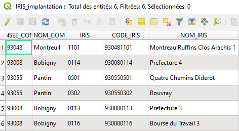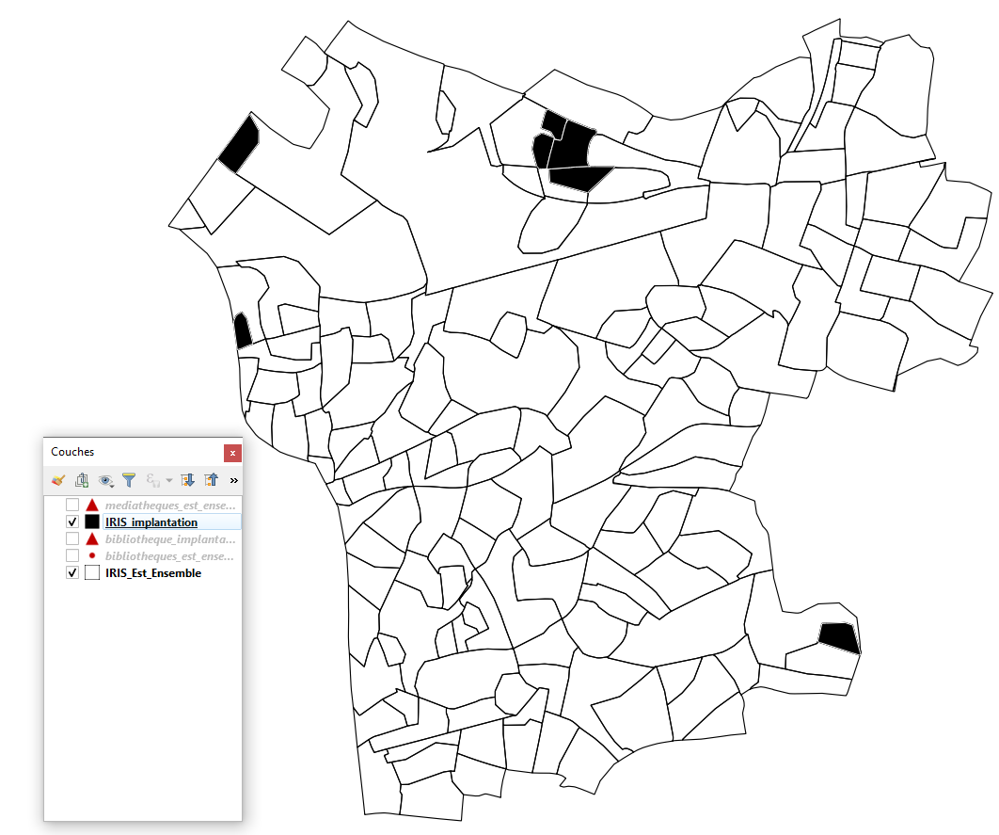
]


---
class: inverse middle center

#  Mettre en page une carte

Synthèse graphique des critères mis en oeuvre dans l'atelier

Éléments fondamentaux sur l'habillage cartographique

Créer une mise en page avec QGIS

---

## Comment arriver à cette carte de synthèse ?

.center[

]

---
.pull-left[

## Codes et conventions cartographiques : Aider à la mise en contexte
### Des éléments obligatoires

.medium[
- Un **titre** 
- Une **date**
- Une **légende**  
- Une **source** (un **auteur**)
- Une **échelle** 
- Une **orientation** (optionnel).  
 ]

### A avoir en tête...

.medium[
- Le choix des couleurs n'est pas anodin (considérations thématiques, statistiques, culturelles, etc.)
- Les éléments graphiques doivent être hiérarchisés. 
- La **légende** résume les éléments présentés sur la carte. Celle-ci peut être organisée par sous-titres de légende pour mieux contextualiser l'information que vous présentez (*par ex : équipements existants, caractéristiques socio-économiques, distances aux équipements*).
- Ne pas trop surcharger la carte : ne pas hésiter à produire des cartes plutôt qu'une. 
- N'hésitez pas à jouer sur la transparence, les hachures, ajouter des labels, des encadrés etc. pour améliorer la lisibilité de votre carte
]
]
 
.pull-right[

 .leg-fig[
 Des morts par milliers aux portes de l'Europe (Source : [Lambert, 2015](https://neocarto.hypotheses.org/1370))
 ]
 ]

---

## Mise en page dans QGIS

.center[

]

---

## Mise en page dans QGIS

.center[
<iframe width="840" height="472.5" src="https://www.youtube.com/embed/zuYOBoMVfrI" title="YouTube video player" frameborder="0" allow="accelerometer; autoplay; clipboard-write; encrypted-media; gyroscope; picture-in-picture" allowfullscreen></iframe>

.leg-fig[Une vidéo (source : La Minute QGIS) qui explique les fondements de la mise en page avec QGIS]
]


---

class: inverse middle center

#  Cartographie thématique dans QGIS

Éléments fondamentaux de sémiologie graphique

Typologies (catégories)

Cartes choroplèthes (valeurs graduées, discrétisations)


---

## Les Règles de la sémiologie graphique

.center[
Le **langage cartographique** a été théorisé par **Jacques Bertin** (1967).

.pull-left[

]

.pull-right[

]

« ***La graphique*** *utilise les propriétés de l'image visuelle pour faire apparaître les* ***relations*** *de* ***différence***, ***d'ordre*** et de ***proportionnalité*** entre les données ».
]

---

## Les variables visuelles (6 + 1)

.pull-left[
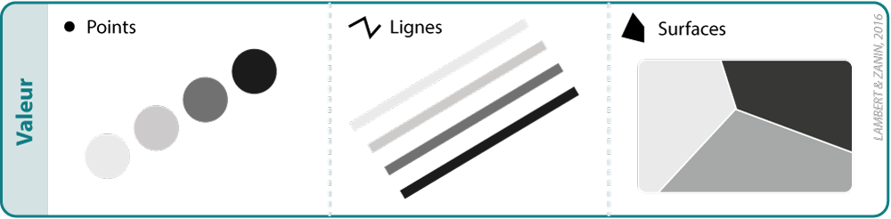
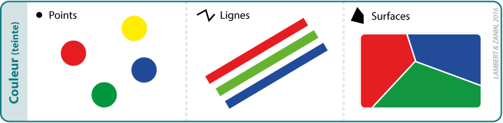
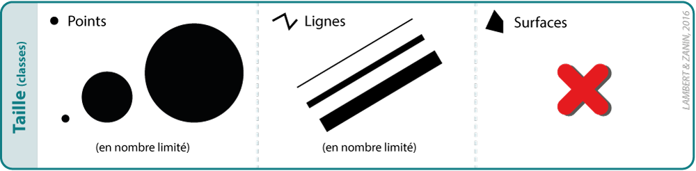
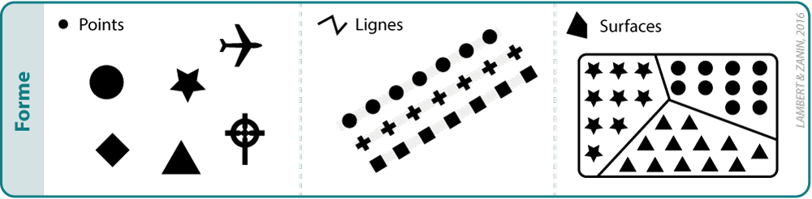
]

.pull-right[
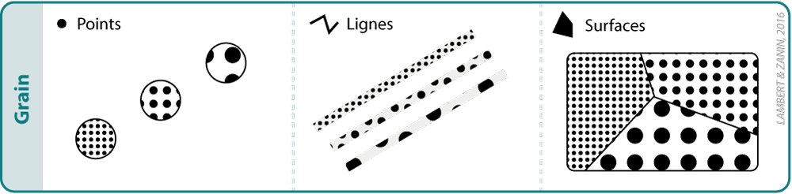
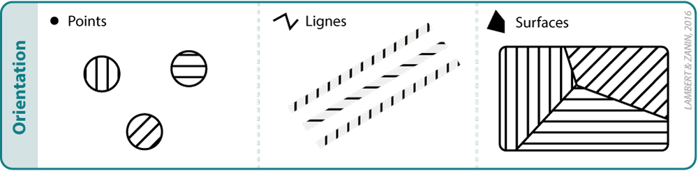
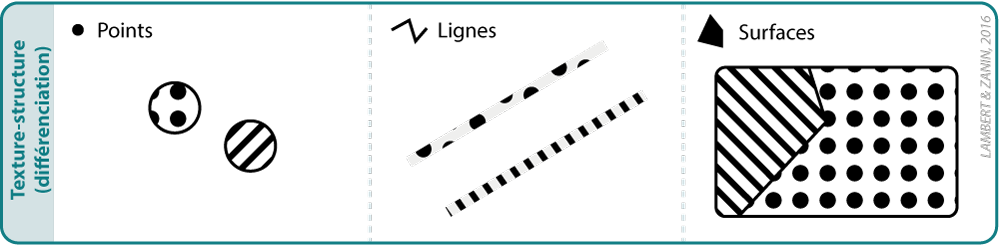

.leg-fig[Source : Manuel de cartographie : principes, méthodes, applications (Lambert, Zanin, 2016)]
]


---

## Les 3 propriétes des variables visuelles

.center[


.leg-fig[Source : Manuel de cartographie : principes, méthodes, applications (Lambert, Zanin, 2016)]
]

---

## Le lien entre données statistiques et variables visuelles

.center[


.leg-fig[Source : Manuel de cartographie : principes, méthodes, applications (Lambert, Zanin, 2016)
]
]

---

## Le lien entre données statistiques et variables visuelles

.center[

]

---

class: middle center

## Pour s'en convaincre...

.pull-left[
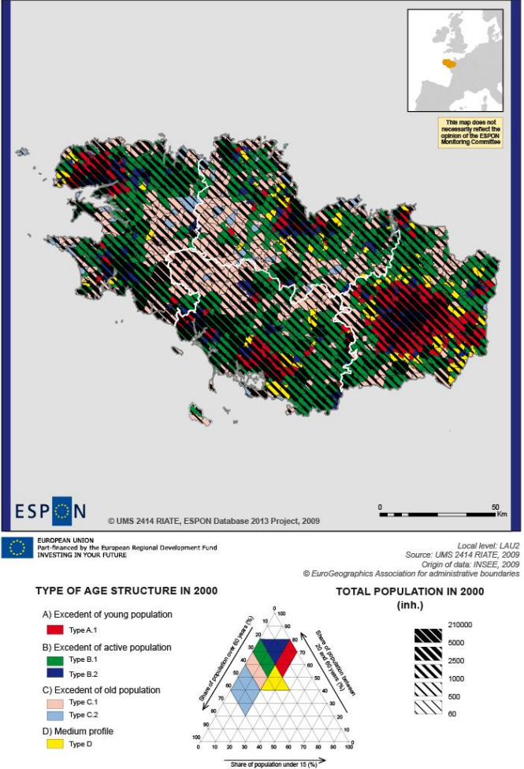
]

.pull-right[
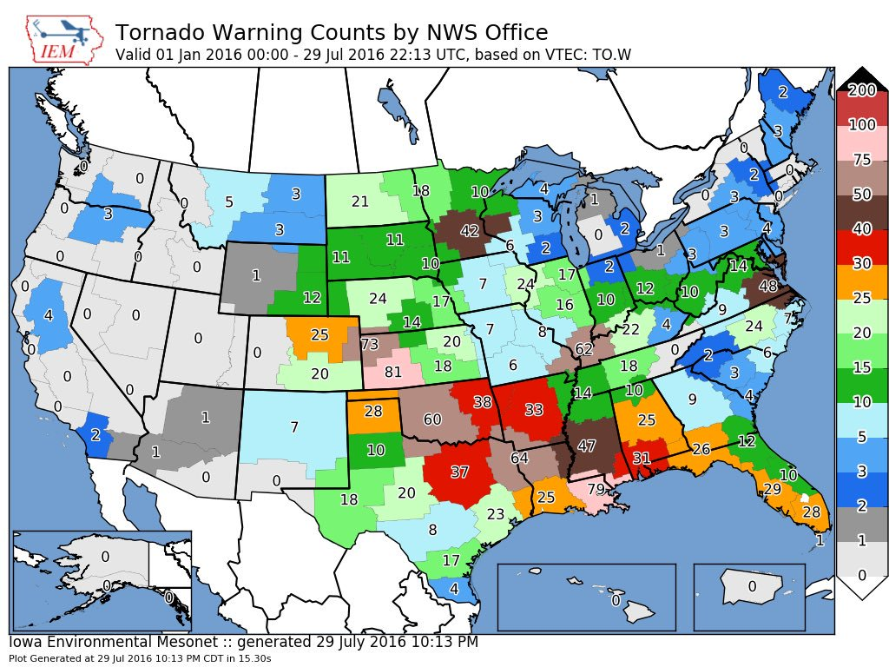
]

---

class: middle center

## Pour s'en convaincre...

.pull-left[

]

--

.pull-right[

]

---


.left-column[

## Variables quantitatives relatives : nécessité de discrétiser

La **discrétisation** est un mode de *simplification de l'information* (quantitative continue) pour la rendre intelligible.
]

.right-column[

]

---

## Deux objectifs

.pull-left[
### Conserver l'essentiel de l'information

* **Regrouper les valeurs qui se ressemblent** et qui sont différentes des autres ; donner des **seuils** qui ont du sens

* Conserver l'ordre de grandeur, la dispersion, la forme de la distribution

* Rendre compte de la **structure interne** du jeu de données
]

.pull-right[
### Transmettre l'information

* Limiter le nombre de classes

$$N(cl) = 1 + 3,3 \log10(N)$$

où $N$ est le nombre d'observations et $N(cl)$ le nombre de classes

* Faciliter la mémorisation

On a coutume de dire que 10 classes est un maximum.

* Construire une carte qui "raconte" quelque-chose !
]

---

## Quelques principes fondamentaux : >> Compromis entre **information** et **démonstration** 

* Les classes ne doivent **pas être vides**

* Les classes doivent couvrir l'**ensemble** de la distribution, et être **contiguës** (elles s'arrêtent là où une autre commence)

* Les classes doivent être  **distinctes** (les valeurs ne doivent pas se superposer)

* Les caractéristiques essentielles de la distribution de l'indicateur doivent être conservées, et permettre de perdre le moins d'information possible.

* Le nombre de classes doit être inférieur au nombre d'observations

---

## Les méthodes

.pull-left[


]

.pull-right[

]


---
class: inverse middle center

#  Pour aller plus loin...

Digitalisation

Statistiques spatiales

Cartes avec Magrit


---
## Digitalisation

.pull-left[
La digitalisation consiste à **numériser des points à partir d'un support visuel**, en attribuant à chaque point des coordonnées X et Y dans un système de projection quelconque.

Elle peut être réalisée avec deux méthodes : la digitalisation sur table à digitaliser ou directement sur un écran à partir d'une source numérisée. 

L'une des bases de départ des SIG est le plan cadastre digitalisé.

La digitalisation nécessite beaucoup de méthode, de pratique et de précaution (éviter les erreurs topologiques, chevauchement des polygones, etc.). Sa pratique ne sera pas abordée dans ce cours.]

.pull-right[
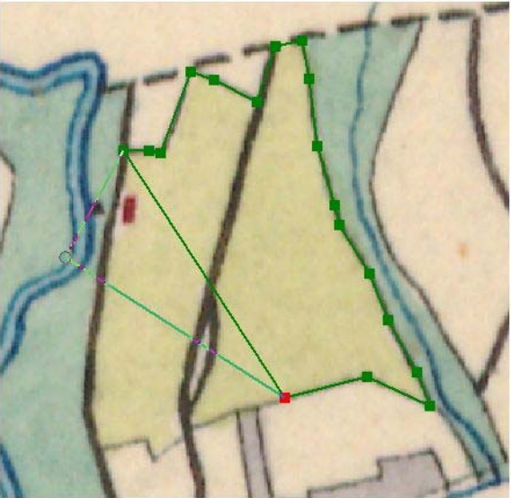

.leg-fig[
Pour en savoir plus, se reporter à [ce document](https://hal.inrae.fr/hal-02791101/document) sur la digitalisation et le géoréférencement de cartes d'État Major ou à [celui-ci]((https://oatao.univ-toulouse.fr/16382/1/Grel_16382.pdf)) pour une application à l'analyse du couvert forestier (source : INRA).
]
]

---

## Digitalisation

.center[
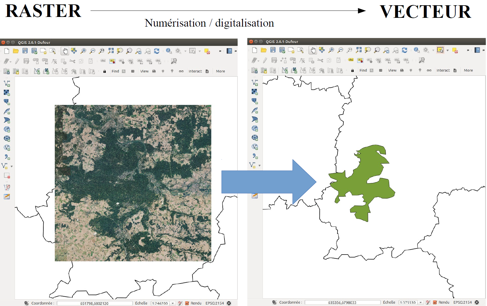
]

---

## Digitalisation

.center[
<iframe width="840" height="472.5" src="https://www.youtube.com/embed/uFaN-uDv90s" title="YouTube video player" frameborder="0" allow="accelerometer; autoplay; clipboard-write; encrypted-media; gyroscope; picture-in-picture" allowfullscreen></iframe>

.leg-fig[Une vidéo (source : CADGIS network) qui explique comment digitaliser une image géoréfrencée avec QGIS)]
]


---

## Quels logiciels pour quelle cartographie ?
.pull-left[
.center[**Logiciels de cartographie**

]

.medium[
* Environnement logiciel complètement **dédié à la création cartographique*</u>**.

* **Cartographie de base** (réflexion poussée sur les choix statistiques)

* Variété des méthodes de représentation

* **Partage et diffusion** (« une belle carte »).

* Interface épurée.]

.center[*Des logiciels dédiés pour la création cartographique*]
]

.pull-right[
.center[**Systèmes d'information géographique**


]

.medium[
* Gestion de **bases de données** géographiques.

* Visualisation et superposition des **couches** géographiques.

* **Géotraitements**.

* Cartographie de base (cartes choroplèthes, typologies, figurés proportionnels).]

.center[*Réaliser une carte thématique de qualité est possible dans un environnement SIG, mais ce n’est pas l’objet premier de ce type de logiciels*]
]

---

## Magrit

.center[.big[en ligne : [http://magrit.cnrs.fr](magrit.cnrs.fr)]]

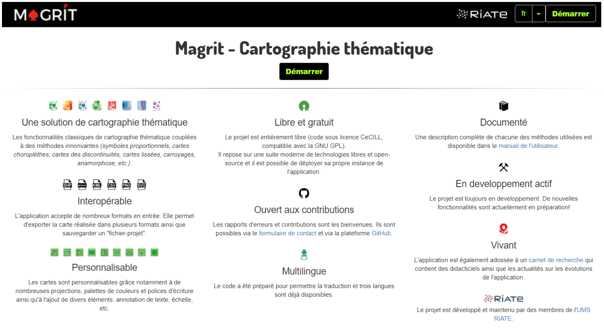

---

## L'interface Magrit


---
class: middle center inverse

# Ressources

---

class: center

## Systèmes d'information géographique


---

class: center

## Cartographie thématique


---
class: middle center

# A vous de jouer ! 

<center>


Présentation accessible et diffusable à l'adresse
[rysebaert.github.io/qgis_data_shs](https://rysebaert.github.io/qgis_data_shs) 

</center>

<br><br><br><br>

.pull-left[
.medium[
|                                                                                                            |                                   |
| :--------------------------------------------------------------------------------------------------------- | :-------------------------------- |
| `r icons::fontawesome("envelope")` | [ronan.ysebaert@cnrs.fr](mailto:ronan.ysebaert@cnrs.fr)       |
| `r icons::fontawesome("home")` | [riate.cnrs.fr](https://riate.cnrs.fr/) |
| `r icons::fontawesome("gitlab")` | [gitlab.huma-num.fr/rysebaert](https://gitlab.huma-num.fr/rysebaert)                         |
| `r icons::fontawesome("github")` | [@rysebaert](https://github.com/rysebaert) |


]]

.pull-right[
.medium[
|                                                                                                            |                                   |
| :--------------------------------------------------------------------------------------------------------- | :-------------------------------- |
| `r icons::fontawesome("envelope")` | [violaine.jurie@univ-paris-diderot.fr](mailto:violaine.jurie@univ-paris-diderot.fr)       |
| `r icons::fontawesome("home")` | [geoteca.u-paris.fr/](https://geoteca.u-paris.fr/) |

]]

