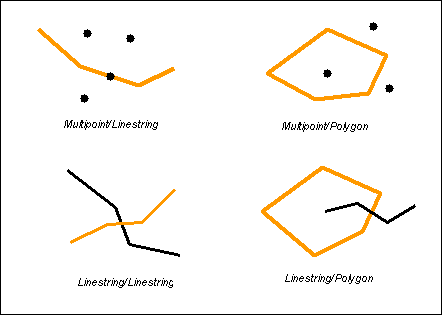
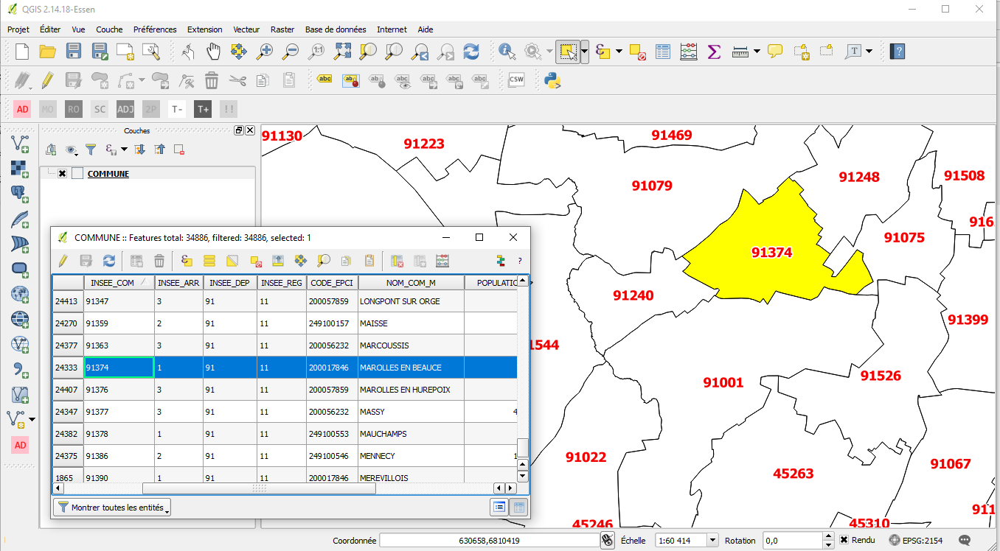

```{r setup, include=FALSE}
options(htmltools.dir.version = FALSE, crayon.enabled = TRUE)
knitr::opts_chunk$set(cache = FALSE,
                      fig.align='center',
                      message = FALSE,
                      warning = TRUE,
                      Encoding = "UTF-8")
# install.packages("devtools")
#devtools::install_github("gadenbuie/countdown")
#devtools::install_github("mitchelloharawild/icons")
library(countdown)
library(fontawesome)
```

class: inverse middle center

#  Déroulé

---
class: middle

.pull-left[

### Information géographique ?  (*9h - 9h45*)

- Les composantes de l'information géographique
- Où en trouver ?
- Formats de fichiers


### Systèmes d'Information Géographiques ? (*9h45 - 10h30*)

- Bref historique du développement des SIG
- Principes et fonctionnalités
- Principaux SIG
- Présentation de QGIS

#### Pause 10h30-10h45


]

.pull-right[.center-right[
###  Systèmes de coordonnées de référence, projections *(10h45 - 11h15)*

- Qu'est-ce qu'une projection ?
- Gérer les projections de ses couches géographiques dans QGIS 

### Manipulations de base (données vectorielles) *(11h15 - 12h30)*
- Import de données tabulaires
- Jointure attributaire
- Jointure spatiale
- Sélections attributaires

#### Déjeuner 12h30 - 13h30

]
]
---
class: middle

.pull-left[.center-left[
### Géotraitements *13h30 - 14h30*
- Présentation des géotraitements 
- Cas d'usage de géotraitements

### Mettre en page une carte 14h30 - 15h15
- Eléments fondamentaux sur l'habillage cartographique
- Créer une mise en page avec QGIS


#### Pause 15h15-15h30


]]

.pull-right[.center-right[

### Cartographie thématique dans QGIS 15h30 - 16h15
- Typologies (symboles catégorisés)
- Cartes choroplèthes (symboles gradués)

### Prolongements (non abordé dans le détail) 16h15 - 16h30

- Digitalisation
- Statistiques spatiales
- Quelques mots sur les outils dédiés à la cartographie thématique (Magrit)

### Moment d'échange

]]

---

.left-column[

## Atelier

*Implantation d'un équipement dans la Métropole Européenne de Lille.* 

.small[

4 critères proposés :
- Dans un IRIS jeune
- Dans un IRIS à faible revenu
- A une certaine distance d'une médiathèque existante
- Non loin du réseau de transport
]
]

.right-column[
<center>

</center>
]


---
## Télécharger les données de l'atelier

[https://github.com/rysebaert/qgis_data_shs](https://github.com/rysebaert/qgis_data_shs){target="_blank"}


data > data.zip > download

--- 


## Présentation des données à disposition - Couches géographiques

Les couches géographiques vectorielles (points, lignes, surfaces) au format shapefile (. shp), auxquelles sont souvent associées des attributs (ex : capacité des salles de cinéma).

.pull-left[
.medium[

**00_Équipements existants** 

- Bibliothèques et médiathèques, conservatoires de musique, missions locales pour l'emploi, salles de cinéma, équipements sportifs, issues de la plateforme open data de la région Ile-de-France, contient les localisations des équipements cibles pour votre étude 

- Hôtels à insecte, ruches, lieux d'écoute à oiseaux, issus de la plateforme collaborative OpenStreetMap. **Attention à la complétude des données** !

**01_Maillages territoriaux** :  IRIS, communes, EPCI et départements de la Métropole du Grand
Paris L’IRIS correspond au découpage territorial le plus fin en France. Ce sera aussi la brique
territoriale que vous utiliserez pour définir le lieu d’implantation (favorisez l’implantation de
l’équipement dans tel et tel IRIS…) IRIS…). Source : IGN en géographie du 1er janvier 2022).

]
]

.pull-right[
]


---

## Présentation des données à disposition - Couches géographiques

D’autres couches géographiques sont disponibles. Elles serviront à définir des critères d’implantation pour optimiser l’implantation de l’équipement que vous aurez choisi..

.medium[
.pull-left[


**BPE** : une sélection pour l’Ile de France de 44 équipements géolocalisés que nous avons jugé
adapté au regard des équipements à implanter. Source INEE, Base Permanente des
Équipements 2021

**Grille 200 m** : Des données socio économiques dans des carreaux réguliers de 200 mètres de
côté (le plus fin existant en France).

**Couverture du sol** : les parcs et jardins, les zones majoritairement dédiées aux fleurs, les
forêts et vergers de la Métropole du Grand Paris. Source : OpenStreetMap.

**Hydrologie** : Le réseau hydrologique principal d’Ile de France (Seine, Marne). Source
Plateforme Open Data de la Région Ile de France.

]

.pull-right[
**Transports** : Le réseau routier principal et le réseau ferré en Ile de Franc e (source :
OpenStreetMap ), ainsi que la localisation des arrêts de bus, de train, de tram et de métro
(source : Plateforme Open Data de la Région Ile de France.

]
]


---

## Présentation des données à disposition - Données statistiques

Fichiers au format Excel qui correspondent à des extraits pour la Métropole du Grand Paris des données officielles de
l’INSEE à l’échelle des IRIS et à la commune. 

.medium[
.pull-left[
**BPE** : Les mêmes équipements que ceux disponibles dans le dossier des couches
géographiques, mais agrégés à l’échelle des IRIS et des communes (e.g. nombre de médecins
généralistes par IRIS ou par commune). Source : INSEE, Base Permanente des équipements en
2021.

**Démo** : Population totale et structure par âge de la population. Source : INSEE.

**Socio-éco** : Structure de l’emploi (chômage, type de salariat, catégories socioprofessionnelles)
de la population de plus de 15 ans selon la situation d’activité  et niveaux de vie des ménages (pauvreté, revenus). Source : INSEE.

A partir de ces données, vous pourrez être en mesure de calculer des ratios d'intérêt : taux de chômage, part de la population jeune / âgée...
]

.pull-right[
]
]

---


## Présentation des données à disposition - Métadonnées

Les métadonnées apportent des éléments essentiels pour comprendre le contenu des ressources à votre disposition, leur origine et d'éventuelles informations sur leur utilisation. Leur consultation attentive est primordiale.

.medium[
Avec ces métadonnées, vous êtes en mesure de répondre aux questions suivantes : *Quelle est la signification du code "P18_POP0002" ? Quelle est son unité de mesure ? Qui a produit la donnée, quand ? Quelle est l'année de référence de l'indicateur ??*
]


---

class: inverse middle center

#  Information géographique ? 

- Les composantes de l'information géographique 
- Où en trouver ?
- Formats de fichiers


---

## Définition générale

.pull-left[
L'information géographique peut être définie comme «**l'ensemble de la description d'un objet et de sa position géographique à la surface de la Terre.**» (*Association Française pour l'Information Géographique*).

Toute information contenant une référence à un localisation, qu’il s’agisse d’un **point** précis du territoire, d’**une ligne** (route, frontière, cours d'eau) ou encore d’**une surface** (aire protégée, zone d’emploi, commune...) **a une dimension géographique**.

Entre **60 et 80%** de l’information que nous traitons possède une dimension géographique. (*Hahmann S. et Burghardt D., 2012, « How much information is geospatially referenced? Networks and cognition »*).
]

.pull-right[
Pour qu'une information soit considérée comme géographique, celle-ci doit précisément être **localisée dans l'espace**.    

La force des données géographiques est de pouvoir les croiser entre elles lorsqu'elles partagent un même socle géographique. On crée ainsi de la donnée à valeur ajoutée préparant la prise de décision (*Ministère de la Transition écologique et de la Cohésion des Territoires, 2019*).

]


---

## Les composantes de l'information géographique

```{r, echo = FALSE, out.width = "900px"}

library(DiagrammeR)

grViz("digraph dot {

  # a 'graph' statement
  graph [overlap = true]

  # several 'node' statements
  node [shape = rectangle, fontname = Helvetica, color='#9c2005', fontsize=13]
  d1

  node [shape = ellipse, fontname = Helvetica, color=black, fontsize = 9] // sets as circles
  d2; d3; d4
  
  d1 [label = 'Données géographiques'];
  d2 [label = 'Niveau sémantique'];
  d3 [label = 'Niveau géométrique'];
  d4 [label = 'Niveau topologique'];

  # several 'edge' statements
  d1->d2[arrowhead = none]
  d1->d3[arrowhead = none]
  d1->d4[arrowhead = none] 

}")
```


## Niveau géométrique

Le **niveau géométrique** d'un objet géographique correspond à **sa forme et sa localisation** sur la surface terrestre, exprimés dans un **système de coordonnées** explicite.
   

```{r, echo = FALSE, out.width = "900px"}
knitr::include_graphics('fig/geom.png')
```

---

## Niveau géométrique

Pour stocker, manipuler, analyser et représenter de l'information géographique, on distingue généralement 2 types de données : le raster et le vecteur. 

.pull-left[


### Le raster  

**c'est une image** (plan scanné, photographie aérienne, image satellitaire...) **localisée dans l'espace**. 

L’information géographique est alors stockée dans des cellules (pixel) contiguës généralement carrées. 

Chaque pixel **défini par une résolution** possède des valeurs qui peuvent être traitées et cartographiées. 

La manipulation des rasters nécessite des méthodes et des outils spécialisés.    
]

.pull-right[
<span style="color:#9c2005;font-weight:bold;">Raster</span>  

</div>

]

---

## Niveau géométrique

Pour stocker, manipuler, analyser et représenter de l'information géographique, on distingue généralement 2 types de données : le raster et le vecteur. 


### Le vecteur

.pull-left[
**Le format vectoriel** utilise le concept d'**objets géométriques (points, lignes, polygones) pour représenter (et stocker) des objets géographiques**. 

Les objets vectoriels ne ne pixellisent pas. On parlera néanmoins de **niveaux de généralisation** pour qualifier leur niveau de précision (parfois aussi appelée résolution).

Leur manipulation est simple et permet de puissants traitements.    

]


.pull-right[

<div class="centered">
<span style="color:#9c2005;font-weight:bold;">Vecteur</span>  

</div>
</div>

]


---

## Niveau géométrique

Pour stocker, manipuler, analyser et représenter de l'information géographique, on distingue généralement 2 types de données : le raster et le vecteur. 

```{r, echo = FALSE, out.width = "600px", fig.align='center'}
knitr::include_graphics('fig/raster_vecteur_2.png')
```

---

## Niveau topologique

Le niveau topologique  **d'un objet géographique se déduit du niveau géométrique**. Il correspond aux relations éventuelles avec d'autres objets ou phénomènes (ex : contiguïté entre deux bâtiments).


```{r, echo = FALSE, fig.align='center', out.width = "500px"}

```


---

## Niveau sémantique

**Il s'agit de l'ensemble des informations relatives à un objet géographique, qui le décrivent et le caractérisent**. Elles sont souvent nommées données attributaires.
<br>

```{r, echo = FALSE, out.width = "800px", fig.align='center'}
knitr::include_graphics('fig/attribut.gif')
```


---

## Niveau sémantique

**Il s'agit de l'ensemble des informations relatives à un objet géographique, qui le décrivent et le caractérisent**. Elles sont souvent nommées données attributaires.
<br>


```{r, echo = FALSE, out.width = "700px", fig.align='center'}

```

---

## Acquisition de l'IG : Relevés de terrain

Le **levé topographique avec théodolite** permet de relever précisément l'étendue et la topographie d'un territoire.        
Le **relevé de point GPS** permet de collecter la localisation précise d'objet dans l'espace.</p>

```{r image_grobs, fig.show = "hold", out.width = "40%", fig.align = "default"}

knitr::include_graphics('fig/triangualtion.png')
knitr::include_graphics('fig/gps.jpg')
```

---

## Acquisition de l'IG : télédétection (image satellite)

**La télédétection comprend l’ensemble des procédés et techniques qui permettent d'acquérir à distance des informations sur les objets terrestres**, en utilisant les propriétés des ondes électromagnétiques émises ou réfléchies par ces objets. La collecte de données de télédétection est réalisée par des avions ou par des satellites. 

**Les informations géographiques collectées par télédétection sont stockées en format RASTER**. Le traitement de ce genre de données nécessite l'**utilisation de logiciels spécialisés (Envi, Erdas, Idrisi...).**.    


```{r, echo = FALSE, out.width = "830px",fig.align='center'}
knitr::include_graphics('fig/teledec.jpg')
```


---

## Acquisition de l'IG : Photogrammétrie et LiDAR

**Ces deux technologies permettent de déterminer la forme, les dimensions, la position dans l'espace d'un objet**. Elles sont très utilisées pour les levés topographiques, mais aussi pour de nombreuses autres applications.


```{r, echo = FALSE, out.width = "800px",fig.align='center'}
knitr::include_graphics('fig/photogrametrie.jpg')
```

<p style="line-height:1.3;font-size:10pt;">La photogrammétrie est une technologie passive. Elle est basée sur des images transformées de la 2D en modèles cartométriques 3D. Elle utilise le même principe que les yeux humains pour établir une perception de profondeur. La limitation de la photogrammétrie est qu’elle ne peut générer que des points basés sur ce que le capteur de la caméra peut voir.</p>      

<p style="line-height:1.3;font-size:10pt;">Lidar qui signifie Light Detection and Ranging est une technologie basée sur des faisceaux laser. Il tire au laser et mesure le temps qu’il faut pour que la lumière revienne. C’est ce qu’on appelle un capteur actif car il émet sa source d’énergie plutôt que de détecter l’énergie émise par les objets au sol.</p>


---

## Acquisition de l'IG : Digitalisation

**La digitalisation consiste à numériser des points à partir d'un support visuel**, c'est à dire à attribuer à chaque point des coordonnées X et Y dans un système quelconque. Cela revient le plus souvent à **créer des objets géographiques vectoriels à partir d'information géographique en mode RASTER (ex : photo aérienne)**. 

```{r, echo = FALSE, out.width = "930px",fig.align='center'}
knitr::include_graphics('fig/digitalisation2.PNG')
```


---

## Acquisition de l'IG : Recensements et enquêtes 

**Les recensements de population et les enquêtes** contiennent la plupart du temps une dimension géographique. (ex : département de naissance, commune d'habitation, pays d'émigration...). Elles sont d'ailleurs **généralement diffusées par entités (objets) géographiques (IRIS, commune, département, région...)**.


.pull-left[

<div class="centered">

</div>

<p style="line-height:1.3;font-size:13pt;">Les données issues de recensements et d'enquêtes sont le plus souvent des données attributaires d'objets géographiques !</p>

]

.pull-right[

Cette carte représente des données issues du RGP 2006 et fournies à l'échelle des communes françaises. 

Il suffit de les mettre en relation avec les polygones des limites communales françaises pour les transformer en données attributaires d'objets géographiques.

]

---
## Acquistion de l'IG : Géolocalisation / GPS

Un exemple d'une application de suivi de bouquetins mis en oeuvre par le [Parc National du Mercantour](https://bouquetin.mercantour-parcnational.fr).

```{r, echo = FALSE, out.width = "900px",fig.align='center'}
knitr::include_graphics('fig/bouquetins.PNG')
```

---

## Et... le Geoweb !

Le mot **Geoweb désigne le mélange du Web 2.0 (ou web participatif) avec tout ce qui est lié à l'information géographique**.

Les **SIG grand public** (ex : OpenStreetMap), les **bases de données participatives** ayant une dimension géographique (ex : Le boin coin) et les **applications** utilisant la géolocalisation (ex : Twitter) sont des outils du Geoweb.

```{r image_grobs2, fig.show = "hold", out.width = "45%", fig.align = "default"}

knitr::include_graphics('fig/cat-map.png')
knitr::include_graphics('fig/gps2.jpg')

```


---

## Les sources de l'IG (France)

### Un incontournable : l'Institut Géographique National

- [Géoservices de l'IGN](https://geoservices.ign.fr/telechargement)  
- [Géoportail (portail nationnal d’accès à l’information géographique de référence)](https://www.geoportail.gouv.fr/)    


### Les organismes publics et les collectivités territoriales

- [Bureau de Recherches Géologiques et Minières (BRGM)](http://infoterre.brgm.fr)          
- [Agence de l'Environnement et de la Maîtrise de l'Energie (ADEME)](https://data.ademe.fr/)          
- [Office national des forêts](https://www.onf.fr/onf/connaitre-lonf/+/35::open-data-pour-mieux-partager-les-donnees-forestieres.html)
- [Institut d'aménagement et d'urbanisme de la région Île-de-France (IAU-idf)](http://data.iau-idf.fr/)             
- [Portail Open Data de la région Ile-de-France](https://data.iledefrance.fr/pages/home/)     
- [Mairie de Paris (Paris Data)](https://opendata.paris.fr)           
- ...


---

## Les sources de l'IG (international)

- [Eurostat - GISCO](https://ec.europa.eu/eurostat/web/gisco/geodata/reference-data)
- [Copernicus](https://land.copernicus.eu/)
- [Natural Earth](https://www.naturalearthdata.com/)
- [World Pop](https://www.worldpop.org/)
- [OpenStreetMap (OSM)](https://www.openstreetmap.fr/), données accessibles via des API comme [Overpass-turbo](http://overpass-turbo.eu/)
- [Global Administrative Boundaries (GADM)](https://gadm.org/)


---

## OpenStreetMap

OpenStreetMap (OSM) est un projet de cartographie lancé en 2004 qui a pour but de **constituer une base de données géographiques libre du monde** en utilisant le système GPS et d'autres données libres et ouvertes. **Tout le monde peut y contribuer et/ou utiliser les données**.

```{r, echo = FALSE, out.width = "960px",fig.align='center'}
knitr::include_graphics('fig/osm.png')
```


---

## OSM, la plateforme collaborative de l’IG libre

```{r, echo = FALSE, out.width = "800px",fig.align='center'}
knitr::include_graphics('fig/barsOSM.png')
```

<p style="line-height:1.3;font-size:11pt;font-style:italic;text-align:center;">Densité des bars à Paris avec des données OSM ([T.Giraud, R Geomatic](https://rgeomatic.hypotheses.org/1244) ) </p>

---

## Questions centrales pour rechercher de l'IG

- **Quel est mon espace d'étude ?** *Monde ? Europe ? France ? Ile-de-France ? ...*<br>

- **Quel est l'objet géographique sur lequel je travaille ?** *Pays ? Régions ? Communes ? Parcs naturels ? Rivières ? ...* <br>

- **Quelle est la thématique que je souhaite explorer ?** *Environnement ? Démographie ? Transport? ...* <br>

- **Quel est le format de données que je recherche ?** *Géométries ? Données statistiques à joindre à mes couches géographiques ?* <br>

- **Données conventionnelles ou non ? Quelle période ?**

</br>

D'un point de vue général, privilégiez l'usage de ressources gérées et maintenues par des **institutions**. 

---

## L'importance des métadonnées

.pull-left[

Avec la massification des données mises à disposition, **la documentation structurée** des données est essentielle. Elle facilite l'accès au contenu informationnel d'une ressource informatique. 

**Une métadonnée est littéralement une donnée sur une donnée. C'est un ensemble structuré d'informations décrivant une ressource** (pas spécifique à l'information géographique).

Les métadonnées synthétisent des informations élémentaires et facilitent la compréhension et l'utilisation des données : **Auteur, date de création/modification, technique de collecte, qualité, taille du fichier, unité de mesure, droits d'utilisation...**.

]

.pull-right[
```{r, echo = FALSE, out.width = "700px",fig.align='center'}
knitr::include_graphics('fig/meta.png')
```

Consulter attentivement les métadonnées associées aux données géographiques est primordial.
]


---

## Format de stockage de données vectorielles

Il existe **plusieurs formats de stockage de l'information géographique**. Les plus connus sont :</p>

.medium[
.pull-left[
- **Shapefile (.shp)** : ou « fichier de couches » est le format de fichier **historique** des (SIG). Initialement développé par ESRI pour ses logiciels commerciaux, il est devenu un standard de facto, et est utilisé par un grand nombre de logiciels libres.

- **Geographic JSON (.geojson)** : Un format ouvert d'encodage d'ensemble de données géospatiales simples utilisant la norme JSON (JavaScript Object Notation). Il permet de décrire des données de type point, ligne, chaîne de caractères, polygone et d'y ajouter des attributs d'information qui ne sont pas spatiaux. Le format GeoJSON, contrairement à la majorité des standards de systèmes d'informations géographiques, n'est pas écrit par l'Open Geospatial Consortium, mais par un groupe de travail de développeurs au travers d'internet. 
]


.pull-right[

- **GeoPackage (.gpkg)** : Un format de données géospatiales raster ou vecteur, ouvert, non propriétaire, non lié à un système d'exploitation. Conçu pour être aussi léger que possible, il permet notamment de stocker plusieurs couches géographiques dans un seul et même fichier. 


- **Keyhole Markup Language (.kml)** : ou « langage à base de balises géolocales », est fondé sur le formalisme XML et destiné à la gestion de l'affichage de données géospatiales dans les logiciels de SIG. Depuis 2008, le format est normalisé par l'Open Geospatial Consortium. Il s'agit, avec le .gpx, du format classique de données produites par GPS. 

]


]

---


## Le shapefile


Son extension est classiquement **.shp**, mais il est toujours accompagné de deux autres fichiers de même nom, mais aux extensions suivantes :


.pull-left[
- <span style="font-size:13pt;line-height:1.3;color:#9c2005;">**.dbf**</span><span style="font-size:13pt;line-height:1.3;"> : fichier qui contient les données attributaires.</span> 
- <span style="font-size:13pt;line-height:1.3;color:#9c2005;">**.shx**</span><span style="font-size:13pt;line-height:1.3;"> : fichier qui stocke l'index de la géométrie.</span>   


<p style="font-size:13pt;line-height:1.3;">D'autres fichiers peuvent être également fournis :</p>   
- <span style="font-size:12pt;line-height:1.3;color:#9c2005;">**.sbn et .sbx**</span><span style="font-size:13pt;line-height:1.3;"> : index spatial des formes.</span> 
- <span style="font-size:13pt;line-height:1.3;color:#9c2005;">**.prj**</span><span style="font-size:13pt;line-height:1.3;"> : information sur le système de coordonnées.</span> 
- <span style="font-size:13pt;line-height:1.3;color:#9c2005;">**.shp.xml**</span><span style="font-size:13pt;line-height:1.3;"> : métadonnées du shapefile.</span> 
- <span style="font-size:13pt;line-height:1.3;">Et bien d'autres encore : .sbn, .sbx, .fbn,.fbx, .cpg, .atx... </span> 
]


.pull-right[

]


---

## Format de stockage des données attributaires

**Les données attributaires peuvent être stockées dans des formats très différents**. Les SIG acceptent d'ailleurs de nombreux formats (.txt, .csv, .dbf, .xls, .xlsx, .ods, ...) en entrée pour importer des données attributaires. Ce n'est pas l'aspect le plus important.

**L'identifiant géographique est en revanche primordial**. Il permet de faire le lien avec les géométries, et ainsi les enrichir.


```{r, echo = FALSE, out.width = "635px",fig.align='center'}
knitr::include_graphics('fig/jointure.png')
```

<p style="font-size:12pt;line-height:1.3;font-style:italic;">Dans le cas ci-dessus, on utilise l'attribut (identifiant) NomC pour joindre la couche géographique (fichier shapefile) et la table d'attributs (fichier csv par exemple).</p>


---


## Données attributaires fournies par l'INSEE


L'INSEE et l'IGN utilisent des identifiants identiques pour qualifier les objets géographiques de référence du territoire français. 


.pull-left[

]

.pull-right[

]

<p style="font-size:10pt;line-height:1.3;font-style:italic;">Dans les fichiers de données INSEE (à gauche) l'attribut qui sert d'identifiant unique pour les communes est nommé CODGEO (code INSEE des communes). La couche géographique des communes fournies par l'IGN (à droite), comportent le même identifiant unique nommé INSEE_COM** </p>


---

## Atelier

Partons en quête d'informations géographiques ! Nous tentons de retrouver :

Objectifs :

- La **dernière version "officielle" du découpage administratif** du territoire français (IGN). 
- Extraire les **parcs et jardins** de Paris avec **OpenStreetMap** et l'API [overpass-turbo](http://overpass-turbo.eu/). 
- Identifier les couches géographiques de **couverture du sol** mises à disposition pour les **villes Européennes** par l'institut **Copernicus**. 


Indice : pensez à spécifier dans votre recherche des mots-clés relatifs :

- Au format des données souhaité (shapefiles)
- A la couverture géographique désirée (France)
- A l'objet géographique recherché.
- A la source de données désirée.


---

## Atelier / Solution (1)


.pull-left[

[La dernière version "officielle" du découpage administratif du territoire français](https://geoservices.ign.fr/adminexpress) : Admin express est dédié à cela. Pour cela il faut passer un peu de temps dans l'outil d'accès aux géoservices de l'IGN pour s'y retrouver ! 

Cette ressource permet d'accéder à tous les découpages géographiques officiels, depuis la commune à la région, et à différentes versions de découpage géographique.
]

.pull-right[
```{r, echo = FALSE, out.width = "800px",fig.align='center'}
knitr::include_graphics('fig/admin_express.PNG')
```
]

---

## Atelier / Solution (2)

Il est au préalable important de définir la clé-valeur de l'objet OpenStreetMap désiré grâce au [wiki OpenSteetMap](https://wiki.openstreetmap.org/wiki/Tag:leisure%3Dpark). Ensuite d'effectuer la requête de l'objet désiré via l'API overpass-turbo. 

.pull-left[


]

.pull-right[

]

---

## Atelier / Solution (2)

On peut ensuite exporter les résultats qui répondent à cette requête. 

```{r, echo = FALSE, out.width = "800px",fig.align='center'}
knitr::include_graphics('fig/osm_3.PNG')
```


---

## Atelier / Solution (3)

L'institut Copernicus [met à disposition](https://land.copernicus.eu/local/urban-atlas) des couches géographiques pour 788 villes européennes (en 2018) de couverture du sol. On peut retracer l'évolution des modifications d'occupation du sol entre 2006 et 2018. Il faut se créer un compte pour accéder aux données.

```{r, echo = FALSE, out.width = "800px",fig.align='center'}
knitr::include_graphics('fig/copernicus.PNG')
```


---

class: inverse middle center

#  Immersion dans l'univers des SIG

Historique du développement des SIG

Principes et fonctionnalités

Outils SIG

Présentation de QGIS

---

## Londres, 1854

.pull-left[
**John Snow** est un médecin britannique. Ses travaux sur la **propagation du choléra** dans le quartier de Soho à Londres en 1854 sont reconnus dans l'histoire de l'**épidémiologie moderne** et de l'**analyse spatiale**.

.left-column[
<br>

]

.right-column[
.medium[
Il va identifier la **cause de l'épidémie** en utilisant un procédé simple, mais innovant, qui repose sur le principes de fonctionnement des SIG : **superposer deux couches géographiques différentes** :

- **Les lieux de résidence des décès liés à l'épidémie**.
- **Les pompes à eau** du quartier.]]  

.medium[
<br><br><br><br><br><br><br><br><br><br><br><br><br>
Il déterminera que la **transmission s'effectue par l'eau** et **identifiera le foyer de contamination** : la pompe de Brewer Street.]
]

.pull-right[

.leg-fig[**Carte de John Snow** avec la localisation des lieux de résidence des personnes décédées du choléra.]
]

---

## Londres, 1854

.pull-left[
**John Snow** est un médecin britannique. Ses travaux sur la **propagation du choléra** dans le quartier de Soho à Londres en 1854 sont reconnus dans l'histoire de l'**épidémiologie moderne** et de l'**analyse spatiale**.

.left-column[
<br>

]

.right-column[
.medium[
Il va identifier la **cause de l'épidémie** en utilisant un procédé simple, mais innovant, qui repose sur le principes de fonctionnement des SIG : **superposer deux couches géographiques différentes** :

- **Les lieux de résidence des décès liés à l'épidémie**.
- **Les pompes à eau** du quartier.]]  

.medium[
<br><br><br><br><br><br><br><br><br><br><br><br><br>
Il déterminera que la **transmission s'effectue par l'eau** et **identifiera le foyer de contamination** : la pompe de Brewer Street.]
]

.pull-right[

.leg-fig[Carte de John Snow revue par Mark Monmonnier, 1996]
]


---

## Un précurseur des applications SIG

.center[Si John Snow avait utilisé un système d'information géographique...]

.pull-left[

]

.pull-right[

]

---

## Historique

**Le concept de Système d'Information Géographique s'est développé et a évolué avec le développement de l'informatique**. 

- **1950 – 1970** : début de l’informatique, premières cartographies automatiques.

- **1970 - 1980** : diffusion des outils de cartographie automatique/SIG dans les organismes d’État (armée, cadastre, services topographiques…

- **1980 - 1990** : croissance du marché des logiciels SIG, développement des applications SIG.

- **Depuis les années 90 et 2000** : diffusion de SIG plus légers, libres, d'applications web et banalisation de l’usage de l’information géographique (cartographie en ligne, calcul d’itinéraires, utilisation de la géolocalisation, base de données participatives.

.medium[
**Les SIG sont aujourd’hui utilisés dans de nombreux domaines** : 
*Agriculture, aménagement du territoire, architecture, assurances & banque, automobile, BTP, cadastre, découpage électoral, défense, démographie, eau et assainissement, électricité, enseignement, environnement, épidémiologie, équipement, géologie, géomarketing, gestion de flotte, gestion de patrimoine, gestion de réseaux, gestion des sols, Internet, immobilier, implantation de commerces, ingénierie logistique, optimisation de parcours, pétrole et gaz, publicité, recherche, ressources naturelles, santé, services d'urgence, télécommunications, tourisme,...* ]

---

## Définition

**Système informatique de matériels, de logiciels, et de processus conçus pour permettre la collecte, la gestion, la manipulation, l'analyse, la modélisation et l'affichage de données à référence spatiale** afin de résoudre des problèmes complexes d'aménagement et de gestion. (*Comité fédéral de coordination inter-agences pour la cartographie numérique, 1988*)</p> 

.pull-left[
La pratique des logiciels de SIG est un métier : **sigiste**. 

Le SIG est également **l'outil de référence des géomaticiens**. 

La géomatique est une discipline issue de la géographie et des développements de l'informatique (**GEO**graphie + infor**MATIQUE**). 

La géomatique regroupe l'ensemble des outils et méthodes permettant d'acquérir, de représenter, d'analyser et d'intégrer des données géographiques.
]

.pull-right[

]

---

## Principes et fonctionnalités

Les logiciels SIG permettent de **superposer des couches géographiques de différentes natures, dans un même système de projection**. Cela permet de réaliser de puissantes **analyses croisées**.

.pull-left[
<br><br><br>
Ces logiciels permettent d'opérer sur l'intégralité de la chaîne de traitement des données géographiques :

- **Digitalisation** (Saisir et abstraire)  
- **Stockage** et **gestion** (Base de données)    
- **Analyse** (Géotraitements, analyse spatiale)       
- **Représentation** (Cartographie)   
]

.pull-right[

]

---

## Principes et fonctionnalités

.pull-left[
<br><br><br>
Pour **modéliser la réalité**, on superpose plusieurs couches d'information géographique, **vecteur et/ou raster**.

Chaque **couche géographique contient des objets de même type** (adresses, parcelles, routes, bâtiments, cours d'eau, limites administratives...)

**Une couche géographique = un type d'objet géographique** : point, ligne, polygone ou image géoréférencée (raster).
]

.center[
.pull-right[

]]

---

## Principes et fonctionnalités

Un SIG permet de travailler sur les trois composantes de l'information géographique :

.pull-left[
.medium[
### Niveau sémantique
**Les attributs** qui décrivent les objets géographiques (ex : libellé, population, catégorie) **peuvent être modifiés, supprimés, ajoutés et surtout requêtés** : Il est possible de sélectionner des objets géographiques **en fonction de la valeur des attributs**.

### Niveau géométrique
Possibilité de **modifier la localisation** et/ou **la forme** des objets géographiques, de **calculer des surfaces**, **des distances**, ou encore des **zones tampons**, de **convertir des polygones en point**... Les opérations possibles sur la géométrie des objets sont multiples.
]
]

.pull-right[
.medium[
### Niveau topologique
Une fonctionnalité puissante qui consiste à **requêter des objets par localisation**, c'est à dire **en fonction de leur positionnement par rapport à d'autres objets**. Pour cela on peut utiliser une série d'opérateur, exemple : *Contient*, *Croise*, *Intersecte*, *Est à l’intérieur*...]

.center[


.small[
Ex : *Sélection d'objets géographiques ponctuels situés à une certaine distance (euclidienne) d'autres objets géographiques ponctuels*
]]]

---

## Principaux logiciels SIG

.center[

]

---

## Installez QGIS ! 

Pour travailler depuis chez vous, nous vous conseillons d'installer QGIS sur votre ordinateur personnel *(https://www.qgis.org/fr/site/forusers/download.html)*. Choisissez la version long terme (la plus stable). 

.center[

]

---

## Les outils : Logiciels d'analyse de données

Les logiciels d'analyse de données (R, SAS, SPSS, etc.) permettent de traiter, explorer et analyser les données disposant d'une dimension géographique, grâce à du code et des fonctions.


```{r, echo = FALSE, out.width = "590px", fig.align='center'}
knitr::include_graphics('fig/rstudio.png')
```

---


## Les outils :  Systèmes d'Informations Géographiques (SIG)

Les SIG sont l'ensemble des outils informatiques permettant de **collecter, stocker, gérer, manipuler, analyser, modéliser et représenter de l’information géographique**. 

.center[

]

---

## Les outils :  Logiciels de cartographie thématique

Bien que les SIG permettent la réalisation de représentations cartographiques, il ne s'agit pas de leur principale fonctionnalité et réaliser une carte peut s'avérer fastidieux... Si l'on souhaite rapidement réaliser une carte qui respecte l'ensemble des règles de la cartographie, **il est plus simple d'utiliser un logiciel spécialisé**.


```{r, echo = FALSE, out.width = "500px",fig.align='center'}
knitr::include_graphics('fig/Magrit.png')
```

---

## Ouvrir QGIS

**Lancez l'application QGIS Desktop**, comme vous le feriez avec n'importe quel logiciel :

<br><br>
.center[

]

---

## Organiser son travail

L'utilisation d'un SIG nécessite de la **rigueur méthodologique**, car l'on se retrouve vite submergé de fichiers. Vous devez donc :

- Travailler en **projet**.

- Utiliser des **intitulés de fichiers** intelligibles.

- Ranger vos données en utilisant des **sous-répertoires**.

- Stocker votre projet **sur une clef USB** (et faire une copie). 


Commencez par **créer votre répertoire de travail** (sur une clé USB de préférence). Téléchargez les données du Moodle et décompressez-les dans votre répertoire de travail. **Ouvrez Qgis et créez un nouveau projet**. *(Projet/enregister/)*

---

## Organiser son projet

Dans votre répertoire de travail, créez une architecture de sous-répertoires qui vous paraît cohérente et dans laquelle vous vous y retrouverez facilement. Ne gardez que les fichiers qui vous seront utiles !</p>

.center[

]

---
.left-column[
## L'Interface de QGIS

.medium[
1.  **Menu principal**

2.  **La barre d’outils** : Raccourci vers les outils les plus récurrents utilisés

3.  **Barre d’outils latérale** : Par défaut, raccourci vers les options d'import de données.

4.  **La barre d’état** : Niveau de zoom, échelle, coordonnées géographiques

5.  **Les panneaux** : Explorateur, listing des couches géographiques chargées...

6.  **Le canevas de carte** : visualisation des couches géographiques.  
]
]

.right-column[


]

---

.left-column[
## Importer une couche vectorielle

**Pour importer des données facilement**, utilisez la barre d'outil latérale.

Choisissez l'icône **en fonction du type de données à importer** (Vecteur, raster, csv...).

Choisissez la couche *IRIS* (Couches Géo > 01_Découpages_territoriaux)
]

.right-column[


.center[
Importez la couche **IRIS** dans QGIS
]
]

---

.left-column[
## Sélection par attributs

Il est possible de sélectionner les objets géographiques à partir de leur **table attributaire**

1. Clic droit sur la couche IRIS
2. Ouvrir la table d'attribut
3. Sélectionner les entités en utilisant une expression 
]


.right-column[

.center[
Sélectionnez uniquement les IRIS de **votre espace d'étude**
]
]

---

.left-column[
## Sélection par attributs

Il est possible de sélectionner les objets géographiques à partir de leur **table attributaire**


1. Clic droit sur la couche IRIS
2. Ouvrir la table d'attribut
3. Sélectionner les entités en utilisant une expression 
4. Choisir son espace d'étude (champ LIB_EPCI)
]

.right-column[


.center[
Sélectionnez uniquement les IRIS de **votre espace d'étude**
]
]


---
.left-column[
## Export d'une sélection


1. Suite à la précédente sélection, clic droit sur la couche IRIS
2. Sélectionner "Exporter, sauvegarder les entités sous...
3. Sélectionner **l'emplacement de votre dossier de travail** et **nommer** la couche. Choisissez un format shapefile ou GEOJSON. 
4. Sélectionner l'option **N'enregistrer que les entités sélectionnées**

]

.right-column[

.center[
**Exportez les IRIS** qui composent votre espace d'étude
]
]

---
.left-column[
## Gestion de la projection

**La projection** d'une couche géographique **est indiquée dans ses propriétés générales**.

.medium[
Les couches géographiques s'affichent automatiquement dans le système de projection de la première couche géographique importée.

Pour modifier le système de projection, il suffit d'enregistrer une nouvelle version de la couche géographique concernée dans le système de projection souhaité (clic-droit sur la couche, enregistrez-sous...).
]
]

.right-column[


Importez la couche géographique contenant vos **équipements d'intérêt**, observez sa **projection** et enregistrez la dans la même projection que celle de vos **IRIS**.

]

---

.left-column[

## Quelques options utiles

**Pour sélectionner et zoomer**, utilisez les différentes fonctionnalité de la barre d'outils.

.medium[
Les icônes *loupe* permettent de **zoomer/dé-zoomer**. Il est également possible d'utiliser la roulette de votre souris. **L'outil de sélection offre plusieurs solutions** : sélection par clic, par polygone, à main levée...

]
]

.right-column[
.center[

]
]

---
.left-column[
## Gestion de l'affichage graphique

Pour changer l'ordre d'affichage des couches, il suffit de les faire glisser à la position de son choix, comme des onglets dans un navigateur Web.

Pour **visualiser l'ensemble d'une couche géographique**, **cliquez droit sur la couche** concernée dans le panneau légende, puis cliquez sur *Zoomer sur la couche*.

]

.right-column[


.center[
Importez la couche géographique des **communes**, placer les couches géographiques dans l'ordre suivant : **IRIS, communes, votre équipement** 
]
]

---
.left-column[
## Gestion de l'affichage graphique

Modifier le style graphique (**symbologie**) d'une couche géographique

**Double-clic sur la couche géographique concernée**, puis onglet*symbologie*.


]

.right-column[


.center[
Jouer sur le **style graphique** (couleur de fond, bordures) des couches IRIS, communes et équipement.
]
]


---
.left-column[
## Gestion de l'affichage graphique

Rajouter des **labels (étiquettes)** à la couche peut faciliter le repérage / la lecture de la carte.


Clic-droit sur la couche commune, puis propriétés. Cliquez ensuite sur "étiquettes".

]

.right-column[
.center[


Faites apparaître sur l'espace d'affichage **le nom des communes** de votre espace d'étude.
]
]

---

## Gestion de l'affichage graphique

.center[


Familiarisez vous avec vos équipements et votre espace d'étude en **superposant intelligemment les couches IRIS, communes, départements** ainsi que celle contenant **votre équipement**. 

Jouez sur les styles, et améliorez la **lisibilité**
]


---
## Exportez une image, enregistrez votre projet

.left-column[

]

.right-column[
**Vous pouvez exporter le visuel créé au format .png**. 
Attention néanmoins, il **manque beaucoup d'éléments** (titre, légende, sources...) etc. pour que cette carte soit valable ! Nous verrons cela dans les prochaines séances. Cela peut néanmoins constituer une base de travail et de réflexion. 

**Enregistrez votre projet à la racine de votre dossier de travail**. Les couches que vous avec chargé et leur style associé seront ainsi enregistrées pour la prochaine utilisation 
]

---


class: inverse middle center

#  Systèmes de coordonnées de référence, projections

Qu'est-ce qu'une projection

Gérer la projection de ses couches géographiques dans QGIS

---


---

---

class: inverse middle center

#  Manipulations de base (vecteur)

Import de données tabulaires

Jointure attributaire

Jointure spatiale

Sélections attributaires

---


---

class: inverse middle center

#  Géotraitements

---

---
class: inverse middle center

#  Mettre en page une carte

Éléments fondamentaux sur l'habillage cartographique

Créer une mise en page avec QGIS

---


---

class: inverse middle center

#  Cartographie thématique dans QGIS

Éléments fondamentaux de sémiologie graphique

Typologies (catégories)

Cartes choroplèthes (valeurs graduées, discrétisations)


---

class: middle 

# A vous de jouer ! 

<center>

.medium[
Présentation réalisée avec [xaringan](https://github.com/yihui/xaringan) et [R Markdown](https://rmarkdown.rstudio.com/)

*css* s'inspirant du thème [css rutgers](https://github.com/jvcasillas/ru_xaringan) et diverses adaptations proposées par [@oliviergimenez](https://github.com/oliviergimenez)
]
]

</center>

<br><br><br><br>

.left[
.medium[
|                                                                                                            |                                   |
| :--------------------------------------------------------------------------------------------------------- | :-------------------------------- |
| `r icons::fontawesome("envelope")` | [ronan.ysebaert@cnrs.fr](mailto:ronan.ysebaert@cnrs.fr)       |
| `r icons::fontawesome("home")` | [riate.cnrs.fr](https://riate.cnrs.fr/) |
| `r icons::fontawesome("gitlab")` | [gitlab.huma-num.fr/rysebaert](https://gitlab.huma-num.fr/rysebaert)                         |
| `r icons::fontawesome("github")` | [@rysebaert](https://github.com/rysebaert) |
| `r icons::fontawesome("file-powerpoint")` | [rysebaert.github.io/mta_geoteca](https://rysebaert.github.io/mta_geoteca) 
| `r icons::fontawesome("r-project")` | [github.com/rysebaert/mta_geoteca/script.R](https://github.com/rysebaert/mta_geoteca/blob/main/script.R) 

]]


---