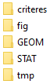
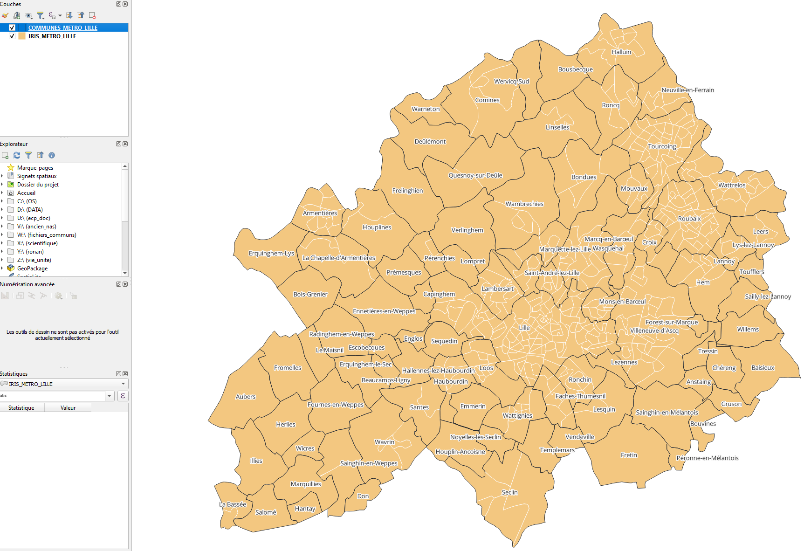
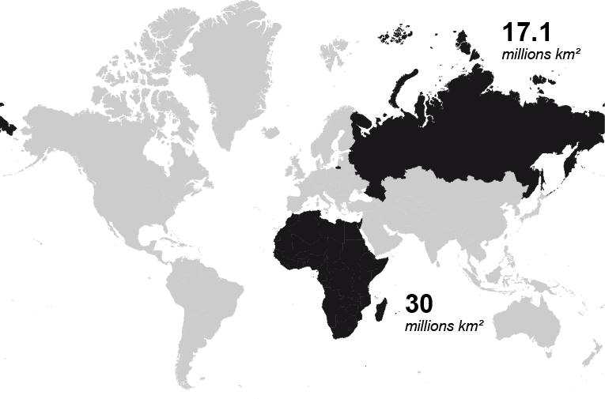
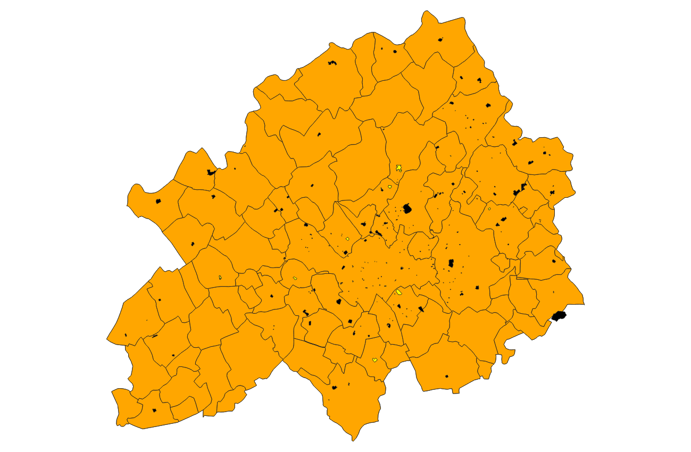
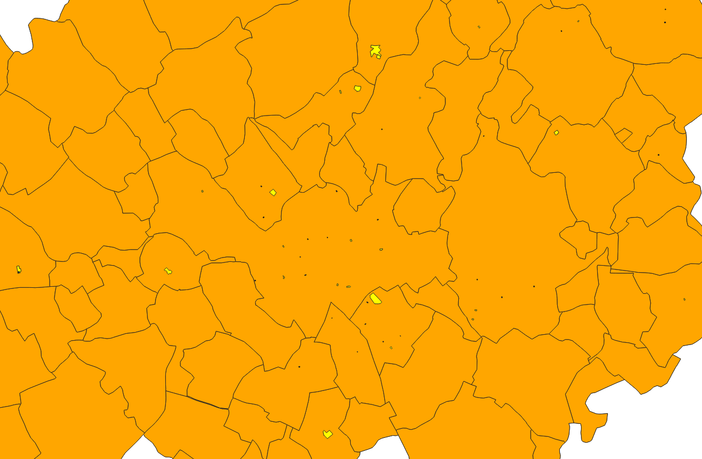
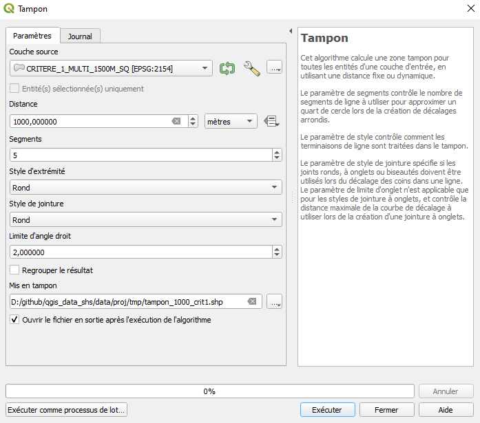
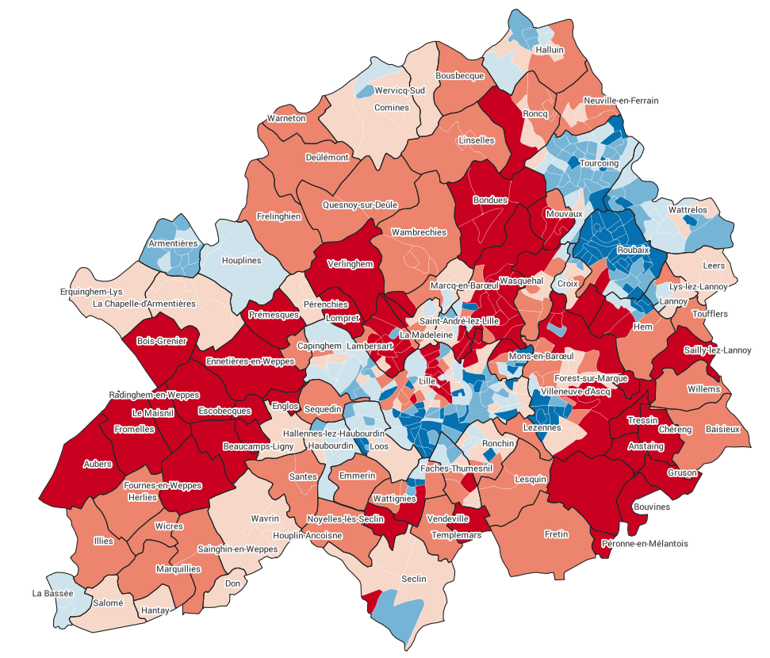
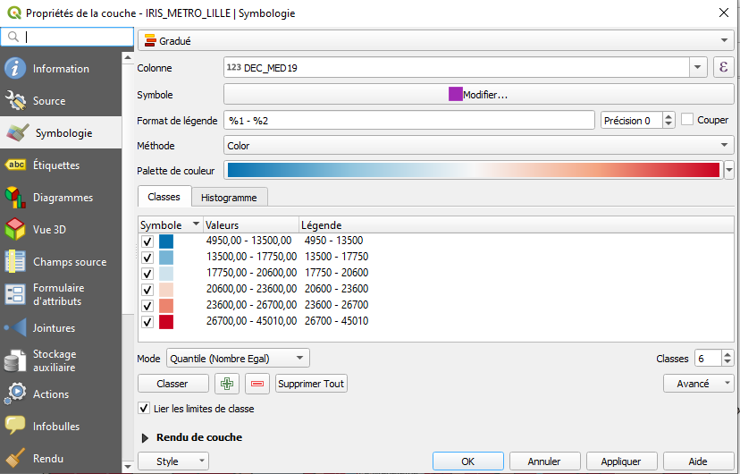
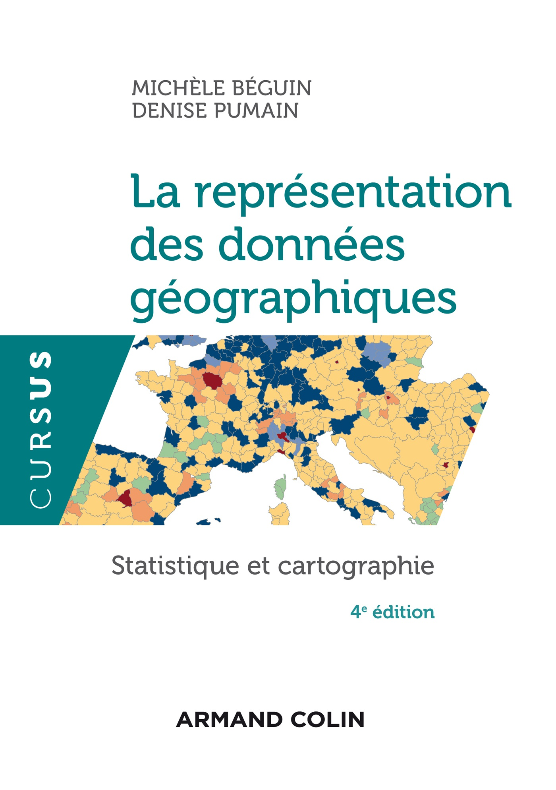

```{r setup, include=FALSE}
options(htmltools.dir.version = FALSE, crayon.enabled = TRUE)
knitr::opts_chunk$set(cache = FALSE,
                      fig.align='center',
                      message = FALSE,
                      warning = FALSE,
                      Encoding = "UTF-8")
# install.packages("devtools")
#devtools::install_github("gadenbuie/countdown")
#devtools::install_github("mitchelloharawild/icons")
library(countdown)
library(fontawesome)
```

class: inverse middle center

# Déroulé

---
class: middle

.pull-left[

### Information géographique ?  (*9h30- 10h*)

- Les composantes de l'information géographique
- Où en trouver ?
- Formats de fichiers


### Systèmes d'Information Géographiques ? (*10h - 11h*)

- Bref historique du développement des SIG
- Principes et fonctionnalités
- Principaux SIG
- Présentation de QGIS


]

.pull-right[.center-right[
###  Systèmes de coordonnées de référence, projections *(11h - 11h30)*

- Qu'est-ce qu'une projection ?
- Gérer les projections de ses couches géographiques dans QGIS 

### Manipulations de base (données vectorielles) *(11h30 - 12h30)*
- Import de données tabulaires
- Jointure attributaire
- Jointure spatiale
- Sélections attributaires

#### Déjeuner 12h30 - 13h30

]
]
---
class: middle

.pull-left[.center-left[
### Géotraitements et statistiques spatiales *(13h30 - 15h)*
- Présentation et mise en pratique

### Mise en cohérence des critères *(15h - 15h30)*
- Modéliser sa chaîne de traitement
- Identifier une localisation optimale


]]

.pull-right[.center-right[

### Cartographie thématique dans QGIS *(15h30 - 16h15)*
- Éléments fondamentaux de sémiologie graphique
- Typologies (variables qualitatives)
- Cartes choroplèthes (variables quantitatives de taux)


### Mettre en page une carte *(16h15 - 17h)*
- Eléments fondamentaux sur l'habillage cartographique
- Créer une mise en page avec QGIS

]]

---

.left-column[

## Atelier

*Implantation d'une piste de* ***roller-derby*** *dans la Métropole Européenne de Lille*


.medium[

4 critères proposés :
- **Minimiser les frais** : Un gymnase préexistant qui présente de bonnes prédispositions (taille, type d'activité)
- **Favoriser l'inclusion sociale** : un territoire dont le revenu médian se situe sous la moyenne de la Métropole Européenne de Lille
- **Optimisation de localisation** : Plus de 2000 m à vol d'oiseau d'un équipement existant
- **Ouvrir aux jeunes populations** : au moins 5 écoles dans un voisinage géographique de 1000m
]
]

.right-column[
<center>

</center>
]


---
## Télécharger les données de l'atelier : <a href="https://github.com/rysebaert/qgis_data_shs" target="_blank">https://github.com/rysebaert/qgis_data_shs</a>

Puis cliquez sur *data > data.zip > download*. Décompresser ensuite l'archive. 
.center[

]

---
## Données à disposition
.left-column[

.medium[

### Découpages géographiques 

Le découpage géographique 2019 des IRIS et des communes (polygones) de la Métropole Européenne de Lille. (Source : <a href="https://geoservices.ign.fr/adminexpress" target="_blank">Admin Express, IGN</a>)

*Fichiers : [data/GEOM/IRIS_METRO_LILLE.shp et data/GEOM/COMMUNES_METRO_LILLE.shp]*

]
]
.right-column[
<center>
```{r, eval = TRUE, echo = FALSE, message=FALSE, warning=FALSE, fig.height=5, dpi=150}
library(sf)
library(mapsf)
library(readxl)

iris <- st_read("data/GEOM/IRIS_METRO_LILLE.shp", quiet = TRUE)
com <- st_read("data/GEOM/COMMUNES_METRO_LILLE.shp", quiet = TRUE)
gym <- st_read("data/GEOM/gym_osm.shp", quiet = TRUE)
school <- st_read("data/GEOM/LILLE_ECOLE.shp", quiet = TRUE)

df <- read_excel("data/STAT/data_INSEE.xlsx")
df <- aggregate(df[,"P18_POP"], by = list(df$INSEE_COM), FUN = sum)
com <- merge(com, df, by.x = "INSEE_COM", by.y = "Group.1", all.x = TRUE)
com <- com[order(com$P18_POP, decreasing = TRUE),]
gym <- st_transform(gym, 2154)
school <- st_transform(school, 2154)

mf_shadow(com)
mf_map(iris, border = "white", col = "peachpuff", lwd = .25, add = TRUE)
mf_map(com, col = NA, add = TRUE)
mf_label(com[1:4,], var = "NOM_COM", halo = TRUE)
mf_scale(size = 5)
mf_credits("Ronan Ysebaert, Violaine Jurie, 2022\nSource: IGN, 2022")
mf_title("Contour des IRIS et des communes")

```
</center>

]

---
## Données à disposition
.left-column[

.medium[

### Gymnases  

L'emprise géographique des gymnases (polygones) et quelques attributs associés : surface, nom, type de sport pratiqués dans le gymnase (Source : <a href="https://www.openstreetmap.org/#map=11/50.6273/3.0563" target="_blank">OpenStreetMap</a>, librairie R <a href="https://cran.r-project.org/web/packages/osmdata/index.html" target="_blank">`osmdata`</a>)

*Fichier : [data/GEOM/gym_osm.shp]*

]
]
.right-column[
<center>
```{r, eval = TRUE, echo = FALSE, message=FALSE, warning=FALSE, fig.height=5, fig.align='center', dpi=150}

mf_shadow(com)
mf_map(com, col = "peachpuff", add = TRUE)
mf_map(gym, col = "lightcoral", border = "lightcoral", add = TRUE)
mf_map(st_centroid(gym[gym$rllr_sk == 1,], 100), col = "red", border = "red", cex = 2, add = TRUE)
mf_legend(type = "typo", val = c("Gymnases", "Activité roller derby identifiée"), 
          pal = c("lightcoral", "red"), title = "", pos = "topleft")
mf_label(com[1:4,], var = "NOM_COM", halo = TRUE)
mf_scale(size = 5)
mf_credits("Ronan Ysebaert, Violaine Jurie, 2022\nSource: (c) OpenStreetMap et contributeurs, 2022")
mf_title("Emprise des gymnases")
```
</center>
]

---

## Données à disposition
.left-column[

.medium[

### Écoles élémentaires

La localisation (points) des écoles élémentaires en 2018 (Source : <a href="https://www.insee.fr/fr/statistiques/3568638?sommaire=3568656
" target="_blank">Dénombrement des équipements en 2021, INSEE</a>)

*Fichier : [data/GEOM/LILLE_ECOLE.shp]*

]
]
.right-column[
<center>
```{r, eval = TRUE, echo = FALSE, message=FALSE, warning=FALSE, fig.height=5, fig.align='center', dpi=150}
mf_shadow(com)
mf_map(com, col = "peachpuff", add = TRUE)
mf_map(school, col = "blue", border = "blue", add = TRUE)
mf_label(com[1:4,], var = "NOM_COM", halo = TRUE)
mf_scale(size = 5)
mf_credits("Ronan Ysebaert, Violaine Jurie, 2022\nSource : Base Permanente des Équipements (INSEE), 2022")
mf_title("Localisation des écoles primaires")
```
</center>
]


---

## Données à disposition
.left-column[

.medium[

### Revenu de la population

Le revenu médian de la population en 2019 à l'échelle des IRIS / Communes (Source :  <a href="https://www.insee.fr/fr/statistiques/6049648
" target="_blank">Revenu, pauvreté et niveau de vie en 2019 (Iris), INSEE</a>)

*Fichier : [data/STAT/data_INSEE.xlsx]*

]
]
.right-column[

<center>
```{r, eval = TRUE, echo = FALSE, message=FALSE, warning=FALSE, fig.height=5, dpi=150, fig.align='center'}
df <- read_excel("data/STAT/data_INSEE.xlsx")
iris <- merge(iris, df[,c("CODE_IRIS", "DEC_MED19")], by.x = "CODE_IRIS", by.y = "CODE_IRIS", all.x = TRUE)

mf_shadow(com)
mf_map(x = iris, var = "DEC_MED19", type = "choro", pal = "RdBu", breaks = "quantile",
       nbreaks = 8, border = NA, leg_val_rnd = -2, leg_title = "Revenu médian 2019",
       add = TRUE)
mf_map(com, col = NA, add = TRUE)
mf_label(com[1:4,], var = "NOM_COM", halo = TRUE)
mf_title("Revenus")
mf_scale(size = 5)
mf_credits("Ronan Ysebaert, Violaine Jurie, 2022\nSource : INSEE, 2022")
```
</center>
]


---

class: inverse middle center

#  Information géographique ? 

Les composantes de l'information géographique 

Où en trouver ?

Formats de fichiers


---

## Information géographique ? 

.pull-left[
Entre **60 et 80%** de l’information que nous traitons possède une dimension géographique. (*Hahmann S. et Burghardt D., 2012, « How much information is geospatially referenced? Networks and cognition »*).

L'information géographique peut être définie comme «**l'ensemble de la description d'un objet et de sa position géographique à la surface de la Terre**» (*Association Française pour l'Information Géographique*). C'est une information **localisée dans l'espace**.

Il peut s'agire d'un **point** précis du territoire, d’**une ligne** (route, frontière, cours d'eau) ou encore d’**une surface** (aire protégée, zone d’emploi, commune...) **a une dimension géographique**.

]

.pull-right[
« La force des données géographiques est de **pouvoir les croiser** lorsqu'elles partagent un même socle géographique. On crée ainsi de la **donnée à valeur ajoutée** préparant la prise de décision » (*Ministère de la Transition écologique et de la Cohésion des Territoires, 2019*).

]


---

class: middle center

## Les composantes de l'information géographique

```{r, echo = FALSE, out.width = "1000px", fig.align='center'}

library(DiagrammeR)

grViz("digraph dot {

  # a 'graph' statement
  graph [overlap = true]

  # several 'node' statements
  node [shape = rectangle, fontname = Helvetica, color='#9c2005', fontsize=13]
  d1

  node [shape = ellipse, fontname = Helvetica, color=black, fontsize = 9] // sets as circles
  d2; d3; d4
  
  d1 [label = 'données géographiques'];
  d2 [label = 'niveau sémantique'];
  d3 [label = 'niveau géométrique'];
  d4 [label = 'niveau topologique'];

  # several 'edge' statements
  d1->d2[arrowhead = none]
  d1->d3[arrowhead = none]
  d1->d4[arrowhead = none] 

}")
```

---

## Niveau géométrique

Le **niveau géométrique** d'un objet géographique correspond à **sa forme et sa localisation** sur la surface terrestre, exprimés dans un **système de coordonnées** explicite.
   

```{r, echo = FALSE, out.width = "900px"}

```

---

## Niveau géométrique

2 types de données sont à différencier : le raster et le vecteur.

.pull-left[


### Le raster  

**C'est une image** (plan scanné, photographie aérienne, image satellitaire...) **localisée dans l'espace**.

L’information géographique est alors stockée dans des cellules (pixel) contiguës généralement carrées.

Chaque pixel **défini par une résolution** possède des valeurs qui peuvent être traitées et cartographiées.

Leur manipulation et analyse relève de champs méthodologiques particuliers (télédétection).  
]

.pull-right[
<span style="color:#9c2005;font-weight:bold;">Raster</span>  

</div>

]

---

## Niveau géométrique

2 types de données sont à différencier : le raster et le vecteur.

.pull-left[


### Le vecteur

**Le format vectoriel** utilise le concept d'**objets géométriques (points, lignes, polygones) pour représenter (et stocker) des objets géographiques**.

Les objets vectoriels ne ne pixelisent pas. On parlera néanmoins de **niveaux de généralisation** pour qualifier leur niveau de précision (parfois aussi appelée résolution).

]

.pull-right[


<span style="color:#9c2005;font-weight:bold;">Vecteur</span>  

</div>


]


---

## Niveau géométrique

2 types de données sont à différencier : le raster et le vecteur.

```{r, echo = FALSE, out.width = "700px", fig.align='center', message=FALSE}
knitr::include_graphics('fig/raster_vecteur_2.png')
```


---

## Niveau topologique

Le niveau topologique  **se déduit du niveau géométrique**. Il correspond aux relations géométriques éventuelles avec plusieurs objets géographiques.


```{r, echo = FALSE, fig.align='center', out.width = "500px"}
knitr::include_graphics('fig/topologie.gif')
```

.medium[
Exemples :

- Multipoint / Linestring : Quel bâtiment touche le tracé d'une route en construction ?
- Multipoint / Polygon : Quelle équipement est inclu / en dehors de tel espace d'étude ?
- Linestring / Linesting : Quelle route traverse une rivière ?
- Linestring / Polygon : Quelle rivière recoupe un espace d'étude donnée ?
]

---

## Niveau sémantique

**Il s'agit de l'ensemble des informations relatives à un objet géographique, qui le décrivent et le caractérisent**. Elles sont souvent nommées données attributaires.
<br>

```{r, echo = FALSE, out.width = "800px", fig.align='center'}
knitr::include_graphics('fig/attribut.gif')
```


---

## Niveau sémantique

**Il s'agit de l'ensemble des informations relatives à un objet géographique, qui le décrivent et le caractérisent**. Elles sont souvent nommées données attributaires.
<br>


```{r, echo = FALSE, out.width = "700px", fig.align='center'}
knitr::include_graphics('fig/attribut.png')
```


---

.pull-left[

## Les sources de l'IG (France)

### Un incontournable : l'Institut Géographique National

- <a href="https://geoservices.ign.fr/telechargement" target="_blank">Géoservices de l'IGN</a>
- <a href="https://www.geoportail.gouv.fr/" target="_blank">Géoportail (portail national d’accès à l’information géographique de référence)</a>


### Les organismes "spécialisés"
- <a href="http://infoterre.brgm.fr" target="_blank">Bureau de Recherches Géologiques et Minières (BRGM)</a>
- <a href="https://data.ademe.fr/" target="_blank">Agence de l'Environnement et de la Maîtrise de l'Energie (ADEME)</a>
- <a href="https://www.onf.fr/onf/connaitre-lonf/+/35::open-data-pour-mieux-partager-les-donnees-forestieres.html" target="_blank">Office national des forêts</a>
- ...

]


.pull-right[
<br><br>
### Les collectivités terrritoriales
- Portail Open Data des régions : <a href="https://data.iledefrance.fr/pages/home/" target="_blank">Ile-de-France</a>,  <a href="https://opendata.hautsdefrance.fr/" target="_blank">Hauts-de-France</a>, <a href="https://data.bretagne.bzh/pages/home-page/" target="_blank">Bretagne</a>, etc. 
- Portail Open Data des métropoles : <a href="https://metropole-grand-paris.opendata.arcgis.com/" target="_blank">Métropole du Grand Paris</a>, <a href="https://opendata.lillemetropole.fr/page/home/" target="_blank">Métropole Européenne de Lille</a>, <a href="https://data.rennesmetropole.fr/explore/?sort=modified" target="_blank">Rennes Métropole</a>, etc.


### Au niveau international

- <a href="https://ec.europa.eu/eurostat/web/gisco/geodata/reference-data" target="_blank">Eurostat - GISCO</a>
- <a href="https://land.copernicus.eu/" target="_blank">Copernicus</a>
- <a href="https://www.naturalearthdata.com/" target="_blank">Natural Earth</a>
- <a href="https://www.worldpop.org/" target="_blank">World Pop</a>
- <a href="https://gadm.org/" target="_blank">Global Administrative Boundaries (GADM)</a>
- <a href="https://www.openstreetmap.fr/" target="_blank">OpenSreetMap (OSM)</a>, données exportables via des API comme <a href="http://overpass-turbo.eu/" target="_blank">Overpass-turbo</a>

]

---

class: middle

## Questions centrales pour rechercher de l'IG

- **Quel est mon espace d'étude ?** *Monde ? Europe ? France ? Ile-de-France ? ...*<br>

- **Quel est l'objet géographique sur lequel je travaille ?** *Pays ? Régions ? Communes ? Parcs naturels ? Rivières ? ...* <br>

- **Quelle est la thématique que je souhaite explorer ?** *Environnement ? Démographie ? Transport? ...* <br>

- **Quel est le format de données que je recherche ?** *Géométries ? Données statistiques à joindre à mes couches géographiques ?* <br>

- **Données conventionnelles ou non ? Quelle période ?**

</br>

D'un point de vue général, privilégiez des ressources gérées et maintenues par des **institutions**. 

---

## Format de stockage de données vectorielles

Il existe **plusieurs formats de stockage de l'information géographique**. Les plus connus sont :</p>

.pull-left[
- **Shapefile (.shp)** : ou « fichier de couches » est le format de fichier **historique** des (SIG). Initialement développé par ESRI pour ses logiciels commerciaux, il est devenu un standard de *facto*, malgré ses limitations (taille de fichiers, longueur texte, nombre maximal d'attributs)...

- **Geographic JSON (.geojson)** : Un format ouvert d'encodage de données géospatiales utilisant la norme JSON (JavaScript Object Notation), assez répandu sur le Web (cartographie interactive, D3.js), etc. 
]


.pull-right[

- **GeoPackage (.gpkg)** : Un format de données géospatiales raster ou vecteur, ouvert, non lié à un système d'exploitation. Conçu pour être aussi léger que possible, il permet notamment de stocker plusieurs couches géographiques dans un seul et même fichier. 


- **Keyhole Markup Language (.kml)** : ou « langage à base de balises géolocales », est fondé sur le formalisme XML. Depuis 2008, le format est normalisé par l'Open Geospatial Consortium. Il s'agit, avec le .gpx, du format classique de données produites par GPS. 


]

---


## Le shapefile


Son extension est classiquement **.shp**, mais il est toujours accompagné de deux autres fichiers de même nom :


.pull-left[
- <span style="font-size:13pt;line-height:1.3;color:#9c2005;">**.dbf**</span><span style="font-size:13pt;line-height:1.3;"> : contient les données attributaires</span> 
- <span style="font-size:13pt;line-height:1.3;color:#9c2005;">**.shx**</span><span style="font-size:13pt;line-height:1.3;"> : stocke l'index de la géométrie</span>   


<p style="font-size:13pt;line-height:1.3;">D'autres fichiers peuvent être également fournis :</p>   
- <span style="font-size:12pt;line-height:1.3;color:#9c2005;">**.sbn et .sbx**</span><span style="font-size:13pt;line-height:1.3;"> : index spatial des formes</span> 
- <span style="font-size:13pt;line-height:1.3;color:#9c2005;">**.prj**</span><span style="font-size:13pt;line-height:1.3;"> : information sur le système de coordonnées</span> 
- <span style="font-size:13pt;line-height:1.3;color:#9c2005;">**.shp.xml**</span><span style="font-size:13pt;line-height:1.3;"> : métadonnées du shapefile</span> 
- <span style="font-size:13pt;line-height:1.3;">et bien d'autres encore : .sbn, .sbx, .fbn,.fbx, .cpg, .atx... </span> 
]


.pull-right[

]


---

## Format de stockage des données attributaires

Les données attributaires peuvent être stockées dans des **formats très différents**. Les SIG acceptent de nombreux formats (.txt, .csv, .dbf, .xls, .xlsx, .ods, ...) de fichiers. 

**L'identifiant géographique est en revanche primordial**. Il permet de faire le lien avec les géométries, et ainsi de les enrichir.


```{r, echo = FALSE, out.width = "635px",fig.align='center'}
knitr::include_graphics('fig/jointure.png')
```

<p style="font-size:12pt;line-height:1.3;font-style:italic;">Dans le cas ci-dessus, on utilise l'attribut (identifiant) NomC pour joindre la couche géographique (fichier shapefile) et la table d'attributs (fichier csv par exemple)</p>


---

## Données attributaires fournies par l'INSEE


L'INSEE et l'IGN utilisent des identifiants identiques pour qualifier les objets géographiques de référence du territoire français. 


.pull-left[

]

.pull-right[

]

<p style="font-size:10pt;line-height:1.3;font-style:italic;">Dans les fichiers de données INSEE (à gauche) l'attribut qui sert d'identifiant unique pour les communes est nommé CODGEO (code INSEE des communes). La couche géographique des communes fournies par l'IGN (à droite), comportent le même identifiant unique nommé INSEE_COM</p>


---

class: inverse middle center

#  Immersion dans l'univers des SIG

Historique du développement des SIG

Principes et fonctionnalités

Outils SIG

Présentation de QGIS

---

## Londres, 1854

.pull-left[
**John Snow** est un médecin britannique. Ses travaux sur la **propagation du choléra** dans le quartier de Soho à Londres en 1854 sont reconnus dans l'histoire de l'**épidémiologie moderne** et de l'**analyse spatiale**.

.left-column[
<br>

]

.right-column[
.medium[
Il va identifier la **cause de l'épidémie** en utilisant un procédé simple, mais innovant, qui repose sur le principe de fonctionnement des SIG : **superposer deux couches géographiques différentes** :

- **les lieux de résidence des décès liés à l'épidémie**.
- **les pompes à eau** du quartier.]]  

.medium[
<br><br><br><br><br><br><br><br><br><br><br><br><br><br><br><br><br><br>
Il déterminera que la **transmission s'effectue par l'eau** et **identifiera le foyer de contamination** : la pompe de Brewer Street.]
]


.pull-right[

.leg-fig[**Carte de John Snow** avec la localisation des lieux de résidence des personnes décédées du choléra.]
]

---

## Londres, 1854

.pull-left[
**John Snow** est un médecin britannique. Ses travaux sur la **propagation du choléra** dans le quartier de Soho à Londres en 1854 sont reconnus dans l'histoire de l'**épidémiologie moderne** et de l'**analyse spatiale**.

.left-column[
<br>

]

.right-column[
.medium[
Il va identifier la **cause de l'épidémie** en utilisant un procédé simple, mais innovant, qui repose sur le principe de fonctionnement des SIG : **superposer deux couches géographiques différentes** :

- **les lieux de résidence des décès liés à l'épidémie**.
- **les pompes à eau** du quartier.]]  

.medium[
<br><br><br><br><br><br><br><br><br><br><br><br><br><br><br><br><br><br>
Il déterminera que la **transmission s'effectue par l'eau** et **identifiera le foyer de contamination** : la pompe de Brewer Street.]
]

.pull-right[

.leg-fig[Carte de John Snow revue par Mark Monmonnier, 1996]
]


---

## Un précurseur des applications SIG

.center[Si John Snow avait utilisé un système d'information géographique...]

.pull-left[

]

.pull-right[

]

---

## Historique

**Le concept de Système d'Information Géographique s'est développé et a évolué avec le développement de l'informatique** :

- **1950 – 1970** : début de l’informatique, premières cartographies automatiques.

- **1970 - 1980** : diffusion des outils de cartographie automatique/SIG dans les organismes d’État (armée, cadastre, services topographiques…

- **1980 - 1990** : croissance du marché des logiciels SIG, développement des applications SIG.

- **depuis les années 90 et 2000** : diffusion de SIG plus légers, libres, d'applications web et banalisation de l’usage de l’information géographique (cartographie en ligne, calcul d’itinéraires, utilisation de la géolocalisation, base de données participatives.

.medium[
**Les SIG sont aujourd’hui utilisés dans de nombreux domaines** : 
*agriculture, aménagement du territoire, architecture, assurances & banque, automobile, BTP, cadastre, découpage électoral, défense, démographie, eau et assainissement, électricité, enseignement, environnement, épidémiologie, équipement, géologie, géomarketing, gestion de flotte, gestion de patrimoine, gestion de réseaux, gestion des sols, Internet, immobilier, implantation de commerces, ingénierie logistique, optimisation de parcours, pétrole et gaz, publicité, recherche, ressources naturelles, santé, services d'urgence, télécommunications, tourisme...* ]


---

## Principes et fonctionnalités

Les logiciels SIG permettent d'opérer sur l'intégralité de la chaîne de traitement des données géographiques :

- **Digitalisation** - saisir et abstraire
- **Stockage** et **gestion** - base de données
- **Analyse** - géotraitements, analyse spatiale   
- **Représentation** - cartographie

--

.pull-left[

Pour **modéliser la réalité**,  plusieurs couches d'information géographique,  **vecteur et/ou raster**, de différente nature et dans un même système de projection sont **superposées**.

Chaque **couche géographique contient des objets de même type** (adresses, parcelles, routes, bâtiments, cours d'eau, limites administratives...)

**Une couche géographique = un seul type d'objet géographique** : point, ligne, polygone ou image géoréférencée (raster)

Il est ensuite possible de réaliser de puissantes **analyses croisées**.

]

.pull-right[
.center[

]
]


---

## Principes et fonctionnalités

Un SIG permet de travailler sur les trois composantes de l'information géographique :

.pull-left[
.medium[
### Niveau sémantique
**Les attributs** qui décrivent les objets géographiques (ex : libellé, population, catégorie) **peuvent être modifiés, supprimés, ajoutés et surtout requêtés** : Il est possible de sélectionner des objets géographiques **en fonction de la valeur des attributs**.

### Niveau géométrique
Possibilité de **modifier la localisation** et/ou **la forme** des objets géographiques, de **calculer des surfaces**, **des distances**, ou encore des **zones tampons**, de **convertir des polygones en point**... Les opérations possibles sur la géométrie des objets sont multiples.
]
]

.pull-right[
.medium[
### Niveau topologique
Une fonctionnalité puissante qui consiste à **requêter des objets par localisation**, c'est à dire **en fonction de leur positionnement par rapport à d'autres objets**. Pour cela on peut utiliser une série d'opérateur, exemple : *Contient*, *Croise*, *Intersecte*, *Est à l’intérieur*...]

.center[


.small[
Ex : *Sélection d'objets géographiques ponctuels situés à une certaine distance (euclidienne) d'autres objets géographiques ponctuels*
]]]


---


## QGIS : Un SIG parmi d'autres

.center[


]


---

## Ouvrir QGIS

Une fois <a href="https://www.qgis.org/fr/site/forusers/download.html" target="_blank">installée</a>, **lancez l'application QGIS Desktop**, comme vous le feriez avec n'importe quel logiciel :

<br><br>
.center[

]

---

## Organiser son projet

L'utilisation d'un SIG nécessite de la **rigueur méthodologique**, car l'on se retrouve vite submergé·e par un grand nombre de fichiers.  

.left-column[

]

.right-column[
Il est fortement conseillé de :

- Travailler en **projet** (projet / enregistrer), à la racine du dossier contenant les données (.qgz ou .qmd dans QGIS). Un projet préserve l'ordre d'apparition des couches géographiques chargées dans l'application et leur style graphique associé. 

- Utiliser des **intitulés de fichiers** intelligibles.

- Organiser son projet en utilisant des **sous-répertoires**
   * **GEOM** : les données géographiques d'entrée, à ne pas modifier.
   * **STAT** : les données statistiques d'entrée, à ne pas modifier.
   * **tmp** : les traitements intermédiaires.
   * **criteres** : les couches géographiques consolidées du projet.
   * **fig** : Un dossier dédié à l'export des images et figures issues de votre projet.
   
- Ne pas modifier les noms des couches géographiques et des répertoires de travail en cours de projet.

]


---
.left-column[
## L'Interface de QGIS

<br>
.medium[
1.  **Menu principal**

2.  **La barre d’outils** : raccourci vers les outils les plus récurrents utilisés

3.  **Barre d’outils latérale** : par défaut, raccourci vers les options d'import de données

4.  **La barre d’état** : niveau de zoom, échelle, coordonnées géographiques

5.  **Les panneaux** : explorateur, listing des couches géographiques chargées...

6.  **Le canevas de carte** : visualisation des couches géographiques
]
]

.right-column[
<br>


]

---

.left-column[
## Importer une couche vectorielle

**Pour importer des données**, utilisez la barre d'outil latérale ou la barre d'outils supérieure.

Choisissez l'icône **en fonction du type de données à importer** (vecteur, raster, csv...).

Ces couches sont contenues dans le dossier **GEOM**.

<br>
Importez les couches **COMMUNES_METRO_LILLE.shp**   
et **IRIS_METRO_LILLE.shp** 
]

.right-column[

]

---

.left-column[
## Importer une couche vectorielle

**Pour importer des données**, utilisez la barre d'outil latérale ou la barre d'outils supérieure.

Choisissez l'icône **en fonction du type de données à importer** (vecteur, raster, csv...).

Ces couches sont contenues dans le dossier **GEOM**.

<br>
Importez les couches **COMMUNES_METRO_LILLE.shp**   
et **IRIS_METRO_LILLE.shp** 
]

.right-column[

]


---
.left-column[
## Sélection sur le canevas de la carte

Cette option permet de sélectionner directement sur la carte des objets géographiques.


]

.right-column[

]

---

.left-column[
## Sélection par attributs

La sélection des objets géographiques peut être réalisée à partir de leur **table attributaire**.

1. Clic droit sur la couche IRIS
<br>
2. Ouvrir la table d'attributs

]

.right-column[

.center[
Clic droit sur la couche > Ouvrir la Table d'Attributs
]
]

---

.left-column[
## Sélection par attributs

Il est possible de sélectionner les objets géographiques à partir de leur **table attributaire**

1. Clic droit sur la couche 
<br>
2. Ouvrir la table d'attributs
<br>
3. Ordonner par nom de commune

<br>
Sélectionnez les IRIS de **Lille**
]


.right-column[
.center[

]
]

---

.pull-left[
## Export d'une sélection

Clic droit sur IRIS > Exporter > Sauvegarder les entités sélectionnées sous...  

Enregistrez la sélection que vous appellerez ***lille_iris*** dans le dossier ***tmp*** au format *geojson*. 

Supprimer ensuite cette couche de la liste des couches (clic droit sur la couche > supprimer la couche)

]

.pull-right[
<br><br><br>

]

---
.left-column[
## Gestion de l'affichage graphique

Pour changer l'ordre d'affichage des couches géographiques, les faire glisser dans le panneaux des couches à disposition, comme des onglets dans un navigateur Web.

Le **style graphique d'une couche** (couleur/transparence du fond et de la bordure, épaisseur de bordure, etc.), est paramétrable dans ses propriétés (symbologie). 

]

.right-column[


.center[
clic droit sur une des couches géographiques chargées > Propriétés > Symbologie

]
]

---

.left-column[
## Gestion de l'affichage graphique

Pour changer l'ordre d'affichage des couches géographiques, les faire glisser dans le panneaux des couches à disposition, comme des onglets dans un navigateur Web.

Le **style graphique d'une couche** (couleur/transparence du fond et de la bordure, épaisseur de bordure, etc.), est paramétrable dans ses propriétés (symbologie). 

]

.right-column[


.center[
Jouez sur le **style graphique** des couches IRIS et COMMUNES pour les visualiser correctement (transparence, couleur et épaisseur du trait).

]
]

---
.left-column[
## Gestion de l'affichage graphique

Des **labels (étiquettes)** peuvent faciliter le repérage / la lecture de la carte.

]

.right-column[
.center[


Clic-droit sur la couche ***COMMUNES*** > puis propriétés > étiquettes

]
]

---

.left-column[
## Gestion de l'affichage graphique

Des **labels (étiquettes)** peuvent faciliter le repérage / la lecture de la carte.

<br>
Faites apparaître sur l'espace d'affichage **le nom des communes** de votre espace d'étude

]

.right-column[
.center[

]
]

---

## Exportez une image, enregistrez votre projet

.left-column[

]

.right-column[
**Vous pouvez exporter le visuel créé au format .png**. 
Attention néanmoins, il **manque beaucoup d'éléments** (titre, légende, sources...) etc. pour que cette carte soit diffusable ! Cela peut néanmoins constituer une base de travail et de réflexion. 

**Enregistrez votre projet à la racine de votre dossier de travail**. Les couches que vous avez chargées et leur style associé seront ainsi enregistrées pour la prochaine utilisation. 
]

---

class: inverse middle center

#  Systèmes de coordonnées de référence, projections

Qu'est-ce qu'une projection ?

Gérer la projection de ses couches géographiques dans QGIS


---
class: middle

## Le géoïde terrestre

La Terre n'a pas une forme géométrique parfaite : **Elle est légèrement aplatie aux pôles et bosselée selon les continents**. Son apparence sphérique lorsqu'on l'observe depuis l'espace masque les nombreuses irrégularités à sa surface. On ne peut lui appliquer des **relations mathématiques**.

Toute mesure ayant besoin d'une référence, on modélise la forme de la Terre selon le modèle théorique du **géoïde**.

.pull-left[
```{r, echo = FALSE, out.width = "350px", fig.align='center'}
knitr::include_graphics('fig/geoide.png')
```
]

.pull-right[

.medium[
<br><br>
Un géoïde est une surface équipotentielle du champ de pesanteur coïncidant « au mieux » avec le **niveau moyen des océans et qui se prolonge sous les continents**.
 
**La surface du géoïde équivaut au niveau d'altitude 0** à l'échelle mondiale. La notion d'**altitude traduit donc la hauteur au-dessus du géoïde**.

Pour la France, il est calé sur un niveau zéro scellé dans le port de Marseille.
]
]

---

class: middle

.pull-left[

##  Formalisation mathématique du géoïde


**L'ellipsoïde** permet de modéliser mathématiquement la surface irrégulière du géoïde.  Il s'agit d'un volume globalement sphérique et aplati aux pôles.

Positionner l'ellipsoïde en fonction du géoïde permet de construire un **système géodésique**. Le plus connu étant le **WGS84**, notamment utilisé pour le GPS. 

Il sert à déterminer les coordonnées géographiques d'un objet sur la surface de la Terre = mesure d'**angles** au regard d'un parallèle (équateur) et un méridien (Greenwich) de référence, aussi appelées **latitude** et **longitude**.

Nombreuses sont les couches géographiques référencées en **WGS84** (EPSG:4326).
]

.pull-right[

```{r, echo=FALSE,out.width="48%", out.height="20%",fig.cap="Géoïde terrestre, ellipsoïde et mesure d'angles depuis l'ellipsoïde", fig.show='hold',fig.align='center'}

knitr::include_graphics('fig/AnimationSphere2.GIF')
```
<br>
```{r, echo = FALSE, out.width = "300px", fig.align='center'}
knitr::include_graphics('fig/sphere_lat_long.png')
```

]

---

## Les projections cartographiques

.center[
**Un système géodésique permet de localiser un objet sur une surface en 3 dimensions**    

```{r, echo = FALSE, out.width = "800px", fig.align='center'}
knitr::include_graphics('fig/orange.png')
```

*Mais comment représenter l'information géographique sur un plan en deux dimensions, sur une carte ?*]
---

## Les projections cartographiques

Une **projection est un procédé mathématique permettant de passer de l'ellipsoïde à sa représentation sur une surface plane**. 

Toutes les projections provoquent des déformations. Plus l'espace représenté est vaste, plus les altérations sont importantes.


```{r, echo = FALSE, out.width = "800px", fig.align='center'}
knitr::include_graphics('fig/projection_style.jpeg')
```

Les projections cartographiques peuvent se classer **selon le type d'altération et la surface de projection**. 

---

## Surfaces de projection

Un ellipsoïde **peut être projeté sur différentes surfaces**, facilement **représentables en deux dimensions**.

.pull-left[

]

.pull-right[
.medium[
Le cône, le cylindre et le plan sont des formes géométriques développables. 

Dans la **projection conique** les méridiens et les parallèles sont projetés sur un cône qui est tangent avec le parallèle souhaité. Cette projection permet d'établir des cartes assez fidèles à la réalité dans les régions voisines du parallèle de contact. Par contre les régions éloignées sont très déformées et souvent un des deux hémisphères ne peut être cartographié en même temps que l'autre.

Une **projection cylindrique** est la projection de la Terre sur un cylindre tangent à un grand cercle ou sécant en deux cercles. Lorsque la sphère est projetée sur un seul cylindre, il y a une importante distorsion des hautes latitudes, où les surfaces sont considérablement agrandies.

Une **projection azimutale** est une manière de projeter une sphère sur un plan, et en particulier, une façon de représenter entièrement la surface de la Terre sous la forme d'un disque.

]
]

---

## Le choix du centrage : pas de règle, mais le résultat n'est pas anodin !

.pull-left[

<br><br>

]

.pull-right[

<br><br>

]

---

## Les types de projection (déformations)

Les projections peuvent être classées selon les **altérations géométriques** qu'elles provoquent.

.pull-left[

### Projections conformes

**Conservent localement les angles, donc les formes**. Les méridiens et parallèles se coupent à angle droit.    

**Les surfaces et les distances sont déformées.** Ce type de projection peut être utilisé pour la navigation maritime.
]

.pull-right[
```{r, echo = FALSE, out.width = "480px", fig.align='center'}
knitr::include_graphics('fig/mercator.jpg')
```
.medium[Exemple : **Projection Mercator**]
.small[*Gerardus Mercator (1569)*]

]

---

## Les types de projection (déformations)

Les projections peuvent être classées selon les **altérations géométriques** qu'elles provoquent.

.pull-left[

### Projections équivalentes

**Conserve localement les surfaces**, mais au prix d’une **déformation des distances et des angles** de route sur la carte.] 

.pull-right[
```{r, echo = FALSE, out.width = "520px", fig.align='center'}

```
.medium[Exemple : **Projection Gall–Peters**]
.small[*James Gall et Arno Peters (1855)*]

]

---
## Les types de projection (déformations)

Les projections peuvent être classées selon les **altérations géométriques** qu'elles provoquent.

.pull-left[

### Projections aphylactiques

Projections  **ni conformes, ni équivalentes**, mais qui cherchent à faire un **compromis acceptable** entre les inévitables déformations des surfaces, des distances et des angles sur une carte.
]

.pull-right[
```{r, echo = FALSE, out.width = "550px", fig.align='center'}
knitr::include_graphics('fig/Natural_Earth.JPG')
```
.medium[Exemple : **Projection Natural Earth**]
.small[*Tom Patterson (2011)*]
]

---
## Les types de projection (déformations)

Les projections peuvent être classées selon les **altérations géométriques** qu'elles provoquent.

.pull-left[

### Projections aphylactiques (équidistantes)

La **distance et la direction**, mesurées à partir du point central, sont toutes deux exactes.] 


.pull-right[
```{r, echo = FALSE, out.width = "380px", fig.align='center'}
knitr::include_graphics('fig/postel.png')
```
.medium[Exemple : **Projection Postel**]
.small[*1578*]
]


---

## Quelles déformations ? 

Le cas controversé de la projection Mercator... 

.pull-left[
```{r, echo = FALSE, out.width = "500px", fig.align='center'}

```
.medium[En réalité, la Russie est 2 fois moins étendue que l'Afrique...]
]

.pull-right[
```{r, echo = FALSE, out.width = "500px", fig.align='center'}
knitr::include_graphics('fig/SA_groenland.png')
```
.medium[... Et l'Amérique du Sud 8 fois plus étendue que le Groenland !]
]


---

## Quelles déformations ? 

**L'indicatrice de Tissot** permet d'apprécier les déformations engendrées par l'usage d'un système de projection cartographique.

.pull-left[
```{r, echo = FALSE, out.width = "450x", fig.align='center'}
knitr::include_graphics('fig/mercator_deform.png')
```
]

.pull-right[
```{r, echo = FALSE, out.width = "500px", fig.align='center'}
knitr::include_graphics('fig/equivalente_deform.png')
```

<br>
Une forme géométrique (un cercle ou une ellipse) est répétée de manière régulière sur le planisphère.
]

---

## Quelle projection choisir ? Des normes, des références et des choix

**Le choix d'une projection cartographique** ne se fait pas aléatoirement. **c'est la zone représentée, la thématique et l'objectif de la carte** qui vous permettront de choisir une projection :

- Pour la navigation, les directions sont importantes.
- Sur les cartes routières, les distances précises sont importantes.

**Des conventions sont admises pour certaines zones géographiques :**

- Pour les régions de **basse latitude** (près de l'Équateur), utilisez des **projections cylindriques**.
- Pour les régions de **latitude moyenne**, les **projections coniques** sont plus adaptées.
- Pour les **régions polaires**, plutôt des **projections azimutales**.

D'un point de vue général, les distorsions sont proportionnelles à la surface à représenter.

---

## En France : La projection Lambert93

.pull-left[
Suite à un décret du [3 mars 2006](https://geodesie.ign.fr/contenu/fichiers/Decret2006-272_03-03-06MODdecret2000-1276.pdf) :

Les administrations de l'État, collectivités locales et entreprises chargées de l'exécution d'une mission de service public doivent utiliser le **système géodésique de référence RGF93** pour leurs échanges de données géoréférencées. Il est compatible avec le système géodésique de **référence européen ETRS89** et avec le système géodésique de référence mondial **WGS84** (utilisé par le système GPS).

Les cartes officielles représentant la France métropolitaine doivent utiliser la projection de référence **Lambert93 Conique Conforme**. 9 variantes de cette projection existent, elles couvrent 9 zones s'étalant du Nord au Sud et doivent être utilisées pour la cartographie locale.

Pour les DROM, des variations de projections cylindriques (UTM). 

]

.pull-right[


.leg-fig[
[Source : Géoréférencement et RGF93, théorie et concepts, 2008](http://gtsoft.ftpacs.com/RGF93_theorie_et_concept_T3.pdf?PHPSESSID=649823751d32b07817a3795a95f748aa)]
]

---

## Chaque pays a son popre système de projection de référence ! 

L'EPSG (European Petroleum Survey Group) a construit une base de données qui recense et identifie les systèmes de **projection les plus utilisés**.

[**epsg.io**](https://epsg.io/) est aujourd'hui une ressource Open-Source de référence internationale.

```{r, echo = FALSE, out.width = "800px", fig.align='center'}
knitr::include_graphics('fig/epsg1.PNG')
```

Le **code EPSG** est un identifiant unique pour qualifier un système de projection, directement utilisable dans des SIG.

---

.left-column[
## Consulter le Systèmes de Coordonnées de référence (SCR) d'une couche

Si les couches géographiques de votre projet ne sont pas dans le même système de coordonnées de référence, vous exposez vos manipulations à de nombreux désagréments ! 

**La projection** d'une couche géographique **est indiquée dans ses propriétés générales**

Importez les couches géographiques des gymnases et des écoles élémentaires de la MEL

]

.right-column[

.center[
.medium[
Importez les couches géographiques ***LILLE_ECOLE.shp*** et ***gym_osm.shp***.   
Consulter leur SCR (Clic droit sur la couche > Propriétés > Informations)
]
]
]
---
.left-column[
## Modifier le SCR d'une couche géographique
Les couches géographiques s'affichent automatiquement dans le système de projection de la première couche géographique importée.

Pour modifier le système de projection, il suffit d'enregistrer une nouvelle version de la couche géographique concernée dans le système de projection souhaité (clic-droit sur la couche > enregistrer sous).

]

.right-column[


.medium[
Exportez les couches géographiques des écoles et gymnases dans le même SCR que celui des IRIS et des communes (Lambert 93)

Enregistrez ces couches dans votre dossier ***tmp***, puis nettoyer l'espace de travail (éviter de visualiser des couches géographiques inutiles)
]

]


---

class: inverse middle center

#  Manipulations de base (vecteur)

Sélections attributaires

Import de données tabulaires

Jointure attributaire


---

## Sélection par attributs

.pull-left[
Il s'agit d'une sélection portant sur les **caractéristiques non spatiales des entités**. Dans un SIG, elles sont prises en charge dans la table attributaire des couches géographiques.

On peut effectuer une sélection par expression sur des **variables catégorielles/qualitatives** *(ex : IRIS de de la commune "X")* ou sur des **variables quantitatives** *(ex: IRIS dont le nombre de foyers fiscaux est supérieur à Y)*.

Le SIG renverra alors une sélection des entités dont les valeurs répondent à la requête.
]

.pull-right[

]

---
## Sélection par localisation

.pull-left[
La sélection par localisation permet de sélectionner certaines entités d'une couche au regard de leur positionnement géographique vis-à-vis d'une autre couche géographique.

Le choix du **prédicat géométrique est important** (intersecte, contient, est disjoint, égal, touche, chevauche, à l'intérieur, croise, etc.) 
]

.pull-right[

.leg-fig[Source : École nationale des techniciens de l'équipement. Établissement d'Aix-en-Provence
]
]

---

class: middle

.pull-left[
## Premier critère : un lieu de pratique adapté

### Nouvelles notions SIG : sélection par localisation et sélection par expression

Objectifs d'atelier :

 - extraire les gymnases où l'on pratique actuellement du roller.
 - ne sélectionner que les gymnases inclus dans la MEL.
 - sélectionner les gymnases de type "multi-activités".
 - sélectionner les gymnases d'une surface au moins 2 fois supérieure à l'emprise d'une piste de roller-derby (750 m²).

]

.pull-right[


]

---

## Quelle pratique actuelle ? 

.left-column[

### Sélectionner les gymnases où une pratique du roller est recensée

.medium[
Clic droit sur la couche ***gymnase*** > ouvrir la table attributaire > sélection par expression

]
]

.right-column[
.center[


]
]

---

## Quelle pratique actuelle ? 

.left-column[

### Sélectionner les gymnases où une pratique du roller est recensée

.medium[
Sur les 324 gymnases de la couche géographique initiale, 6 ont une pratique identifiée du roller. 

Enregistrer cette sélection sous le nom ***roller*** dans votre dossier ***tmp***
]
]

.right-column[
.center[


]
]
---

## Un lieu de pratique adapté

.left-column[

### **Étape 1** - Sélectionner les gymnases inclus dans la MEL

On ne recherche pas à pratiquer l'activité en Belgique ! 

.medium[
Vecteur > Outil de recherche > Sélection par localisation. 

Sur les 324 gymnases de la couches géographiques initiale, seuls 265 sont inclus dans la MEL. 

Enregistrer cette sélection sous le nom ***gymnase_MEL*** dans votre dossier ***tmp***

Nettoyez votre espace de travail, ne conserver que la couche ***gymnase_MEL*** et la couche ***communes***
]

]

.right-column[
.center[

]
]

---

## Un lieu de pratique adapté

.left-column[

### **Étape 2** - Sélectionner les gymnases permettant des multi-activités

Tous les gymnases ne se prêtent pas au roller-derby (tennis, terrains de boule, etc). 
On ne conserve que les gymnases qui accueillent des multi-activités (multi). 

.medium[

Clic droit sur la couche ***gymnase_MEL*** > ouvrir la table attributaire > sélection par expression
]
]

.right-column[
.center[


]
]
---

## Un lieu de pratique adapté

.left-column[

### **Étape 2** - Sélectionner les gymnases permettant des multi-activités

Tous les gymnases ne se prêtent pas au roller-derby (tennis, terrains de boule, etc). 
On ne conserve que les gymnase qui accueillent des multi-activités (multi). 

.medium[
Sur les 265 gymnases de la MEL, 52 sont connus par accueillir plusieurs activités.  

Enregistrez cette sélection sous le nom ***gymnase_MEL_MULTI*** dans votre dossier ***tmp*** et nettoyez votre espace de travail
]

]

.right-column[
.center[

]
]

---

## Un lieu de pratique adapté

.left-column[

### **Étape 3** - Sélectionner les gymnases d'une surface suffisante

On estime qu'au moins 1500m² (2 fois l'emprise d'une piste de roller derby) est nécessaire pour la pratique de l'activité.

.medium[
Clic droit sur la couche ***gymnase_MEL_MULTI*** > ouvrir la table attributaire > sélection par expression
]
]

.right-column[
.center[

]
]

---

## Un lieu de pratique adapté

.left-column[

### **Étape 3** - Sélectionner les gymnases d'une surface suffisante

On estime qu'au moins 1500m² (2 fois l'emprise d'une piste de roller derby) est nécessaire pour la pratique de l'activité.

.medium[
**BRAVO ! VOUS AVEZ IDENTIFIÉ UN PREMIER CRITÈRE D'IMPLANTATION !!**  
Sur les 52 gymnases restants, 24 présentent une surface favorable ! 

Enregistrez cette sélection sous le nom ***CRITERE_1_MULTI_1500M_SQ*** dans votre dossier ***criteres*** et nettoyez votre espace de travail. 
]
]

.right-column[
.center[


]
]

---

class: middle

.pull-left[
## Deuxième critère : Accessible aux ménages les plus modestes

### Nouvelles notions SIG : import de données tabulaires, jointures attributaires

Objectifs d'atelier :

- importer des données issues d'un fichier Excel (revenu médian à l'échelle des IRIS)
- les joindre à une couche géographique
- réaliser une sélection par expression sur ces données

]

.pull-right[
.center[

]
]

---

## Jointure attributaire

.pull-left[
<br>
Une **jointure attributaire** permet de joindre **deux tables attributaires décrivant des entités communes et partageant un champ commun**. L'opération produit **une seule table** juxtaposant les champs de la table à joindre à ceux de la table d'origine.

Dans un SIG la table d'origine est souvent celle associée aux entités localisées d'**une couche géographique**, ce qui permet par exemple de cartographier les **données d'un tableau statistique sans dimension spatiale**. 

Les jointures attributaires sont utilisées pour introduire des informations nouvelles dans une couche géographique.
]

.pull-right[
<br><br><br>


.leg-fig[Source : Université Virtuelle Environnement et Développement durable, glossaire des SIG
]
]

---
## Accessible aux ménages les plus modeste

.left-column[

### **Étape 1** - Transformer le fichier Excel contenant les données en .csv, puis l'importer dans QGIS 

.medium[

Ouvrez le fichier STAT > ***data_INSEE.xls***

L'enregistrer au format .csv

Couche > Ajouter une couche > Ajouter une couche de texte délimité
- Virgule en séparateur décimal
- Pas de géométrie

*Cliquez sur "ajouter"*
]
]

.right-column[
.center[

]
]

---

## Accessible aux ménages les plus modeste
.left-column[

### **Étape 2** - Jointure attributaire

.medium[
Jointure de ce fichier de données non spatiales à la couche géographique des IRIS.

Au préalable, il faut s'assurer de la concordance des données statistiques avec les géométries et identifier le nom de la colonne (identifiant unique) sur laquelle portera la jointure.   

Quelles colonnes (ou champs) utiliser pour joindre les données INSEE aux géométries des IRIS ? 

Clic droit sur la couche ***IRIS_METRO_LILLE*** > propriétés > jointure > cliquez sur "**+**"
]
]

.right-column[
.center[

]]

---

## Accessible aux ménages les plus modeste
.left-column[

### **Étape 2** - Jointure attributaire

.medium[
Jointure de ce fichier de données non spatiales à la couche géographique des IRIS.

Au préalable, il faut s'assurer de la concordance des données statistiques avec les géométries et identifier le nom de la colonne (identifiant unique) sur laquelle portera la jointure.

- choisir les deux champs à mettre en lien : consulter attentivement la table attributaire pour choisir les bons noms de colonne
- choisir les champs de la table jointe à ajouter en évitant les redondances
- supprimer le préfixe du nom de champ
]
]

.right-column[
.center[

]]

---

## Accessible aux ménages les plus modeste
.left-column[

### **Étape 2** - Jointure attributaire

.medium[
Jointure de ce fichier de données non spatiales à la couche géographique des IRIS.


]
]

.right-column[
.center[
**BRAVO !!! Vous venez de joindre les données démographiques de l'INSEE dans la table attributaire de la couche IGN IRIS !** 
<br>


]]

---

## Accessible aux ménages les plus modeste
.left-column[

### **Étape 3** - Statistiques basiques

QGIS propose plusieurs outils permettant de retourner des statistiques basiques sur les données attributaires d'une couche géographique.

.medium[
Ouvrez le module de statistiques basiques et effectuez l'opération pour le champ ***DEC_MED_19***
]
]

.right-column[
.center[


<br>


]]

---

## Accessible aux ménages les plus modeste
.left-column[

### **Étape 3** - Statistiques basiques

QGIS propose plusieurs outils permettant de retourner des statistiques basiques sur les données attributaires d'une couche géographique.

.medium[
La moyenne du revenu médian des IRIS qui composent la MEL s'élève à 20 625 euros. Retenons cette valeur
]
]

.right-column[
.center[

]]


---

## Accessible aux ménages les plus modeste
.left-column[

### **Étape 4** - Sélection par attributs


.medium[
Sélectionner les IRIS sous la moyenne de la MEL au moyen d'une sélection par expression...
]
]

.right-column[
.center[

]]


---

## Accessible aux ménages les plus modeste
.left-column[

### **Étape 4** - Sélection par attributs


.medium[
Sélectionner les IRIS sous la moyenne de la MEL au moyen d'une sélection par expression...

... puis enregistrer la sélection sous le nom ***CRITERE_2_REVENU*** de votre dossier ***criteres***
]
]

.right-column[
.center[


]]


---

class: inverse middle center

#  Géotraitements et introduction aux statistiques spatiales

---

## Géotraitement

.pull-left[

Les SIG proposent plusieurs outils de **géotraitement**. Ils permettent d'opérer sur la **géométrie et/ou la topologie** des objets géographiques. La dimension attributaire est parfois également prise en compte. Ces traitements peuvent s'effectuer en mode **vecteur** et/ou en mode **raster**.

Le résultat d'un géotraitement est la **création d'une nouvelle couche géographique**.
.center[

]
.leg-fig[
Extrusion des contours des côtes bretonnes par une série de géotraitements (Source : [Atol Open Blog](https://blog.atolcd.com/mise-a-jour-en-vue-pour-lextension-gis-de-pentaho-data-integration/))
]

]

.pull-right[


.leg-fig[
Tampons variables autour des rivières (Source : [Documentation QGIS](https://docs.qgis.org/2.8/fr/docs/gentle_gis_introduction/vector_spatial_analysis_buffers.html))]
]

---


## Géotraitement

.pull-left[

Les SIG proposent plusieurs outils de **géotraitement**. Ils permettent d'opérer sur la **géométrie et/ou la topologie** des objets géographiques. La dimension attributaire est parfois également prise en compte. Ces traitements peuvent s'effectuer en mode **vecteur** et/ou en mode **raster**.

Le résultat d'un géotraitement est la **création d'une nouvelle couche géographique**.

.center[

]
.leg-fig[
Extrusion des contours des côtes bretonnes par une série de géotraitements (Source : [Atol Open Blog](https://blog.atolcd.com/mise-a-jour-en-vue-pour-lextension-gis-de-pentaho-data-integration/))
]

]

.pull-right[


.leg-fig[
Périmètre de 500 m autour des monuments historiques avec interdiction relative de publicité (Source : [Open Data Métropole Européenne de Lille](https://opendata.lillemetropole.fr/explore/dataset/zone-de-500m-autour-des-monuments-historiques-spr/information/?location=12,50.65871,3.11617&basemap=jawg.streets))]
]


---
.pull-left[

### Zone tampon (buffer, distances tampon)

.center[

]


### Intersection

.center[

]
]

.pull-right[
### Différenciation symétrique (ou différence)

.center[

]


### Union

.center[

]
]

---
.center[
### Regroupement (merge, dissolve)


]

---

class: middle

.pull-left[
## Troisième critère : diversifier l'offre géographique

### Nouvelles notions SIG : mise en oeuvre de géotraitements

Objectifs d'atelier :

 - extraire l'espace à plus de 2000 mètres d'un lieu de pratique de roller connu


]


.pull-right[


]

---

## Diversifier l'offre géographique

.left-column[

### **Étape 1** - Espace tampon de 2000m autour de la couche roller


.medium[
Importez la couche ***roller*** précédemment créée et stockée dans le dossier ***tmp*** puis réalisez un **espace tampon** de **2000 m** autour des polygones qu'elle contient. 

Sélectionnez l'option *regrouper le résultat*
]
]

.right-column[
.center[

]]


---

## Diversifier l'offre géographique

.left-column[

### **Étape 2** - Différence entre le territoire de la MEL et l'espace tampon précédemment créé


.medium[
Importez la couche ***MEL*** (dossier ***GEOM***), puis réaliser la **différence** entre cette couche et l'**espace mis en tampon** stocké virtuellement sur votre ordinateur. 


]
]

.right-column[
.center[

]]

---

## Diversifier l'offre géographique

.left-column[

### **Étape 3** - Export du résultat

Nous avons sous les yeux l'espace situé à plus de 2000 mètres d'un gymnase où une pratique du roller est inventoriée ! 

.medium[

Exportez la couche ***difference*** (clic droit sur la couche difference, puis exporter) dans le dossier ***criteres*** et nommer la couche ***CRITERE_3_DISTANCE_2000_ROLLER***


]
]

.right-column[

]


---


class: middle

.pull-left[
## Quatrième critère : pour une pratique scolaire

### Nouvelles notions SIG : compter des points dans un polygone

Objectifs d'atelier :

 - ne sélectionner que les gymnases qui ont moins 3 écoles à moins de 1000 mètres

]


.pull-right[


]

---

## Statistiques spatiales

QGIS offre plusieurs [fonctionnalités](https://docs.qgis.org/2.8/fr/docs/training_manual/vector_analysis/spatial_statistics.html#:~:text=Les%20statistiques%20spatiales%20vous%20permettent,av%C3%A8rent%20utiles%20%C3%A0%20cet%20%C3%A9gard.) qui permettent d'analyser et de comprendre ce qu'il se passe dans un jeu de données vectorielles. 

- **Calculer une matrice de distance** : calculer des distances entre les points d'une couche géographique et indicateurs dérivés (distance minimale, moyenne, maximale, etc.)

- **Coordonnées moyennes** : obtenir le centre géométrique d'une couche de polygones

- **Dénombrement de points dans des polygones** : le nombre de points inclus dans un polygone  

... et beaucoup d'autres !


---
## Pour une pratique scolaire

.left-column[

### **Étape 1** - Import des couches utiles

.medium[

Nettoyez votre espace de travail (supprimer les couches géographiques inutiles).

Importez la couche ***CRITERE_1_MULTI_1500M_SQ*** précédemment créée (dossier ***criteres***), la couche ***ecoles*** correctement projetée (EPSG 2154, dossier ***tmp***)  

Importez la couche de la MEL pour visualiser l'emprise de la métropole 

]
]

.right-column[

]


---

## Pour une pratique scolaire

.left-column[

### **Étape 2** - Espace tampon de 1000 mètres autour des gymnases

.medium[

Réaliser un espace tampon de 1000 mètres autour des gymnases **sans regrouper les résultats** 



]
]

.right-column[
.center[

]]

---

## Pour une pratique scolaire

.left-column[

### **Étape 3** - Compter le nombre d'écoles dans l'espace tampon de 1000 mètres

.medium[

Vecteur > Outil d'analyse > Compter les points dans les polygones

]
]

.right-column[
.center[

]]

---

## Pour une pratique scolaire

.left-column[

### **Étape 4** - Joindre le résultat à la couche des gymnases

.medium[

Clic droit sur la couche ***CRITERE_1_MULTI_1500M_SQ*** > Propriétés > Jointure

Joindre la couche temporaire ***Compte*** par l'identifiant commune (champ ***osm_id***)

]
]

.right-column[
.center[

]]

---

## Pour une pratique scolaire

.left-column[

### **Étape 5** - Sélectionner les gymnases avec plus de 3 écoles

.medium[

Clic droit sur la couche ***CRITERE_1_MULTI_1500M_SQ*** > Ouvrir la table d'attributs

Ordonner le champ ***NUM_ECOLE*** de façon croissante

Sélectionner les gymnases avec plus de 3 écoles
]
]

.right-column[
.center[

]]


---

## Pour une pratique scolaire

.left-column[

### **Étape 6** - Exportez les résultats

.medium[

Clic droit sur la couche ***CRITERE_1_MULTI_1500M_SQ*** > ***N'enregistrer que les entités sélectionnées***

Enregistrer la sélection dans le dossier ***criteres*** et la nommer ***CRITERE_1_4_3ECOLES_1000M***
]
]

.right-column[
.center[

]]


---
class: inverse middle center

# Mise en cohérence des critères

Modéliser sa chaîne de traitement

Identifier une localisation optimale

---
## Modéliser sa chaine de traitement

La modélisation graphique de la chaîne de traitement, aussi appelée *cheminement décisionnel* est particulièrement utile pour :

- Expliquer **les étapes de la réalisation** à d’autres personnes (reproductibilité des résultats, transposition à d'autres espaces d'études ou objets géographiques).

- Apporter de la **rigueur méthodologique** à ses travaux (transparence de la procédure).

- Se rappeler comment sont **nommés et organisés les fichiers** (particulièrement utile d’une séance à l’autre).

Nous vous conseillons de réaliser ce schéma au fur et à mesure de l’avancement de vos traitements ! 

---
## Modéliser sa chaine de traitement

Insérer maj chemin décisionnel

---

## Quelle implantation ? Une procédure possible :

Nous avons créé 4 couches géographiques qui constituent nos critères pour l'implantation d'une nouvelle piste de roller derby :

- **CRITERE_1_MULTI_1500M_SQ** : gymnases de plus de 1500 m², multi-activité, localisé dans la MEL
- **CRITERE_2_REVENU** : les IRIS dont le revenu médian est inférieur à la moyenne de la MEL
- **CRITERE_3_DISTANCE_2000_ROLLER** : l'espace à plus de 2000m d'un gymnase avec une activité de roller existante  
- **CRITERE_1_4_3ECOLES_1000M** : à partir du critère 1, les gymnases qui comprennent au moins 3 écoles situées à moins de 1000 mètres

<br>

Dans notre cas, nous cherchons à identifier les gymnases qui répondent à l'ensemble de ces critères...

---
## Une procédure possible

Sélectionnez les gymnases issus du critère 4 qui recoupent les IRIS à plus faible revenu

.medium[
Outil de recherche > selection par localisation
]

.pull-left[

]

.pull-right[

]

---
## Une possible procédure... 

Parmi la sélection courante de ces gymnases, sélectionnez les gymnases à plus de 2000 mètres d'un gymnase où la pratique du roller est recensée <br>
Exportez ensuite le résultat de la sélection dans le dossier **criteres** et nommez la couche **IMPLANTATION**


.pull-left[

]

.pull-right[

]


---

class: center

##         Eureka ! Vous avez trouvé !!        

.center[

]

---

class: inverse middle center

#  Cartographie thématique dans QGIS

Éléments fondamentaux de sémiologie graphique

Discrétisation

Typologies (catégories)

Cartes choroplèthes (valeurs graduées, discrétisations)


---

## Les Règles de la sémiologie graphique

.center[
Le **langage cartographique** a été théorisé par **Jacques Bertin** (1967)

.pull-left[

]

.pull-right[

]

« ***La graphique*** *utilise les propriétés de l'image visuelle pour faire apparaître les* ***relations*** *de* ***différence***, ***d'ordre*** et de ***proportionnalité*** entre les données » .

Il conceptualise l'idée de variables visuelles (ou rétiniennes).
]


---

## Le lien entre données statistiques et variables visuelles

.center[


.leg-fig[Source : *Manuel de cartographie : principes, méthodes, applications* (Lambert, Zanin, 2016)
]
]

---

## Le lien entre données statistiques et variables visuelles

.center[

]


---

class: middle center

## Pour s'en convaincre...

.pull-left[

]

--

.pull-right[

]

---


.left-column[

## Variables quantitatives relatives : nécessité de discrétiser

La **discrétisation** est un mode de *simplification de l'information* (quantitative continue) pour la rendre intelligible.
]

.right-column[

]

---

## Deux objectifs

.pull-left[
### Conserver l'essentiel de l'information

* **Regrouper les valeurs qui se ressemblent** et qui sont différentes des autres ; donner des **seuils** qui ont du sens

* Conserver l'ordre de grandeur, la dispersion, la forme de la distribution

* Rendre compte de la **structure interne** du jeu de données
]

.pull-right[
### Transmettre l'information

* Limiter le nombre de classes

$$N(cl) = 1 + 3,3 \log10(N)$$

où $N$ est le nombre d'observations et $N(cl)$ le nombre de classes

* Faciliter la mémorisation

On a coutume de dire que 10 classes est un maximum.

* Construire une carte qui "raconte" quelque-chose !
]

---

## Quelques principes fondamentaux : >> Compromis entre **information** et **démonstration** 

* Les classes ne doivent **pas être vides**

* Les classes doivent couvrir l'**ensemble** de la distribution, et être **contiguës** (elles s'arrêtent là où une autre commence)

* Les classes doivent être  **distinctes** (les valeurs ne doivent pas se superposer)

* Les caractéristiques essentielles de la distribution de l'indicateur doivent être conservées, et permettre de perdre le moins d'information possible.

* Le nombre de classes doit être inférieur au nombre d'observations

---

## Les méthodes

.pull-left[


]

.pull-right[

]


---


class: middle

.pull-left[
## Réaliser une carte choroplèthe avec QGIS

### Nouvelles notions SIG : discrétisation, palettes de couleur

Objectifs d'atelier :

 - réaliser une carte du revenu par IRIS

]

.pull-right[

]

---

class: middle

.pull-left[
## Préalable

- nettoyer son espace de travail (supprimer les couches géographiques inutiles)
- n'importer que les couches géographiques utiles : communes, IRIS
- importer le fichier de données data_INSEE
- réaliser une jointure entre la couche IRIS et les données INSEE pour récupérer les revenus
- éventuellement, ajouter des labels pour faciliter la localisation

-> Astuce, créez un nouveau projet QGIS pour éviter de supprimer vos précédentes analyses.
]

.pull-right[


]

---

## Paramétrer la visualisation

.left-column[
Une fois la jointure attributaire réalisée :

.medium[
clic droit sur la couche > IRIS > Propriétés > Symbologie

- sélectionnez "Gradué"
- sélectionnez le nom du champ d'intérêt (variable quantitative relative)
- sélectionnez le nombre de classes désirées
- paramétrez la palette de couleur (en cohérence avec la méthode de discrétisation)
- sélectionnez la méthode de discrétisation désirée

**IL FAUT ÊTRE EN MESURE DE JUSTIFIER SES CHOIX**
]
]

.right-column[



]

---

## Des ressources utiles

.pull-left[

### Histogramme QGIS

Permet d'évaluer les effets de la discrétisation sur la distribution des valeurs. 
Le choix d'une discrétisation doit toujours être justifiée par des objectifs statistiques et communicationnels. 


]

.pull-right[

### Palettes de couleur

Les palettes de couleur QGIS ne sont pas optimales. Préférez utiliser des palettes de couleur dédiées à la cartographie, comme celles proposées par <a href="https://colorbrewer2.org/#type=diverging&scheme=RdBu&n=8" target="_blank">ColorBrewer</a>).


]

---

.left-column[

### Des choix justifiés... 

.medium[
- **Discrétisation (stat)** : gaussienne à tendance dissymétrique à droite, les quantiles sont adaptés

- **Discrétisation (message véhiculé par la carte**) : permettre d'identifier visuellement les 20 % des territoires au plus haut/faible revenu. 

- **Nombre de classes** : 8 (indice d'Huntsberger indique 1+3.3(log10(502)) = 9.9

- **Palette** : Opposition rouge/bleu autour de la médiane. Usage d'une convention européennes de couleurs (rouge = valeur négatives, "mal", inverse en France).
]
]

.right-column[


]

---


class: middle

.pull-left[
## Réaliser une carte qualitative avec QGIS

### Nouvelles notions SIG : symboles catégorisés 

Objectifs d'atelier :

 - réaliser une carte des types d'IRIS (activité, habitation, espaces naturels)

]

---

## Paramétrer la visualisation

.left-column[

.medium[
clic droit sur la couche > IRIS > Propriétés > Symbologie

- sélectionnez "Catégorisé"

- sélectionnez le nom du champ d'intérêt (variable qualitative non ordonnée)

- classez les valeurs du champ (toutes valeurs uniques)

- paramétrez la palette de couleur. Choisissez des couleurs qui font "sens"

]
]

.right-column[


]
---

.left-column[
## Résultat

.medium[
clic droit sur la couche > IRIS > Propriétés > Symbologie

- sélectionnez "Catégorisé"

- sélectionnez le nom du champ d'intérêt (variable qualitative non ordonnée)

- classez les valeurs du champ (toutes valeurs uniques)

- paramétrez la palette de couleur. Choisissez des couleurs qui font "sens"

]
]

.right-column[


]

---

## Et pour une carte en figurés proportionnels (données quantitatives de stock) ? 

.pull-left[

C'est possible avec QGIS, mais cela nécessite quelques
 <a href="https://ouvrir.passages.cnrs.fr/tutoqgis/10_01_representation.php#:~:text=Dans%20QGIS%2C%20la%20visualisation%20de,d'une%20couche%20de%20points" target="_blank">manipulations</a>...


]

--

.pull-right[

Nous conseillons l'usage de logiciels de cartographie dédiés, comme  <a href="http://magrit.cnrs.fr/" target="_blank">Magrit</a>


]


---

## Et pour une carte en figurés proportionnels (données quantitatives de stock) ? 

.pull-left[

C'est possible avec QGIS, mais cela nécessite quelques
 <a href="https://ouvrir.passages.cnrs.fr/tutoqgis/10_01_representation.php#:~:text=Dans%20QGIS%2C%20la%20visualisation%20de,d'une%20couche%20de%20points" target="_blank">manipulations</a>)...


]


.pull-right[

Exemple de carte réalisée avec Magrit


]

---

class: inverse middle center

#  Mettre en page une carte


Éléments fondamentaux sur l'habillage cartographique

Créer une mise en page avec QGIS

---

.left-column[
## Que manque t-il sur cette carte ?
]

.right-column[

]


---

.left-column[

## Que manque t-il sur cette carte ?

### Des éléments obligatoires

- un **titre** 
- une **date**
- une **légende**  
- une **source** (un·e **auteur·rice**)
- une **échelle** 
- une **orientation** (optionnel)  

]

.right-column[

]


---

.left-column[

## Que manque t-il sur cette carte ?

### Des éléments obligatoires

- un **titre** 
- une **date**
- une **légende**  
- une **source** (un·e **auteur·rice**)
- une **échelle** 
- une **orientation** (optionnel) 
]

.right-column[
.center[

]

### À avoir en tête...

.medium[
- Le choix des couleurs n'est pas anodin (considérations thématiques, statistiques, culturelles, etc.)
- Les éléments graphiques doivent être hiérarchisés. 
- La **légende** résume les éléments présentés sur la carte. Celle-ci peut être organisée par sous-titres de légende pour mieux contextualiser l'information que vous présentez (*par ex : équipements existants, caractéristiques socio-économiques, distances aux équipements*).
- Ne pas trop surcharger la carte : ne pas hésiter à produire des cartes plutôt qu'une. 
- N'hésitez pas à jouer sur la transparence, les hachures, ajouter des labels, des encadrés etc. pour améliorer la lisibilité de votre carte
]
]

---

class: middle center

## Mettre en page une carte avec QGIS

Projet > Nouvelle mise en page. Ne pas oublier d'enregistrer la mise en page !

.center[

]


---

class: middle center

## Un exemple appliqué à notre proposition d'implantation

.center[

]


---


class: middle

.pull-left[
## Mettre en page une carte avec QGIS

### Nouvelles notions SIG : modèle de mise en page 

Objectifs d'atelier :

 - mettre en page la carte des revenus d'IRIS ou des types d'IRIS avec QGIS

]


.pull-right[

]


---
class: inverse middle center

# Ressources bibliographiques

---

class: center

## Systèmes d'information géographique

.pull-left[

]

.pull-right[

]

---

class: center

## Cartographie thématique




---
class: middle center

# À vous de jouer ! 

<center>

Présentation accessible et diffusable à l'adresse [rysebaert.github.io/qgis_data_shs](https://rysebaert.github.io/qgis_data_shs) 

</center>

<br><br><br><br>


